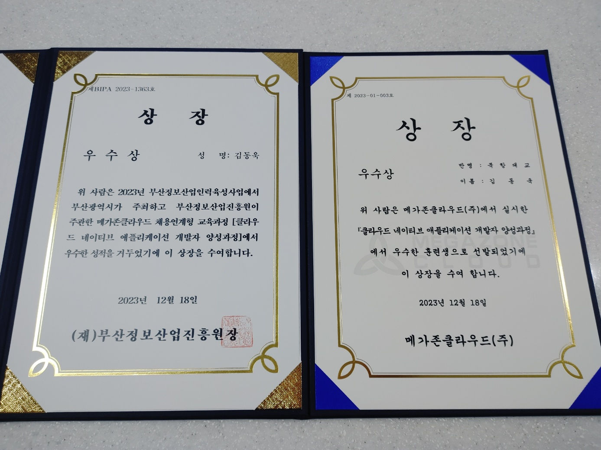

# 2023년 회고

제목에선 거창하게 `2023년 회고`라고 작성했지만, 막상 7개월 동안 교육과정에서 느낀 점을 작성하게 될 것 같다.

작년 우아한테크코스 지원 이후로 다시 해군 전산 군무원 준비를 조금씩 다시 시작하게 됐다.

왜냐하면 작년 내가 웹 개발을 처음 배웠던 곳인 부트캠프에서부터 우아한테크코스까지 개발을 좋아하고 재능이 많은 사람들을 보았기 때문에 재능 하나 없고 내세울 건 오직 노력밖에 없는 전공자인 내가 `이 대한민국에서 개발자로 일할 수 있는 자리가 과연 있을까?`라는 의문점을 가지게 됐고 그래서 개발과 점점 멀어지게 된 것 같다.

그렇게 군무원 준비하다가 5월 초쯤 부트캠프에서 같이 공부했던 사람들의 연락을 받고 힘을 얻어 다시 개발자의 길로 들어서기로 했다.

그리고 한 채용사이트에서 `클라우드 네이티브 애플리케이션 개발자 교육과정`의 교육생을 모집한다는 글을 보고 요즘 웹 개발이 클라우드 기반으로 진행하다 보니 클라우드 환경에 관해 공부하면 좋겠다는 생각에 지원하게 됐다.

## 교육과정 후기

> **아쉬움이 참 많다.**

그 순간순간마다 최선을 다했다고 생각했지만 돌이켜보면 좀 더 노력할 걸 이라는 아쉬움이 많이 남는다.

5월 25일부터 12월 18일까지의 7개월 과정이 이제 끝났다.

사실 처음 시작했을 때까지만 해도 정말 끝이 안 보일 정도로 긴 시간이라는 생각을 했는데 막상 수료하고 보니 정말 짧은 시간이라는 느낀다.

개발이란 게 참 타임머신 탄 것처럼 시간이 흘러가는 게 다른 것 같다.

이 교육과정을 들었던 이유 중 하나가 개발자 친구를 많이 만들어 보고 싶어 지원했는데 역시나 MBTI 99%의 극 I형 인지라 사람들에게 쉽게 다가가지 못했다 ㅎㅎ

그래도 같이 교육 듣던 사람들이 먼저 다가와 줘서 정말 고맙게 느낀다.

여기 들어와서 정말 사람들에게 생각이나 커뮤니케이션에 대해 너무나도 많이 배웠던 것 같다.

특히 내가 정말 소통이 잘 안되는 편이구나라고 느낀 이유가 사람들에게 어떤 것을 설명할 때 내 나름대로 로우레벨로 설명한 것이 의미가 잘 전달되지 않아 `어떻게 내 생각을 다른 사람들에게 의미를 잘 전달할 수 있게 말해야 할까?` 라는 고민을 했고 커뮤니케이션 능력을 키우는 것이 개선해야 할 점이라 생각한다.

아무래도 회사에 들어가서도 커뮤니케이션이 가장 중요하다고 생각하기에 꼭 입사 전에 이 부분을 고쳐야겠다.

> **사람들에게 좀 더 적극적으로 내 지식을 공유할 걸 그랬다.**

물론 코드에 관해 물어보면 최선을 다해 설명해 주고 추가로 `코드 리팩토링을 이 방향으로 하면 어떨까요?` 라는 등의 첨언을 해드렸긴 했지만, 수동적인 자세에서 최선을 다했기 때문에 내가 능동적으로 주변 사람들에게 오지랖이라도 부려서라도 지식 공유를 했으면 어땠을까 하는 아쉬움이 남아있다.

그랬더라면 자연스럽게 소통 능력도 조금은 성장했을 텐데…

사실을 교육 시작했을 때부터 이런 오지랖을 부릴 거라고 다짐했지만, `내가 누굴 가르칠 역량이 되나?, 혹시 내가 잘못된 정보를 전달하면 어쩌지?` 라는 두려움에 조금 망설이긴 했다. ㅎㅎ 

> **사람들의 재능이 부러웠다.**

이 교육 시작과 동시에 개발을 처음 접해보신 분들이 많았었는데 7개월간의 그 사람들을 바라보면서 개발 능력이 엄청난 성장을 하는 것을 보고 사람들의 그 선천적인 재능이 부러웠다.

난 남들보다는 그 선천적인 재능이 부족하다고 생각해 노력으로 차이를 좁히려고 했다.

그래서 7개월 동안 기술 공부를 평일, 주말 가릴 거 없이 강의장에서 최소 밤 10시 퇴근을 하며 성장하려 노력했다.

처음에는 사람들의 개발 능력이 향상되는 걸 보고 `나는 왜 이렇게 부족한 게 많지?` 라는 생각을 했지만 지금 돌이켜보면 여러 가지 기술에 대해 넓게 배운 게 아닌 한 기술에 대해 섬세하고 깊고 구체적으로 기술들을 공부해서 착각했던 것 같다.

그리고 그 노력의 결실로 아래와 같은 상을 받지 않았나 싶다.

물론 내가 여기 교육생보다 뛰어나서 받은 상은 아니라고 생각한다. 

나보다 훨씬 뛰어나고 노력하고 또 개발에 대한 고민을 많이 하시는 사람들이 많다.

이 상을 받은 이유는 그 사람들처럼 나도 노력하라는 의미로 생각한다.

> **마지막으로 이 교육과정에서 함께한 팀원, 교육생들에게 정말 고생했고 감사하다는 말 전하고 싶다.**

특히 같이 프로젝트 했던 팀원들에게 너무 미안한 것이 팀원들의 도움이 필요할 때 정말 같이 해결하고 싶은 마음이 너무나도 컸는데 내 능력이 너무나도 부족하여 해결하지 못한 것들이 많았다.

여러분들을 통해서 정말 여러 가지로 많이 배웠고 영감을 많이 받았으며 다시는 이렇게 즐겁게 개발하지 못할 것 같다.

내가 개발자의 꿈을 꾸는 이유 중 하나가 이런 사람들을 통해서 서로 영감을 얻고 지식을 공유하는 개발 특유의 문화 덕분에 꾸준히 개발자의 길을 걷고 있는 것 같다.

여러분들과의 추억을 마음속 깊이 간직하고 싶고 이 추억이 내가 꾸준히 개발할 수 있도록 원동력으로 삼겠다.

꼭 필드에서 여러분들을 다시 봤으면 하는 바람이다.

이 교육과정을 끝으로 2023년이 마무리될 것 같다.

MBTI 99%의 극 J형답게 내년 목표를 정하고 글을 마무리하려 한다.

## 내년 목표

### 1. 블로그 글 게시하기

사실 교육과정 시작할 때부터 블로그 글을 꾸준히 게시하려 했으나 글을 작성할 시간이 너무 생기지 않아 글 작성을 하지 않았는데 내년부터 시간이 나지 않더라도 조금씩 글을 작성하고 게시하려 한다.

### 2. 운동하기

이번 연도 새해 목표로 러닝을 시작했었는데 7월부터는 교육에 집중하느라 러닝을 하지 못했다.

다시 여유가 생긴 만큼 러닝을 다시 시작하고 20대 중반 이후로 그만뒀던 헬스를 다시 시작해야겠다.

교육하면서 살도 많이 빠지고 체력이 쉽게 바닥이 나더라.. 내년엔 사람답게 지내고 싶다! ㅎㅎㅎ

### 3. 내 나이만큼 책 읽기

이 목표는 내가 개발자를 처음 준비했을 때 많은 도움이 된 [비전공자를 위한 개발자 취업 올인원 가이드](https://www.inflearn.com/course/%EA%B0%9C%EB%B0%9C%EC%9E%90-%EC%B7%A8%EC%97%85-%ED%86%B5%ED%95%A9%ED%8E%B8)의 지식 공유자 [한정수](https://github.com/integerous) 개발자님의 회고록에서 벤치마킹했다.

사실 이 회고록을 쓰는 데 시간이 오래 걸렸다 ㅎㅎ

물론 처음 회고록을 작성해봤기 때문이라는 변명이 있지만(~~사실 2022년 회고록도 작성했지만 긍정적인 부분 하나 없는 글이라 글 게시까지는 못했다 ㅠ~~), 글 작성하면서 내가 어휘력, 문장력이 많이 부족하구나 싶다.

글 마지막으로 ChatGPT 글 문장이 자연스럽도록 바꿔 달라고 하기까지 했다!

내년 목표는 기술 서적 포함해서 내 나이만큼 책 읽도록 한번 도전해 보겠다.

그리고 그 결실로 글 잘쓰는 개발자가 되겠다!

