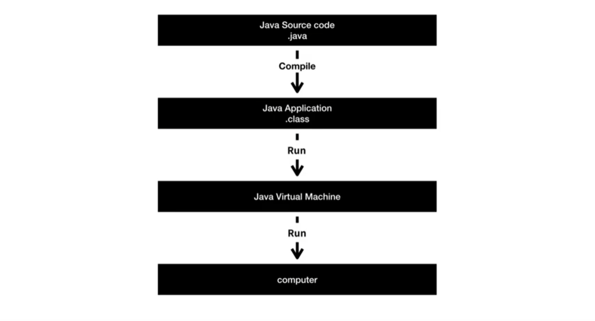

# 생활코딩 JAVA1 강의 수강 1 ~ 6.5
***
> ## JAVA1 - 4.2 Java의 동작원리

1. 사람이 이해할 수 있게 만들어진 컴퓨터 언어 JAVA로 소스 코드를 작성한다.(.java)

2. 확장자가 .java 파일을 이해할 수 있도록 전환하는 작업인 컴파일로 컴퓨터가 이해할 수 있는 언어로 변환한다.(.class)

3. Java Virtual Machine한테 클래스 파일을 실행하라고 시킨다.

4. Java Virtual Machine이 확장자가 클래스인 파일을 읽어서 거기에 적혀있는 대로 컴퓨터를 동작시키게 된다.

> ## JAVA1 - 6.2 데이터 타입

데이터의 타입을 구분하는 이유는 데이터의 타입별로 그 타입의 어울리는 연산 방법이 있기 때문에 엄격하게 구분을 한다.

우리가 컴퓨터를 다루는 방법에 어떤 스킬을 쌓아 간다는 것은 두 가지의 중요한 흐름을 가진다.
1. 내가 지금 하고 있는 시스템에는 어떤 종류의 데이터 타입들이 존재하는가를 알아가는 방향

2. 각각의 데이터 타입별로 어떤 연산 방법들이 존재하는가를 알아가는 방향

이것들을 통해서 우리가 컴퓨터로 할 수 있는 일의 가능성이 엄청나게 증가하게 된다.

> ## JAVA1 - 8.3 데이터 타입의 변환(casting)

숫자형 데이터 타입은 + - * / 로 사칙연산이 가능하고 복합적인 수학적인 작업이 필요할 경우 Math 클래스를 활용한다.
Math.PI = 3.141592....
Math.floor() = 소수점 내림
Math.ceil() = 소수점 올림
***
## 💡 틀렸거나 잘못된 정보가 있다면 망설임 없이 댓글로 알려주세요!
