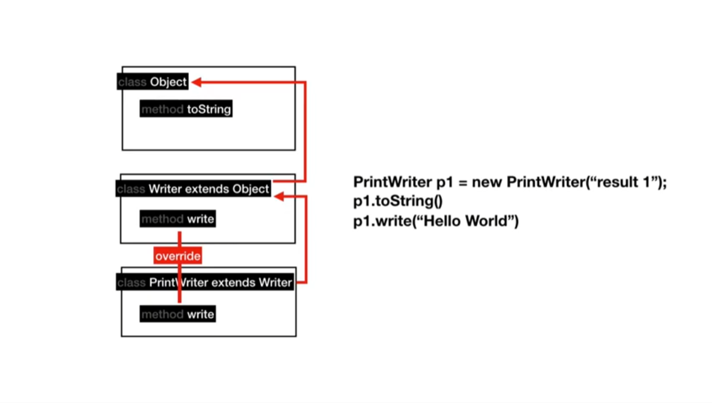

# ❗ TIL

## 생활코딩 JAVA1 강의 수강 12.1 ~ 13.5
***
>JAVA1 - 12.3 직접 컴파일하고 실행하기 : 컴파일과 실행하기

Windows 환경에서 명령 프롬프트를 이용한 컴파일과 실행하기

1. program.java 파일이 있는 디렉토리로 변경
명령어 : cd ~

2. program.java 파일을 컴파일하여 class 파일 만들기
명령어 : javac
예) javac program.java
명령어 dir로 .class 파일이 생긴 것을 확인할 수 있다.

3. 프로그램 실행하기
명령어 : java (=java virtual machine)
예) java program
program.class 파일을 찾아 실행 .class 파일의 main 안에 있는 코드를 실행한다.

>JAVA1 - 12.4 직접 컴파일하고 실행하기 : 라이브러리 이용

라이브러리 : 다른 사람이 사용할 수 있도록 잘 정리 정돈된 프로그램들

>JAVA1 - 13.1 자바 문서 보는 법 - API vs UI

API : 우리가 자바를 응용해서 프로그래밍적으로 실행되는 프로그램을 만들기 위해 사용해야 되는 조작 장치, 조작 방법

UI : 사용자가 우리가 만든 프로그램을 조작하기 위해서 사용하는 조작 장치

>JAVA1 - 13.2 자바 문서 보는 법 - 패키지, 클래스, 변수, 메소드

패키지 : 서로 연관된 비슷한 성격의 여러 개의 클래스들을 그룹핑해서 이름을 붙인 것

클래스 : 서로 연관된 변수와 메소드를 그룹핑하여 이름을 붙인 것

메소드 : 어떤 작업이 수행되도록 기능을 구현해 놓은 것

변수 : 어떤 값을 담아놓는 그릇

>JAVA1 - 13.4 자바 문서 보는 법 - 인스턴스

인스턴스는 하나의 클래스를 복제해서 서로 다른 데이터의 값과 서로 같은 메소드를 가진 복제본을 만드는 것이다.

>JAVA1 - 13.5 자바 문서 보는 법 - 상속

가장 기본적인 클래스인 오브젝트 클래스의 모든 클래스는 오브젝트 클래스를 반드시 상속을 받는다.

상속은 부모 클래스의 변수와 메소드를 자식 클래스가 그대로 이어받아 재사용할 수 있는 관계를 의미하고 부모 클래스의 메소드를 재정의(Overriding)하여 사용할 수 있다.

***
## 💡 틀렸거나 잘못된 정보가 있다면 망설임 없이 댓글로 알려주세요!

