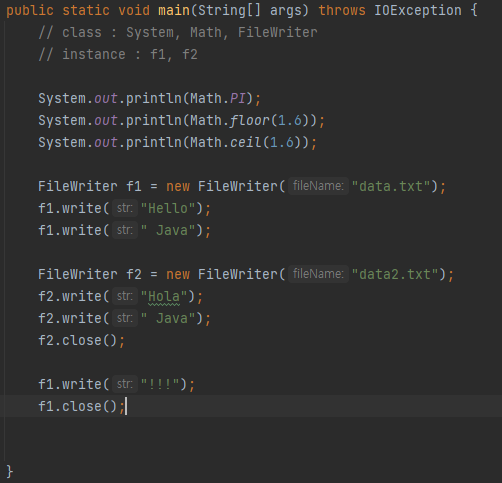
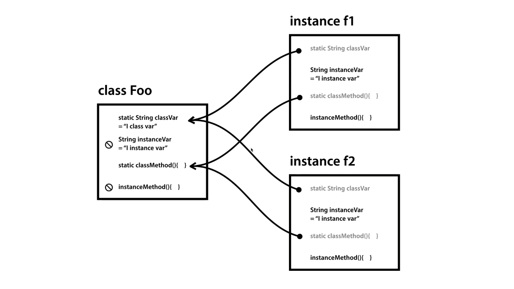

# ❗ 오늘의 TIL

## 생활코딩 JAVA 객체지향 프로그래밍 강의 수강 1 ~ 9 완강
***
>JAVA 객체지향 프로그래밍 - 1. 수업소개

method를 다른 컴퓨터 언어에서는 function, subroutine, procedural이라고 부른다.
한국어로는 절차 지향적 프로그래밍, 영어로는 procedural programming이라고 불리는 프로그래밍의 패러다임은 procedure 즉 자바에서는 메소드라고 불리는 것을 이용해서 프로그램을 정리 정돈하는 프로그래밍기법이라고 할 수 있다. 메소드를 이용해서 작은 부품을 만들고 이것을 결합해서 더 큰 프로그램을 만들어 가는 테크닉이 procedural programming이다.
대표적인 언어는 C이다. 클래스를 중심으로 프로그램의 구조를 만들어가는 컴퓨터 프로그래밍 방법론을 객체지향 프로그래밍, 또 이런 방법론을 언어 차원에서 제공하는 언어들을 객체지향 언어라고 한다.

>JAVA 객체지향 프로그래밍 - 2. 남의 클래스 & 남의 인스턴스

Math라는 클래스가 있고 그 안에는 PI라는 변수, floor, ceil과 같은 메소드들도 있다. 코드가 많아짐에 따라서 서로 연관된 같은 주제를 가지고 있는 변수와 메소드를 그룹핑한 껍데기가 클래스이다. 긴 맥락을 가지고 작업해야 하는 그러한 작업인 경우에는 우리가 클래스를 직접 사용하는 것이 아니라 클래스를 복제본으로 만들어서 제어한다.



```java
public static void main(String[] args) throws IOException {
        // class : System, Math, FileWriter
        // instance : f1, f2
         
        System.out.println(Math.PI);
        System.out.println(Math.floor(1.6));
        System.out.println(Math.ceil(1.6));
         
        FileWriter f1 = new FileWriter("data.txt");
        f1.write("Hello");
        f1.write(" Java");
         
         
        FileWriter f2 = new FileWriter("data2.txt");
        f2.write("Hola");
        f2.write(" Java");
        f2.close();
         
        f1.write("!!!");
        f1.close();
    }
```

>JAVA 객체지향 프로그래밍 - 4.2. 클래스 - 형식

하나의 파일 안에서 클래스를 여러 개 만들면 그 각각의 클래스가 파일로서 존재하게 된다.
하나의 거대한 자바 파일로 애플리케이션을 만들 수도 있지만, 그 기능에 따라 파일로 적당히 분산하여 소프트웨어를 만든다면 이거 또한 정리정돈의 효과를 가진다.

>JAVA 객체지향 프로그래밍 - 6. static

클래스를 통해서 직접 인스턴스 변수에 접근하는 건 금지되어 있다. 또 인스턴스 메소드에 접근하는 것도 금지되어 있다. 인스턴스는 클래스의 여러 가지 멤버들을 복제해 오는데 static이라는 키워드가 붙은 클래스 변수는 인스턴스에 실제 값이 존재하지 않고 클래스를 가리키고 있고 클래스에 static이라는 키워드가 없는 변수는 인스턴스 변수로 생성되면서 만약에 클래스의 값도 세팅되어 있다면 그 값까지 복제가 된다. 그리고 클래스에 있는 변수와 인스턴스에 있는 변수는 서로 링크 걸려 있지 않기 때문에 인스턴스에서 변수의 값은 바꾼다고 해도 클래스의 변수의 값은 바뀌지 않는다. 하지만 static이라는 키워드가 붙은 변수는 인스턴스에서 바꾸면 클래스에 있는 변수도 바뀌고 반대로 클래스에 있는 변수가 바뀌면 인스턴스에서도 변수가 바뀐다. 메소드도 마찬가지로 static이라는 키워드가 붙은 메소드는 클래스의 메소드를 참조하는 것이고 static이라는 키워드가 없는 메소드는 인스턴스가 메소드를 복제하여 서로 독립된 존재가 된다.(그림 참조)




```java
class Foo{
    public static String classVar = "I class var";
    public String instanceVar = "I instance var";
    public static void classMethod() {
        System.out.println(classVar); // OK
//      System.out.println(instanceVar); // Error
    }
    public void instanceMethod() {
        System.out.println(classVar); // OK
        System.out.println(instanceVar); // OK
    }
}
public class StaticApp {
    public static void main(String[] args) {
        System.out.println(Foo.classVar); // OK
//      System.out.println(Foo.instanceVar); // Error
        Foo.classMethod(); // OK
//      Foo.instanceMethod(); // Error
         
        Foo f1 = new Foo();
        Foo f2 = new Foo();
    
        System.out.println(f1.classVar); // I class var
        System.out.println(f1.instanceVar); // I instance var
     
        f1.classVar = "changed by f1";
        System.out.println(Foo.classVar); // changed by f1
        System.out.println(f2.classVar);  // changed by f1
    
        f1.instanceVar = "changed by f1";
        System.out.println(f1.instanceVar); // changed by f1
        System.out.println(f2.instanceVar); // I instance var
    }
 
}
```


* 중요 : 클래스의 변수를 바꾸면 모든 인스턴스에 변수의 값이 바뀐다. 또 인스턴스에서 클래스 변수를 바꿀 수도 있는데 그렇게 되면 클래스의 변수가 바뀌고 그 클래스 변수를 사용하고 있는 모든 인스턴스의 클래스 변수의 값도 바뀐다.
결론은 static은 클래스 소속, static이 없는 것은 인스턴스 소속이다.

>JAVA 객체지향 프로그래밍 - 7. 생성자와 this

인스턴스가 생성될 때 반드시 처리해야 할 어떠한 작업이 있을 것인데 바로 초기에 주입할 필요가 있는 값을 전달하거나 최초로 꼭 실행해야 할 작업을 수행하고 싶을 때 바로 생성자라는 것을 이용해서 문제를 해결할 수 있다. 생성자는 클래스의 이름과 똑같은 메소드를 정의하면 되고 static이나 return 데이터 타입 등은 지정하지 않는다. this라는 특수한 키워드는 그 클래스가 인스턴스화 되었을 때의 인스턴스를 가리키는 이름이다.

>JAVA 객체지향 프로그래밍 - 9. 수업을 마치며

차후에 공부해야 할 주제 : 상속(Inheritance), 인터페이스(Interface), 패키지(Package)

***
## 💡 틀렸거나 잘못된 정보가 있다면 망설임 없이 댓글로 알려주세요!

