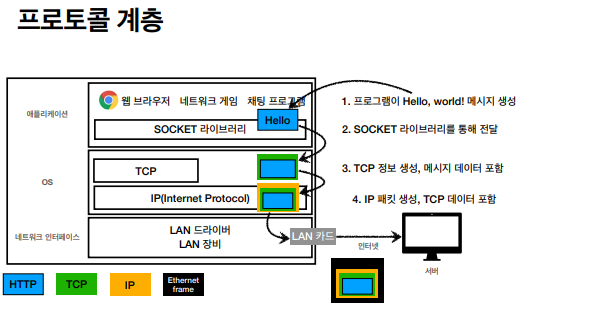

# ❗ TIL

## 모든 개발자를 위한 웹 기본지식 수강
***
>인터넷 네트워크 - 1. 인터넷 통신

인터넷에서 실질적인 최종 통신은 두 프로세스 사이의 데이터 전달이다.

>인터넷 네트워크 - 2. IP(인터넷 프로토콜)

IP 역할
* 지정한 IP 주소(IP Address)에 데이터 전달
* 패킷(Packet)이라는 통신 단위로 데이터 전달

IP 패킷의 정보(규칙)

IP 프로토콜의 한계
* 비연결성 : 패킷을 받을 대상이 없거나 서비스 불능 상태여도 패킷 전송한다.

* 비신뢰성 : 패킷 전달 과정에서 자료 손실과 패킷 전달 순서 같은 문제도 발생할 수 있다.(패킷이 용량이 클 때[1500byte 이상 보통 나누어서 보냄] 패킷들이 중간에 다른 노드로 탈수 있음)

* 프로그램 구분 : 같은 IP를 사용하는 서버에서 통신하는 애플리케이션들을 구분할 수 없다.

위 문제점은 TCP로 해결 가능하다.

>인터넷 네트워크 - 3. TCP, UDP

IP에 TCP를 올려서 보완해주는 역할

IP 정보 > TCP 정보 > 메시지 정보

이더넷 프레임 : 맥 주소(물리적인 정보)

패킷 : 패키지 + 버킷 합성어

TCP 특징
* 연결 지향 - 먼저 연결을 하고 메시지 보낸다.
* 데이터 전달 보증 - 내가 메시지를 보냈는데 패킷이 중간에 누락이 됐을 때 메시지 전송이 실패한 걸 내가 알 수 있다.
* 순서 보장 
* 신뢰할 수 있는 프로토콜
* 대부분 애플리케이션에서 TCP 사용한다.

* 클라이언트, 서버 둘 다  서로 신뢰할 수 있다.
* 논리적 연결(전용 랜선이 보장 된 것이 아니다.)

UDP 특징
* IP에서 PORT(패킷 구분)와 체크섬(메시지를 검증해주는 데이터) 정도만 추가된 정도이다.
* 연결지향  - TCP 3 way handshake X
* 데이터 전달 및 순서가 보장되지 않지만, 단순하고 빠르다
* 최근에 각광받고 있다.
    * 왜? 최근 HTTP/3 스펙이 나왔는데 TCP의 3 way handshake와 데이터, 기본적인 메커니즘의 자체가 속도가 빠른 매커니즘이 아니기 때문에 UDP로 최적화를 해보자고 시도 중이기 때문이다.(*TODO : HTTP/3에 대해 찾아보기*)

>인터넷 네트워크 - 4. PORT

PORT는 같은 IP 내에서 프로세스를 구분할 때 사용한다.

비유적으로 IP는 아파트 PORT는 101동 104호로 생각하면 된다.

PORT 특징
* 0 ~ 65535 사이의 번호를 할당 가능하다.
* 0 ~ 1023 까지의 번호는 잘 알려진 포트로 사용하지 않는 것이 좋다.
    * FTP - 20(데이터 포트), 21(제어 포트)
    * TELNET - 23
    * HTTP - 80
    * HTTPS - 443

>인터넷 네트워크 - 5. DNS

DNS(Domain Name System) : IP는 숫자로 구성되어 있어서 사람이 기억하기 어렵고, 변경될 수 있어서 IP주소를 문자로 이름을 붙인다.

>정리

복잡한 인터넷망에 메시지를 보내기 위해서 인터넷 프로토콜이라는 IP가 필요하다.
인터넷 프로토콜만 가지고는 메시지가 잘 도착했는지 신뢰하기 어렵고 PORT라는 개념이 없다. 이러한 문제를 TCP가 해결해준다. UDP는 IP에서 PORT만 추가, 필요하면 위에 애플리케이션으로 기능을 확장할 수 있다. PORT는 같은 IP 안에서 통신하는 애플리케이션을 구분하기 위해서 사용한다. DNS는 IP가 외우기 어렵고 변경될 수 있기 때문에 도메인명을 등록해서 사용할 수 있도록 도와준다.

### 사진 출처 : [모든 개발자를 위한 HTTP 웹 기본지식](https://www.inflearn.com/course/http-%EC%9B%B9-%EB%84%A4%ED%8A%B8%EC%9B%8C%ED%81%AC)

***
## 💡 틀렸거나 잘못된 정보가 있다면 망설임 없이 댓글로 알려주세요!

