# [모든 개발자를 위한 HTTP 웹 기본지식](https://www.inflearn.com/course/http-%EC%9B%B9-%EB%84%A4%ED%8A%B8%EC%9B%8C%ED%81%AC) 수강
***
> ## URI와 웹 브라우저 요청 흐름 - URI

### URI(Uniform Resource Identifier)
* Uniform : 리소스 식별하는 통일된 방식
* Resource : 자원, URI로 식별할 수 있는 모든 것(제한 없음)
    * 자원 : 웹브라우저의 HTML파일 같은 것뿐만 아니라 실시간 교통 정보 등 우리가 구분할 수 있는 모든것
* Identifier : 다른 항목과 구분하는데 필요한 정보

* URI는 로케이터(locator), 이름 또는 둘 다 추가로 분류될 수 있다.
    * 참조 : https://www.ietf.org/rfc/rfc3986.txt

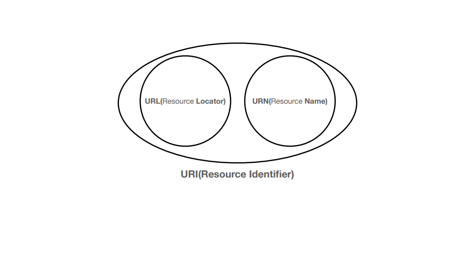
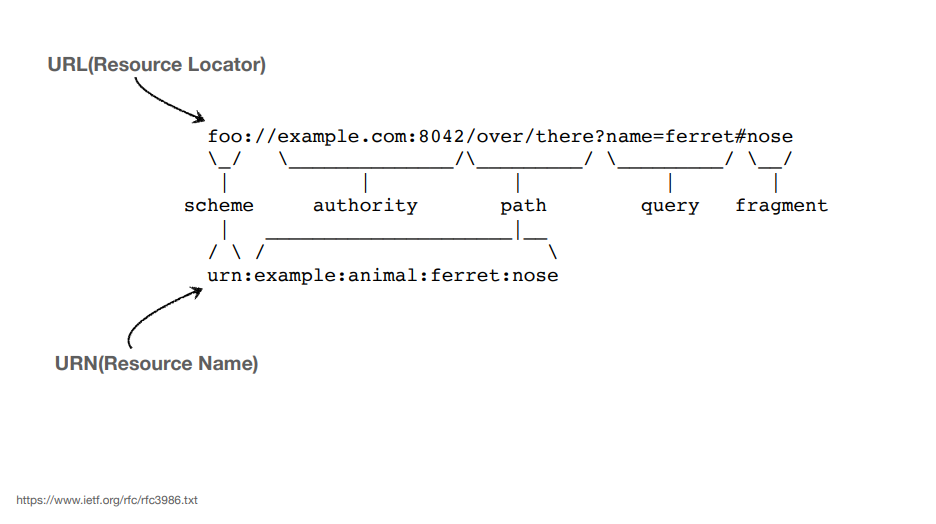

### URL, URN 뜻
* URL(Uniform Resource Locator)
    * Locator : 리소스가 있는 위치를 지정
* URN(Uniform Resource Name)
    * Name : 리소스에 이름을 부여
* 위치는 변할 수 있지만, 이름은 변하지 않는다.
* URN 이름만으로 실제 리소스를 찾을 수 있는 방법이 보편화 되지 않았다.

### URL 전체 문법
* scheme://[userinfo@]host[:port][/path][?query][#fragment]
* https://www.google.com:433/search?q=hello&hl=ko

    * scheme
        * 주로 프로토콜 사용한다.
        * 프로토콜 : 어떤 방식으로 자원에 접근 한 것인가 하는 클라이언트와 서버 간의 약속(예 : http, https, ftp 등등)
        * http는 80 포트, http는 443 포트를 주로 사용한다. 포트는 생략 가능하다.
        * https는 http에 보안을 추가한 프로토콜이다.(HTTP Secure)
    * userinfo
        * URL에 사용자정보를 포함해서 인증한다.
        * 거의 사용하지 않는다.
    * host
        * 호스트명
        * 도메인명 또는 IP 주소를 직접 사용가능하다.
    * port
        * 접속 포트
        * 일반적으로 생략한다. 생략시 http는 80, https는 443 
        * 단, 특정서버에 따러 접근할 때 입력하기도 한다.
    * path
        * 리소스 경로(path), 계층적 구조이다.
        * 예 : /home/file1.jpg
    * query
        * key = value 형태
        * ?로 시작, &로 추가 가능(?keyA=valueA&keyB=valueB)
        * query parameter, query string 등으로 불림, 웹 서버에 제공하는 파라미터, 문자 형태이다.
    * fragment
        * html 내부 북마크 등에 사용한다.
        * 서버에 전송하는 정보는 아니다.
> ## URI와 웹 브라우저 요청 흐름 - 웹 브라우저 요청 흐름

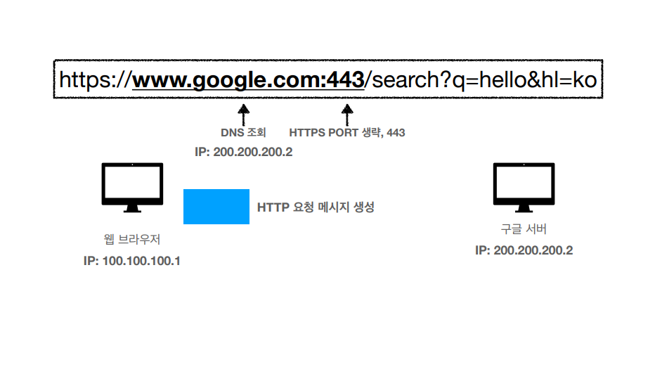

1. 구글 서버 찾기 위해 DNS 조회
2. PORT 조회
3. HTTP 요청 메시지 생성

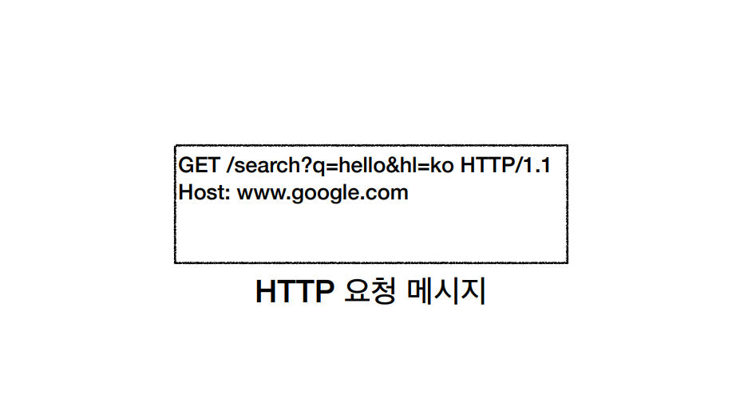

* GET 명령어, 쿼리 정보, HTTP 버전 정보, HOST 정보

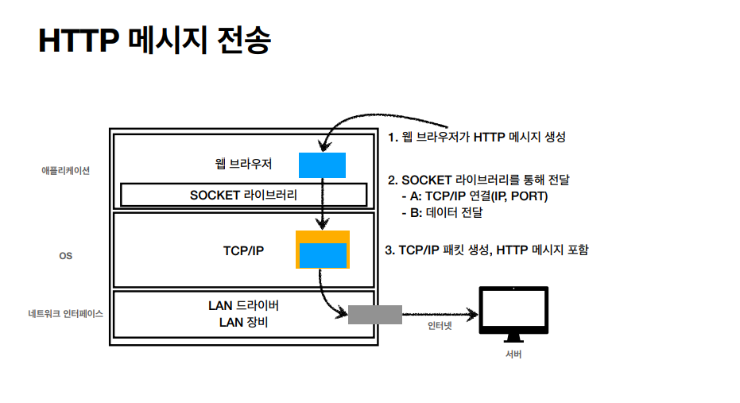

1. 웹 브라우저가 HTTP 메시지 생성

2. SOCKET 라이브러리를 통해 전달
    1. TCP/IP 연결(TCP 3 way handshake)
    2. 데이터 전달
3. HTTP 메시지를 포함한 TCP/IP 패킷 생성

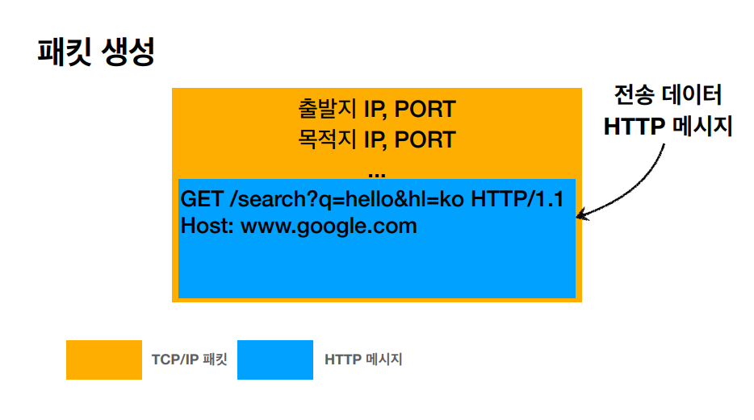

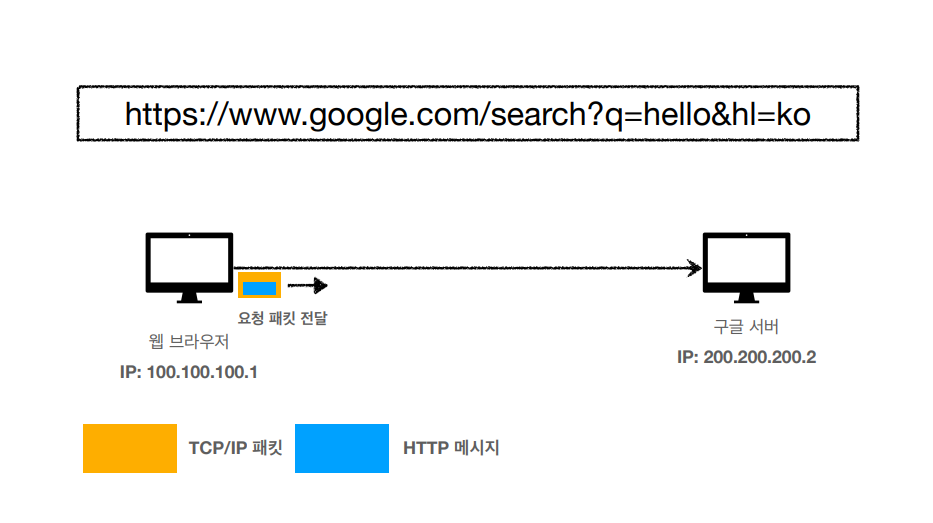

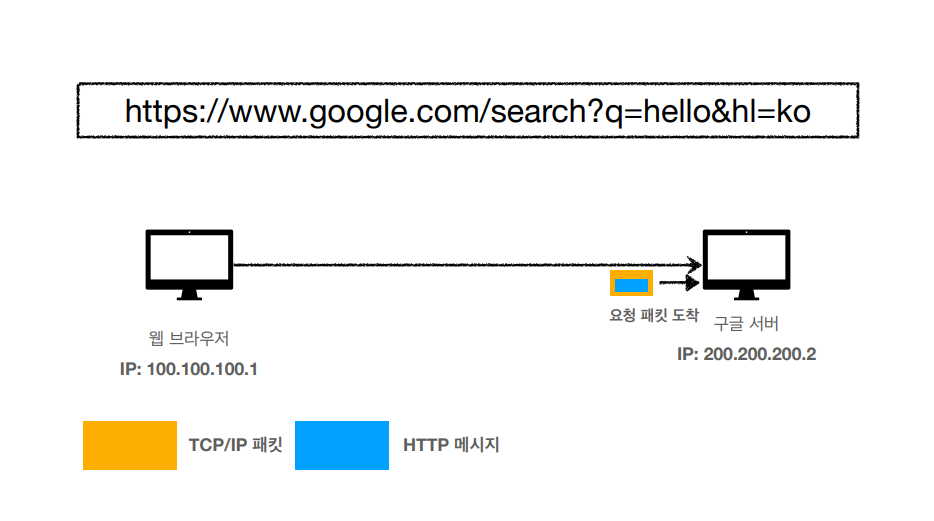

 * TCP/IP 패킷을 버리고 HTTP 메시지 해석
 * 메시지에 요청하는 데이터를 찾음.

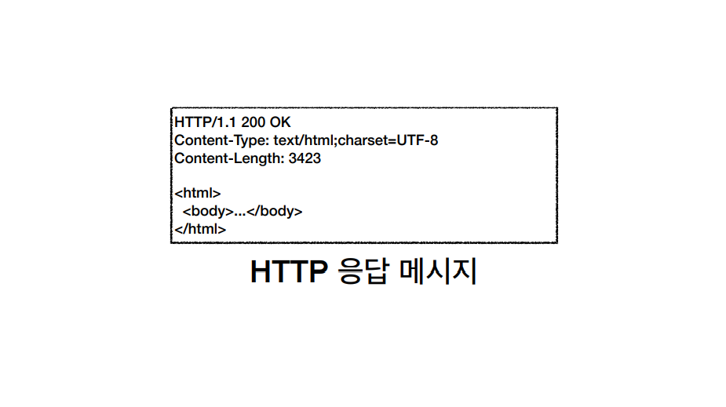

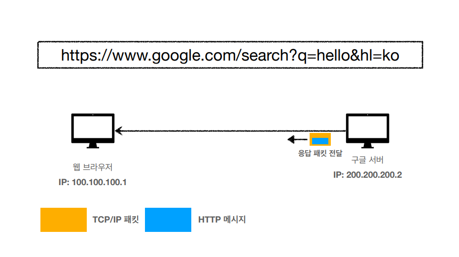

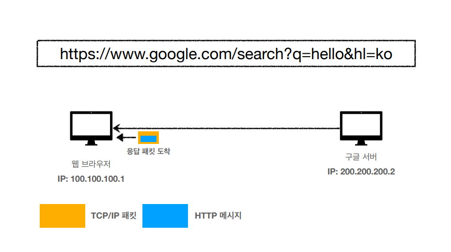

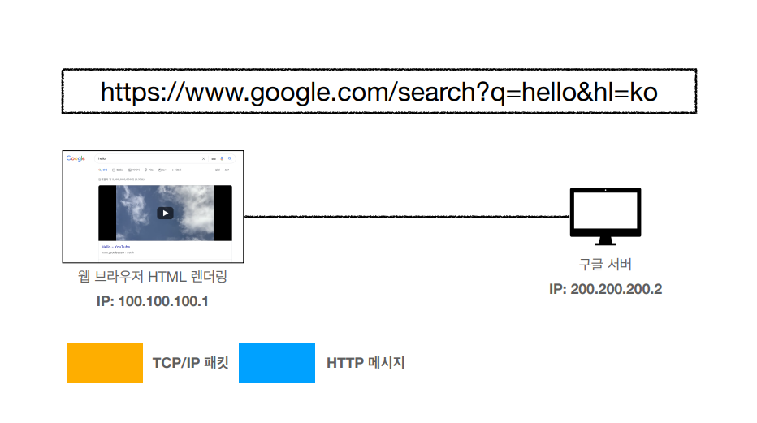

***
## 💡 틀렸거나 잘못된 정보가 있다면 망설임 없이 댓글로 알려주세요!

