# [모든 개발자를 위한 HTTP 웹 기본지식](https://www.inflearn.com/course/http-%EC%9B%B9-%EB%84%A4%ED%8A%B8%EC%9B%8C%ED%81%AC) 수강
***
> ## HTTP 기본 - 모든 것이 HTTP

### HTTP(HyperText Transfer Protocol)
* HTML, TEXT
* IMAGE, 음성, 영상, 파일
* JSON, XML (API)
* 거의 모든 형태의 데이터 전송 가능
* 서버 간에 데이터를 주고받을 때도 대부분 HTTP 사용
    * 실무에서 서버 간의 통신할 때 TCP 프로토콜을 직접 이용해서 데이터 전송 하는 경우는 드물다(게임 서버, 특수한 경우)
    * 모바일 게임 같은 경우 HTTP 통신하는 구조로 개발 많이 함.

### HTTP 역사
* HTTP/0.9(1991) : GET 메서드만 지원, HTTP 헤더 없음
* HTTP/1.0(1996) : 메서드, 헤더 추가
* HTTP/1.1(1997) : 가장 많이 사용
    * RFC2068(1997) -> RFC2616(1999) -> RFC7230~7235(2014)
    * HTTP/1.1에 대부분의 기능이 담겨 있음.
* HTTP/2(2015) : 성능 개선
* HTTP/3(진행 중) : TCP 대신에 UDP 사용, 성능 개선

### 기반 프로토콜
* TCP : HTTP/1.1, HTTP/2
* UDP : HTTP/3
* 현재 HTTP/1.1 주로 사용
    * HTTP/2, HTTP/3도 점점 증가

### HTTP 특징
* 클라이언트 서버 구조
* 무상태 프로토콜(Stateless), 비연결성
* HTTP 메시지로 통신
* 단순함, 확장 가능

> ## HTTP 기본 - 클라이언트 서버 구조

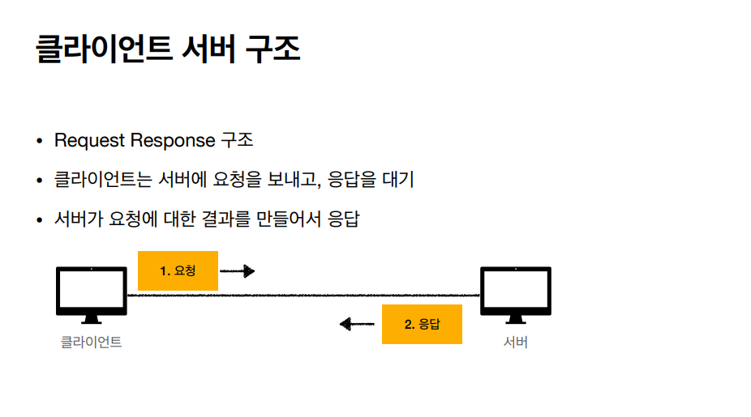

오래전에는 서버와 클라이언트가 분리되어 있지 않았는데 이후에 클라이언트와 서버를 개념적으로 분리

* 비즈니스 로직과 데이터는 서버로 집중
* UI, 사용성을 클라이언트로 집중

장점 : 클라이언트와 서버를 독립적으로 분리하여 진화한다.

> ## HTTP 기본 - Stateful, Stateless

### 무상태 프로토콜(Stateless)
* 서버가 클라이언트의 상태를 보존하지 않는다.
* 장점 : 서버 확장성이 높음(스케일 아웃)
* 단점 : 클라이언트가 추가 데이터 전송(*데이터를 많이 보냄*)

### Stateful, Stateless 차이
* Stateful(상태 유지)
    * 고객 : 이 티셔츠 얼마인가요?
    * 점원 : 만원입니다. (*티셔츠 상태 유지*)
    * 고객 : 2개 구매하겠습니다.
    * 점원 : 2만 원 입니다. 신용카드, 현금 중에 어떤 걸로 구매하시겠어요? (*티셔츠, 2개 상태 유지*)
    * 고객 : 신용카드로 구매하겠습니다.
    * 점원 : 2만 원 결제 완료되었습니다. (*티셔츠, 2개, 신용카드 상태 유지*)
* Stateless(무상태)
    * 고객 : 이 티셔츠 얼마인가요?
    * 점원**A** : 만원입니다.
    * 고객 : 티셔츠 2개 구매하겠습니다.
    * 점원**B** : 티셔츠 2개는 2만 원 입니다. 신용카드 현금 중에 어떤 걸로 구매하시겠어요?
    * 고객 : 티셔츠 2개를 신용카드로 구매하겠습니다.
    * 점원**C** : 2만 원 결제 완료되었습니다.
* 정리
    * **상태 유지** : 중간에 다른 점원으로 바뀌면 안 된다. (중간에 다른 점원으로 바뀔 때 상태 정보를 다른 점원에게 미리 알려줘야 한다.) - *쉽지 않음*
    * **무상태** : 중간에 다른 점원으로 바뀌어도 된다.
        * 갑자기 고객이 증가해도 점원을 대거 투입할 수 있다.
        * 갑자기 클라이언트 요청이 증가해도 서버를 대거 투입할 수 있다.
    * 무상태는 응답 서버를 쉽게 바꿀 수 있다. -> **무한한 서버 증설 가능**
        * 클라이언트, 서버 아키텍처는 엄청난 확장성을 가진다.

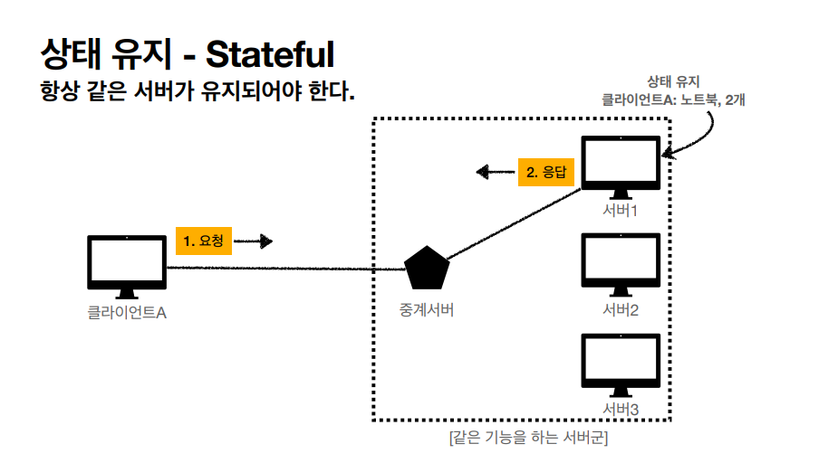

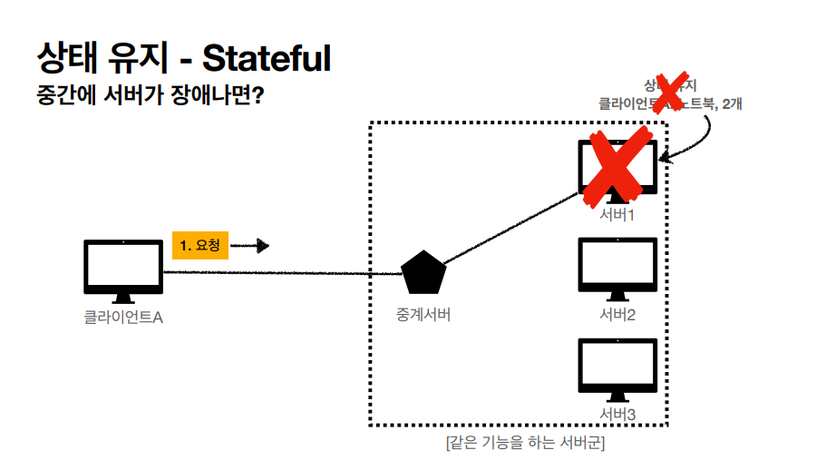

* 중간에 서버가 장애가 나면 다시 상태를 보내야 한다.

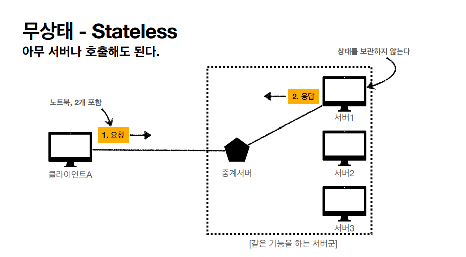

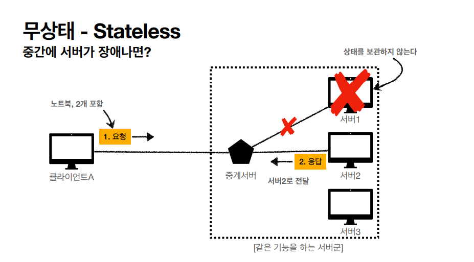

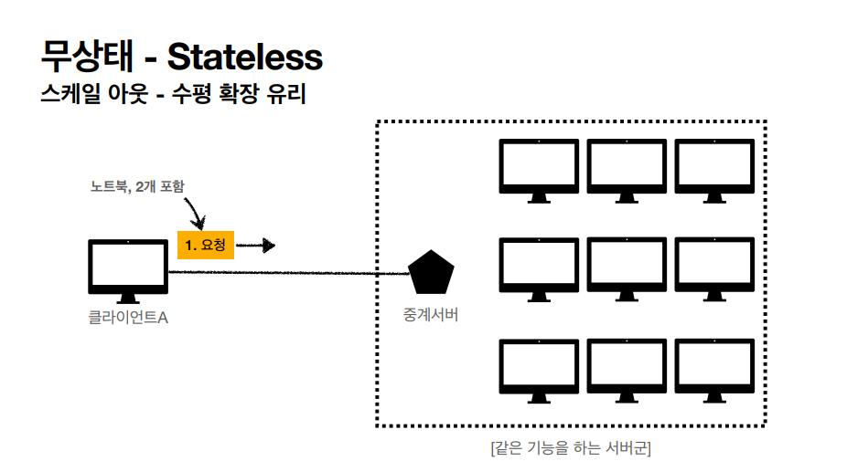

### Stateless의 실무 한계
* 모든 것을 무상태로 설계할 수 있는 경우도 있고 없는 경우도 있다.
* 무상태 : 예) 로그인이 필요 없는 단순한 서비스 소개 화면
* 상태 유지 : 예) 로그인
* 로그인한 사용자의 경우 로그인했다는 상태를 서버에 유지, 일반적으로 브라우저 쿠키와 서버 세션들을 사용해서 상태 유지
* 상태 유지는 최소한만 사용
* 정리 
    * 웹 애플리케이션을 설계할 때는 최대한 무상태로 설계한다. 어쩔 수 없는 상황에서만 상태 유지를 한다.

> ## HTTP 기본 - 비 연결성(connectionless)

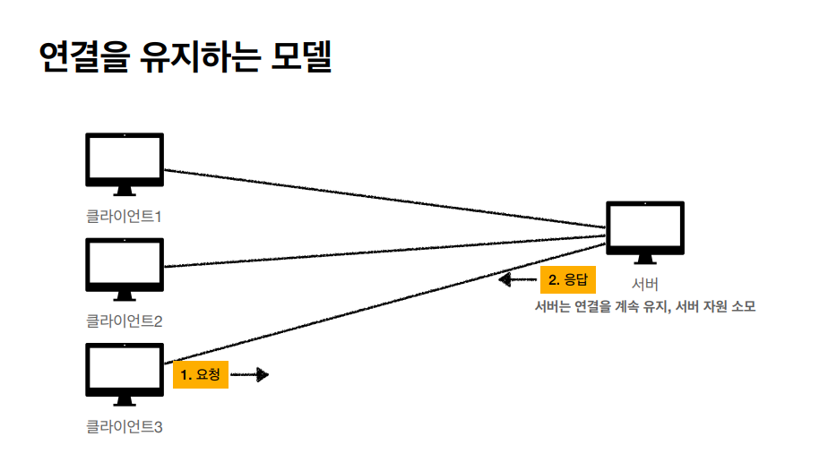

* 단점 : 클라이언트가 놀고 있어도 서버 연결을 계속 유지해야 한다.

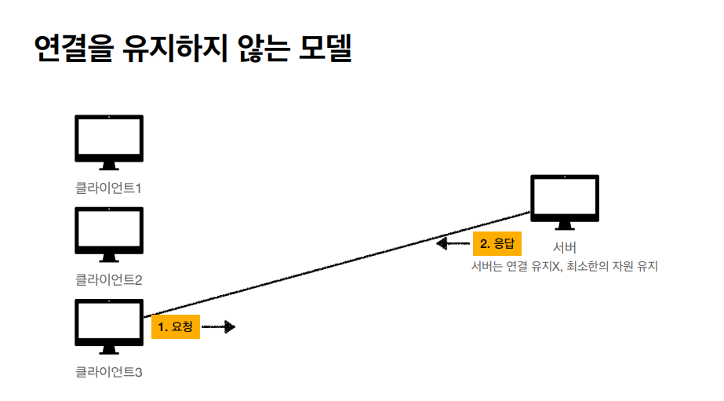

* 장점 : 자원을 현재 요청을 주고받을 때만 연결한다.

### 비 연결성
* HTTP는 기본적으로 연결을 유지하지 않는 모델
* 일반적으로 초 단위의 이하의 빠른 속도로 응답
* 1시간 동안 수천 명이 서비스를 사용해도 실제 서버에 동시에 처리하는 요청은 수십 개 이하로 매우 작다.
    * 예) 웹 브라우저에서 계속 연속해서 검색 버튼을 누르지는 않는다.
* 서버 자원을 매우 효율적으로 사용할 수 있다.

### 비 연결성의 한계와 극복
* 한계
    * TCP/IP 연결을 계속 새로 맺어야 함 - 3 way handshake 시간 추가
    * 웹 브라우저로 사이트를 요청하면 HTML뿐만 아니라 자바스크립트, CSS, 이미지 등 수 많은 자원이 함께 다운로드된다.
* 극복
    * 현재는 HTTP 지속 연결(Persistent Connections)로 문제 해결
    * HTTP/2, HTTP/3에서 더 많은 최적화

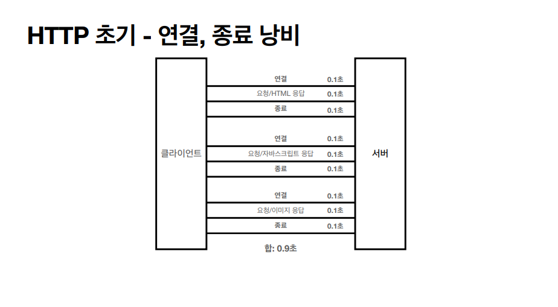

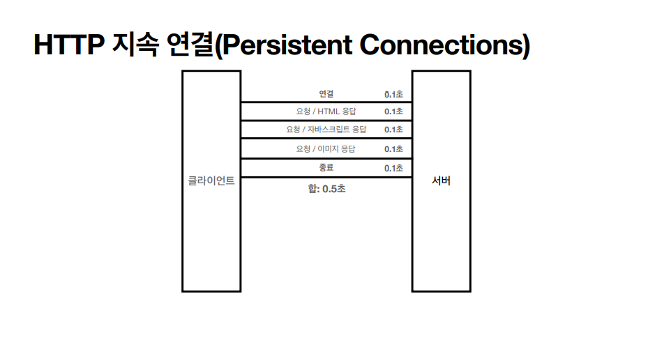

### Stateless를 기억하자!! - 서버 개발자들이 어려워하는 업무
* 같은 시간에 딱 맞추어 발생하는 대용량 트래픽
    * 예) 수강 신청, 선착순 이벤트, 명절 기차 예매
    * 예시 해결) 높은 트래픽이 예상될 경우에 정적 페이지를 첫 페이지로 설정하여 트래픽 분산을 유도한다.

> ## HTTP 기본 - HTTP 메시지

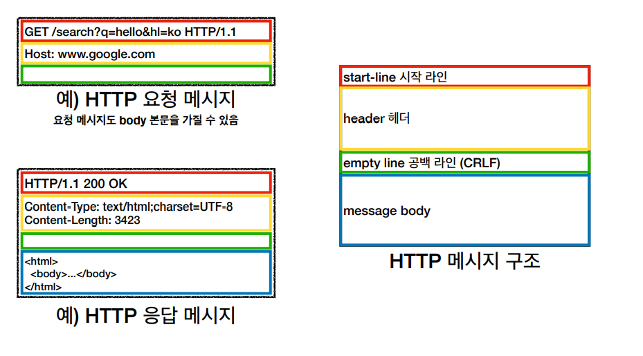

* 공백 라인 무조건 존재해야 한다.

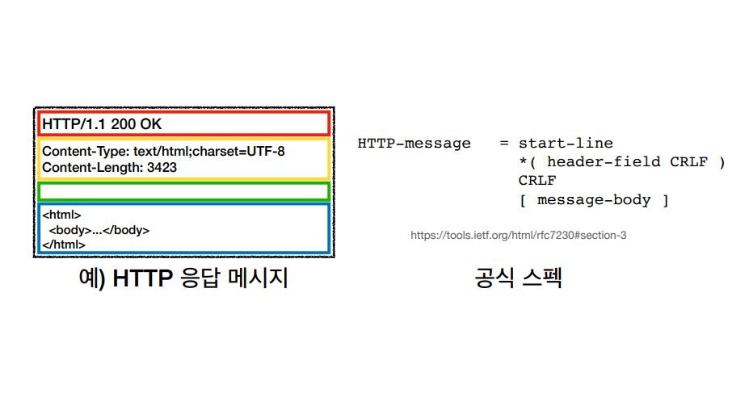

### 시작라인 - 요청 메시지
* start-line = **request-line** / status-line
* request-line = method[공백]request-target[공백]HTTP-version[CRLF(엔터)]
* 예) 요청 메시지 = **GET /search?q=hello&hl=ko HTTP/1.1**
* HTTP 메서드 (**GET** : 조회)
    * 종류 : GET, POST, PUT, DELETE...
    * 서버가 수행해야 할 동작 지정
        * GET : 리소스 조회
        * POST : 요청 내역 처리
* 요청 대상 (**/search?q=hello&hl=ko**)
    * absolute-path[?query] (절대 경로[?쿼리])
    * 절대 경로 = "/"로 시작하는 경로
    * 참고 : *, http://...?x=y 와 같이 다른 유형의 경로지정 방법도 있다.
* HTTP Version (**HTTP/1.1**)

### 시작라인 - 응답 메시지
* start-line = request-line / **status-line**
* status-line = HTTP-version[공백]status-code[공백]reason-phrase[CRLF(엔터)]
* 예) 응답 메시지 = **HTTP/1.1 200 OK**
* HTTP Version (**HTTP/1.1**)
* HTTP 상태 코드 : 요청 성공, 실패를 나타냄
    * 200 : 성공
    * 400 : 클라이언트 요청 오류
    * 500 : 서버 내부 오류
* 이유 문구 : 사람이 이해할 수 있는 짧은 상태 코드 설명 글

### HTTP 헤더
* header-field = field-name":"[OWS(띄어쓰기 허용)]field-value[OWS]
    * 주의!! - ":" 앞에 공백이 있으면 안 된다.
* 예) Host: www.google.com
* 예) Content-Type: text/html;charset=UTF-8
* 예) Content-Length: 3423
* field-name은 대소문자 구문 없음

### HTTP 헤더 용도
* HTTP 전송에 필요한 모든 부가정보(*메시지 바디를 제외한 모든 메타 데이터 정보가 들어가 있다.*)
    * 예) 메시지 바디의 내용, 메시지 바디의 크기, 압축, 인증, 요청 클라이언트(브라우저) 정보, 서버 애플리케이션 정보, 캐시 관리 정보...
* 표준 헤더가 너무 많다
    * 참조 : https://en.wikipedia.org/wiki/List_of_HTTP_header_fields
* 필요하면 임의의 헤더 추가 가능
    * helloworld: hihi

### HTTP 메시지 바디 용도
* 실제 전송할 데이터
* HTML 문서, 이미지, 영상, JSON 등등 byte로 표현할 수 있는 모든 데이터 전송 가능

### HTTP 결론 : 단순함, 확장 가능
* HTTP는 단순하다.
* HTTP 메시지도 매우 단순
* 크게 성공하는 표준 기술은 단순하지만, 확장 가능한 기술이다.

***
## 💡 틀렸거나 잘못된 정보가 있다면 망설임 없이 댓글로 알려주세요!

