# [모든 개발자를 위한 HTTP 웹 기본지식](https://www.inflearn.com/course/http-%EC%9B%B9-%EB%84%A4%ED%8A%B8%EC%9B%8C%ED%81%AC) 수강
***
> ## HTTP 메서드 - HTTP API를 만들어보자

### API URI 설계
* 회원 목록 조회 /read-member-list
* 회원 조회 /read-member-by id
* 회원 등록 /create-member
* 회원 수정 /update-member
* 회원 삭제 /delete-member

-> 이것은 좋은 URI 설계인가? 가장 중요한 것은 **리소스 식별**

### API URI 고민
* 리소스의 의미는 뭔가?
    * 회원을 등록하고 수정하고 조회하는 것이 리소스가 아니다!
    * 예) 미네랄을 캐라 -> 미네랄이 리소스
    * **회원이라는 개념 자체가 바로 리소스다.**
* 리소스를 어떻게 식별하는 것이 좋을까?
    * 회원을 등록하고 수정하고 조회하는 것은 모두 배제
    * **회원이라는 리소스만 식별하면 된다. -> 회원 리소스를 URI에 매핑**

### API URI 설계 - 리소스 식별, URI 계층 구조 활용
* 회원 목록 조회 /members
* 회원 조회 /members/{id} -> 어떻게 구분하지?
* 회원 등록 /members/{id} -> 어떻게 구분하지?
* 회원 수정 /members/{id} -> 어떻게 구분하지?
* 회원 삭제 /members/{id} -> 어떻게 구분하지?
* 참고 : 계층 구조상 상위를 컬렉션으로 보고 복수단어 사용 권장(member->members)

### 리소스와 행위를 분리 - 가장 중요한 것은 리소스를 식별하는 것
* URI는 리소스만 식별!
* 리소스와 해당 리소스를 대상으로 하는 행위를 분리
    * 리소스 : 회원
    * 행위 : 조회, 등록, 삭제, 변경
* 리소스는 명사, 행위는 동사 (미네랄을 캐라)
* 행위(메서드)는 어떻게 구분? **해답은 HTTP 메서드**

> ## HTTP 메서드 - HTTP 메서드 - GET, POST

HTTP 메서드는 클라이언트가 서버에 무엇인가를 요청할 때 기대하는 행동

### HTTP 메서드 종류 - 주요 메서드
* GET : 리소스 조회
* POST : 요청 데이터 처리, 주로 등록에 사용
* PUT : 클라이언트에서 서버로 리소스를 보낼 때 리소스를 대체, 해당 리소스가 없으면 생성(*폴더에서 파일을 넣을 때 파일이 없으면 생성, 있으면 덮어쓰기 하는 것처럼 생각하면 된다*)
* PATCH : 리소스 부분 변경(*특정 필드를 바꿀 때 사용*)
* DELETE : 리소스 삭제

### 메서드 종류 - 기타 메서드
* HEAD : GET과 동일하지만 메시지 부분을 제외하고, 상태 줄과 헤더만 반환한다.
* OPTIONS : 대상 리소스에 대한 통신 가능 옵션(메서드)를 설명 (주로 CORS에서 사용)
* CONNECT : 대상 자원으로 식별되는 서버에 대한 터널을 설정
* TRACE : 대상 리소스에 대한 경로를 따라 메시지 루프백 테스트를 수행

### GET
* 리소스 조회
* 서버에 전달하고 싶은 데이터는 query(쿼리 파라미터, 쿼리 스트링)를 통해서 전달
* 메시지 바디를 사용해서 데이터를 전달할 수 있지만, 지원하지 않는 곳이 많아서 권장하지 않는다.

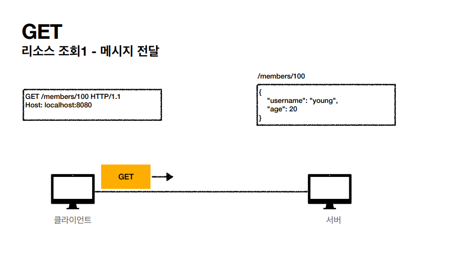
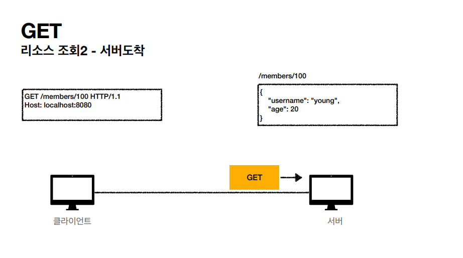
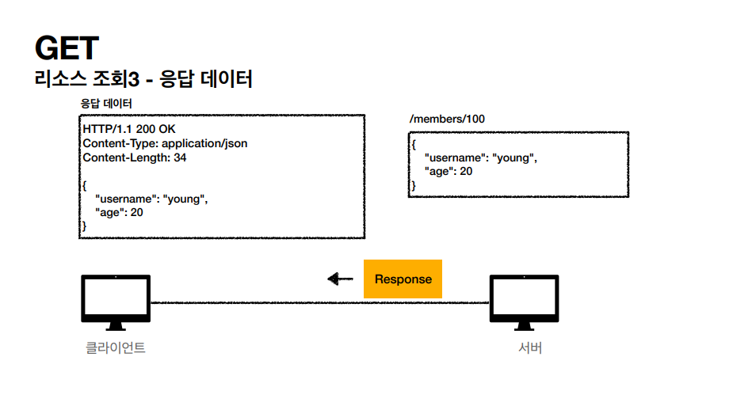

### POST
* 요청 데이터 처리
* **메시지 바디를 통해 서버로 요청 데이터 전달**
* 서버는 요청 데이터를 처리
    * 메시지 바디를 통해 들어온 데이터를 처리하는 모든 기능을 수행한다.
* 주로 전달된 데이터로 신규 리소스 등록, 프로세스 처리에 사용

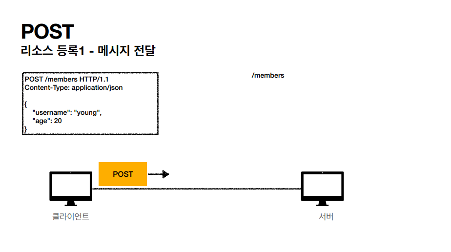
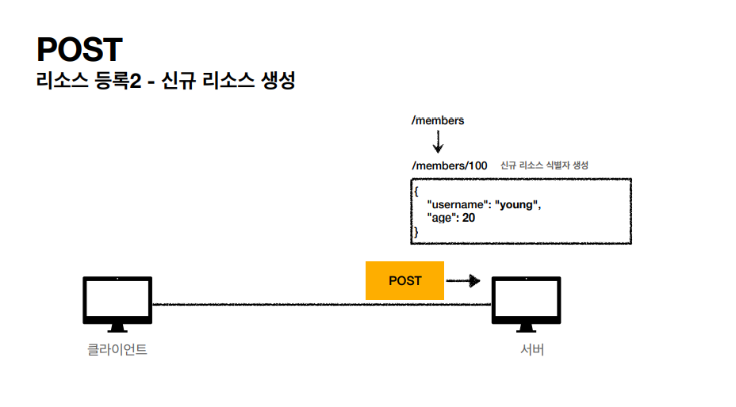

* 201로 보낼 때 location이라는 자원이 생성된 경로를 보내준다.

### POST - 요청 데이터를 어떻게 처리한다는 뜻일까? 예시
* 스펙 : POST 메서드는 대상 리소스가 리소스의 고유한 의미 체계에 따라 요청에 포함된 표현을 처리하도록 요청합니다.
* 예를 들어 POST는 다음과 같은 기능에 사용됩니다.
    * HTML 양식에 입력된 필드와 같은 데이터 블록을 데이터 처리 프로세스에 제공
        * 예) HTML FORM에 입력한 정보로 회원 가입, 주문 등에서 사용
    * 게시판, 뉴스 그룹, 메일링 리스트, 블로그 또는 유사한 기사 그룹에 메시지 게시
        * 예) 게시판 글쓰기, 댓글 달기
    * 서버가 아직 식별하지 않은 새 리소스 생성
        * 예) 신규 주문 생성
    * 기존 자원에 데이터 추가
        * 예) 한 문서 끝에 내용 추가하기
* **정리 : 이 리소스 URI에 POST 요청이 오면 요청 데이터를 어떻게 처리할지 리소스마다 따로 정해야 한다 -> 정해진 것이 없음**

### POST 정리
1. 새 리소스 생성(등록)
    * 서버가 아직 식별하지 않은 새 리소스 생성
2. **요청 데이터 처리 - 중요!!!**
    * 단순히 데이터를 생성하거나, 변경하는 것을 넘어서 프로세스를 처리해야 하는 경우
        * 예) 주문에서 결제 완료 -> 배달 시작 -> 배달 완료처럼 단순히 값 변경을 넘어 프로세스의 상태가 변경되는 경우
    * POST의 결과로 새로운 리소스가 생성되지 않을 수도 있음
        * 예) POST /order/{orderld}/start-delivery (컨트롤 URI(*실무에선 리소스만 가지고 URI를 설계할 수 없다. 리소스로 최대한 URI를 설계하고 어쩔 수 없는 부분은 컨트롤 URI로 설계한다.*))
3. 다른 메서드로 처리하기 애매한 경우
* 예) JSON으로 조회 데이터를 넘겨야 하는데, GET 메서드를 사용하기 어려운 경우 -> POST의 메시지 바디에 조회용 데이터를 넘기면 된다.
* 애매하면 POST 사용

> ## HTTP 메서드 - HTTP 메서드 - PUT, PATCH, DELETE

### PUT
* 리소스를 대체
    * 리소스가 있으면 완전히 대체
    * 리소스가 없으면 생성
    * 쉽게 이야기해서 덮어버림
* **중요!!! 클라이언트가 리소스를 식별**
    * 클라이언트가 리소스 위치를 알고 URI 지정
    * POST와의 큰 차이점

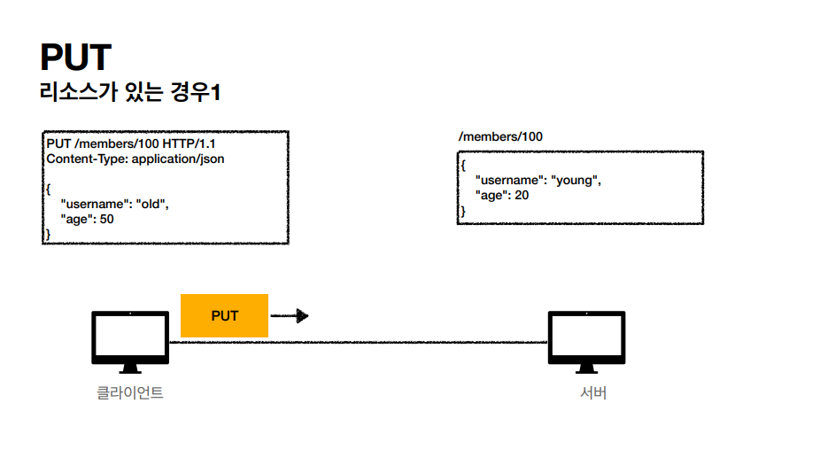
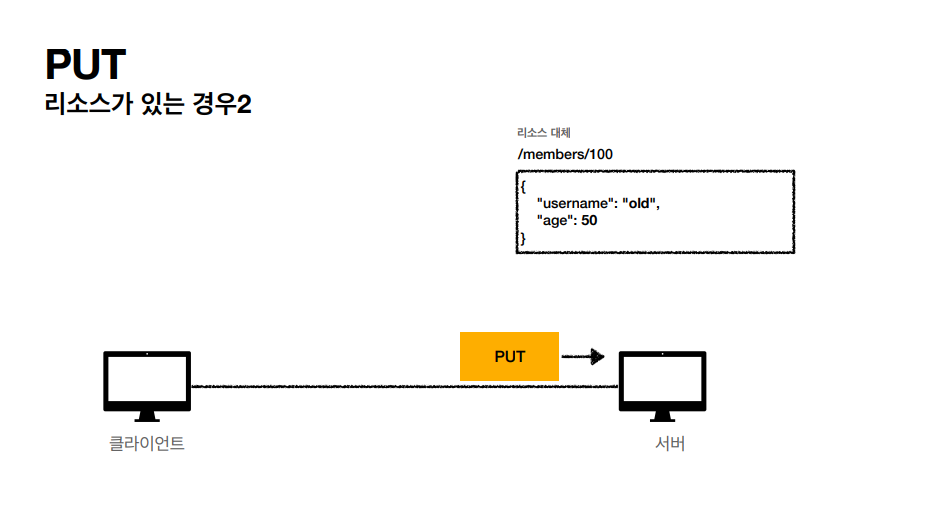
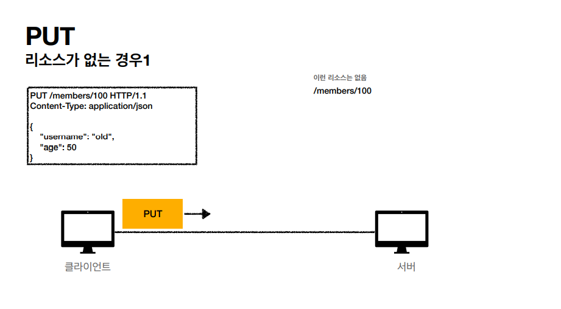

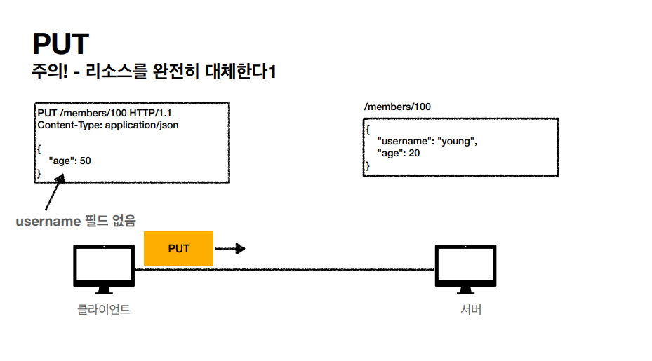
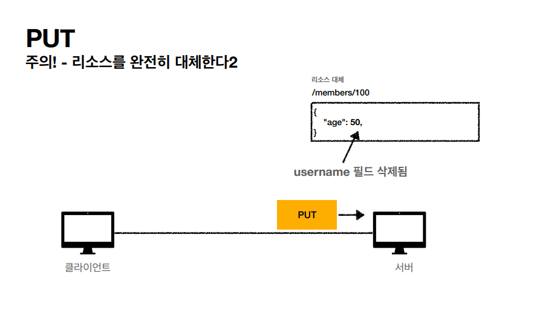
* PUT은 리소스를 수정하는 게 아니다. -> PATCH로 수정작업을 한다.

### PATCH
* 리소스 부분 변경

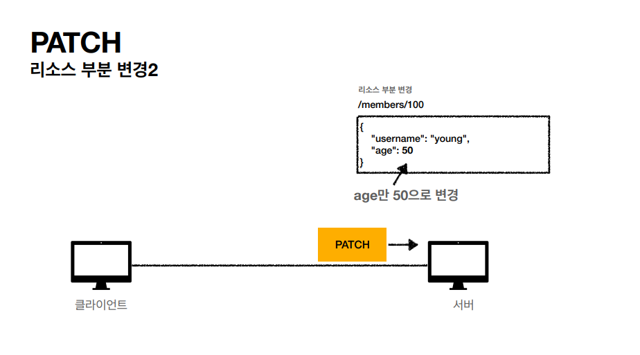
* 리소스 부분 변경할 때 PATCH가 지원이 안 되는 서버라면 POST를 사용한다. (~~POST는 무적!!!!!!~~)

> ## HTTP 메서드의 속성

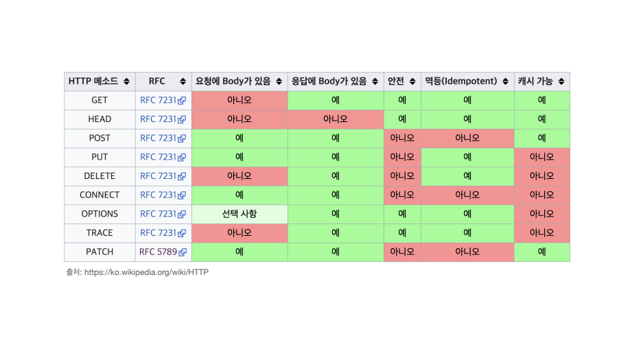

### 안전(Safe)
* 한 번이든 여러 번이든 호출해도 리소스를 변경하지 않는다.
* Q : 그래도 계속 호출해서, 로그 같은 게 쌓여서 장애가 발생하면요?
* A : 안전은 해당 리소스만 고려한다. 그런 부분까지 고려하지 않는다.

### 멱등(Idempotent)
* f(f(x)) = f(x)
* 한 번 호출하든 두 번 호출하든 100번 호출하든 결과가 똑같다.
* 멱등 메서드
    * GET : 한 번 조회하든, 두 번 조회하든 같은 결과가 조회된다.
    * PUT : 결과를 대체한다. 따라서 같은 요청을 여러 번 해도 최종 결과는 같다.
    * DELETE : 결과를 삭제한다. 같은 요청을 여러 번 해도 삭제된 결과는 똑같다.
    * ~~POST : 멱등이 아니다! 두 번 호출하면 같은 결제가 중복해서 발생할 수 있다.~~
* 활용
    * 자동 복구 메커니즘
    * 서버가 TIMEOUT 등으로 정상적으로 응답을 못 주었을 때, 클라이언트가 같은 요청을 다시 해도 결과가 똑같은가? 판단 근거
* **Q : 재요청 중간에 다른 곳에서 리소스를 변경해버리면?**
    * 사용자1 : GET -> username:A, age:20
    * 사용자2 : PUT -> username:A, age:30
    * 사용자1 : GET -> username:A, age:30 -> 사용자2의 영향으로 바뀐 데이터 조회

* **A : 멱등은 외부 요인으로 중간에 리소스가 변경되는 것까지는 고려하지 않는다. 동일한 사용자가 똑같은 요청을 여러 번 한 것에 고려한다.**

### 캐시가능(Cacheable)
* 응답 결과 리소스를 캐시해서 사용해도 되는가?
* GET, HEAD, POST, PATCH 캐시가능
* 실제로는 GET(*URL로 키 사용*), HEAD 정도만 캐시로 사용
    * POST, PATCH는 본문 내용까지 캐시 키로 고려해야 하는데, 구현이 쉽지 않다.

***
## 💡 틀렸거나 잘못된 정보가 있다면 망설임 없이 댓글로 알려주세요!

