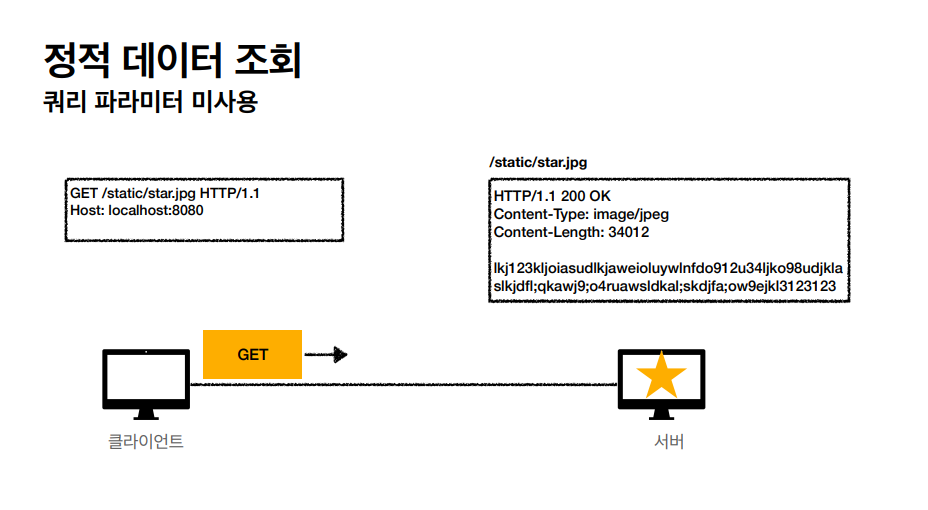
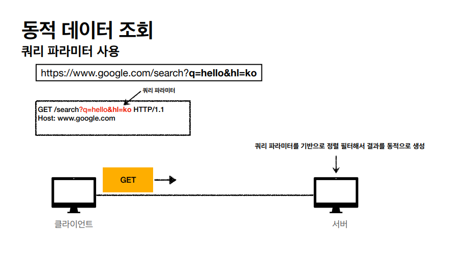
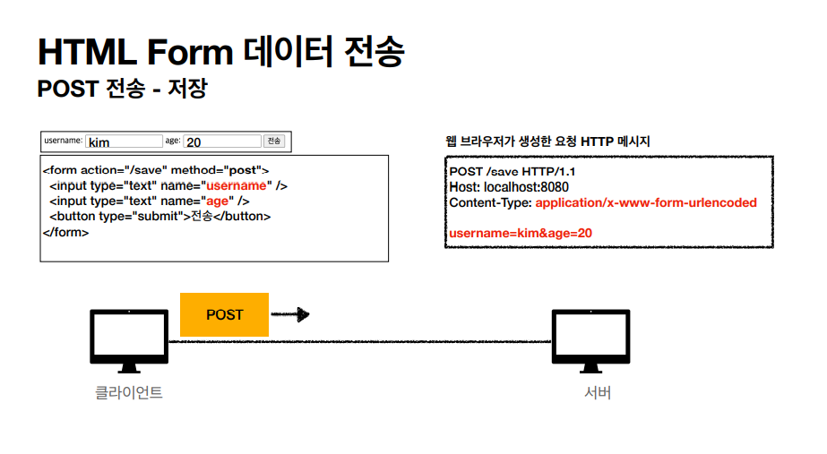
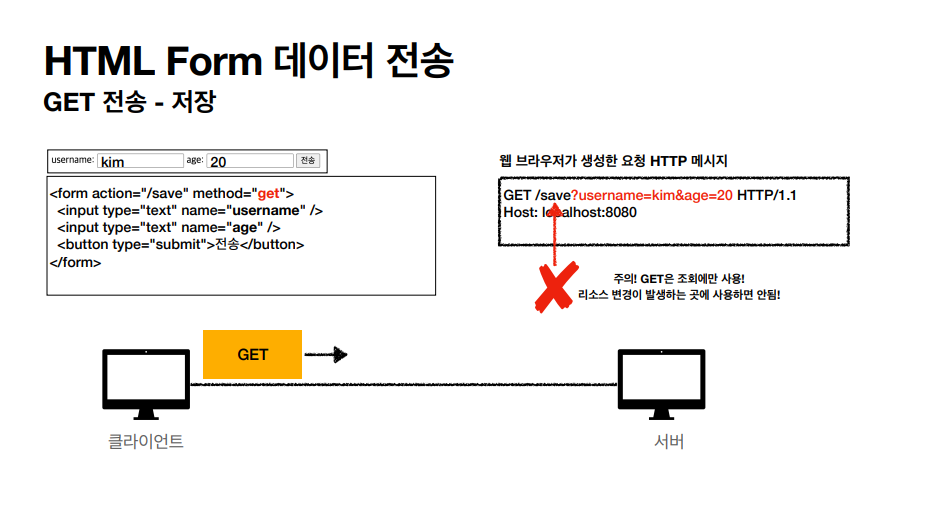
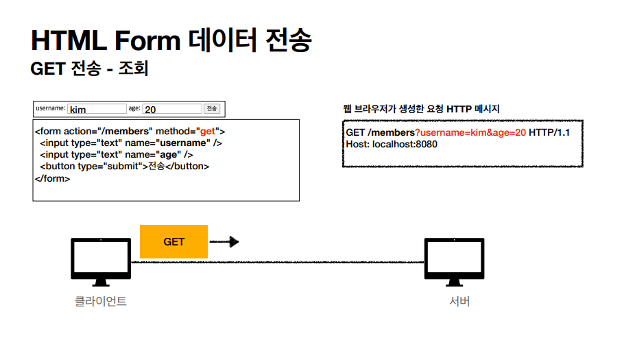
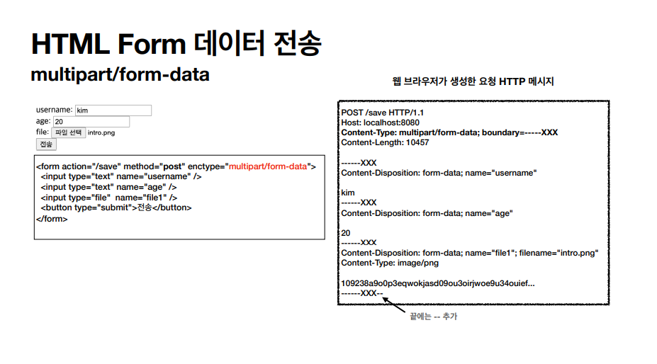
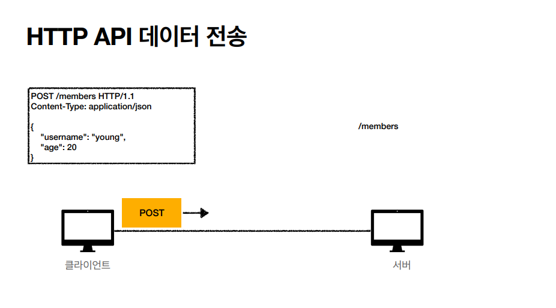

# [모든 개발자를 위한 HTTP 웹 기본지식](https://www.inflearn.com/course/http-%EC%9B%B9-%EB%84%A4%ED%8A%B8%EC%9B%8C%ED%81%AC) 수강
***
> ## HTTP 메서드 활용 - 클라이언트에서 서버로 데이터 전송

### 클라이언트에서 서버로 데이터 전송 - 데이터 전달 방식은 크게 2가지
* 쿼리 파라미터를 통한 데이터 전송
    * GET
    * 주로 정렬 필터(검색어, 게시판 리스트에 정렬 조건을 넣는 등)
* HTTP 메시지 바디를 통한 데이터 전송
    * POST, PUT, PATCH
    * 회원 가입, 상품 주문, 리소스 등록, 리소스 변경

### 클라이언트에서 서버로 데이터 전송 - 4가지 상황
* 정적 데이터 조회 (GET)
    * 이미지, 정적 텍스트 문서
* 동적 데이터 조회 (GET)
    * 주로 검색, 게시판 목록에서 정렬 필터(검색어)
* HTML Form을 통한 데이터 전송 (POST -> 데이터 변경, GET -> 데이터 조회)
    * 회원 가입, 상품 주문, 데이터 전송
* HTTP API를 통한 데이터 전송
    * 회원 가입, 상품 주문, 데이터 변경
    * 서버 to 서버, 앱 클라이언트, 웹 클라이언트(Ajax)

### 정적 데이터 조회 - 정리
* 이미지, 정적 텍스트 문서
* 조회는 GET 사용
* 정적 데이터는 일반적으로 쿼리 파라미터 없이 리소스 경로로 단순하게 조회 가능

### 동적 데이터 조회 - 정리
* 주로 검색, 게시판 목록에서 정렬 필터(검색어)
* 조회 조건을 줄여주는 필터, 조회 결과를 정렬하는 정렬 조건에 주로 사용
* 조회는 GET 사용
* GET은 쿼리 파라미터 사용해서 데이터를 전달

### HTML Form 데이터 전송 - 정리
* HTML Form submit시 POST 전송
    * 예)회원 가입, 상품 주문, 데이터 변경
* Content-Type: application/x-www-form-urlencoded 사용 (default)
    * form의 내용을 메시지 바디를 통해서 전송(key=value, 쿼리 파라미터 형식)
    * 전송 데이터를 url encoding 처리
        * 예) abc김 -> abc%EA%B9%80 (UTF-8 형식)
* HTML Form은 GET 전송도 가능 (쿼리 파라미터 형식)
* Content-Type: multipart/form-data
    * 파일 업로드 같은 바이너리 데이터 전송시 사용
    * 다른 종류의 여러 파일과 폼의 내용 함께 전송 가능(그래서 이름이 multipart)
*참고 : HTML Form 전송은 GET, POST만 지원

### HTTP API 데이터 전송 - 정리
* 서버 TO 서버
    * 백엔드 시스템 통신
* 앱 클라이언트
    * 아이폰, 안드로이드
* 웹 클라이언트
    * HTML에서 Form 전송 대신 자바스크립트를 통한 통신에 사용(AJAX)
    * 예) React, VueJs, 같은 웹 클라이언트와 API 통신
* POST, PUT, PATCH : 메시지 바디를 통해 데이터 전송
* GET : 조회, 쿼리 파라미터로 데이터 전달
* Content-Type: application/json을 주로 사용 (사실상 표준)
    * TEXT, XML, JSON 등등

> ## HTTP 메서드 활용 - HTTP 설계 예시
* HTTP API - 컬렉션 (*실무에서 자주 사용*)
    * POST 기반 등록
    * 예) 회원 관리 API 제공
* HTTP API - 스토어
    * PUT 기반 등록
    * 예) 정적 컨텐츠 관리, 원격 파일 관리
* HTML FORM 사용
    * 웹 페이지 회원 관리
    * GET, POST만 지원

### 회원 관리 시스템 - API 설계 - POST 기반 등록
* **회원** 목록 /members -> **GET**
* **회원** 등록 /members -> **POST**
* **회원** 조회 /members/{id} -> **GET**
* **회원** 수정 /members/{id} -> **PATCH, PUT, POST**
* **회원** 삭제 /members/{id} -> **DELETE**

### 회원 관리 시스템 - POST - 신규 자원 등록 특징
* `클라이언트는 등록될 리소스의 URI를 모른다`
    * 회원 등록 /members -> POST
    * POST /members 
* 서버가 새로 등록된 리소스 URI를 생성해준다.
    * HTTP/1.1 201 Created Location: **/members/100**
* 컬렉션(Collection)
    * 서버가 관리하는 리소스 디렉토리
    * 서버가 리소스의 URI를 생성하고 관리
    * 여기서 컬렉션은 /members

### 파일 관리 시스템 - API 설계 - PUT 기반 등록
* **파일** 목록 /files -> **GET**
* **파일** 조회 /files/{filename} -> **GET**
* **파일** 등록 /files/{filename} -> **PUT**
* **파일** 삭제 -> /files/{filename} -> **DELETE**
* **파일** 대량 등록 /files -> **POST**

### 파일 관리 시스템 - PUT - 신규 자원 등록 특징
* `클라이언트가 리소스 URI를 알고 있어야 한다.`
    * 파일 등록 /files/{filename} -> PUT
    * PUT **/files/star.jpg**
* 클라이언트가 직접 리소스의 URI를 지정한다.
* 스토어(Store)
    * 클라이언트가 관리하는 리소스 저장소
    * 클라이언트가 리소스의 URI를 알고 관리
    * 여기서 스토어는 /files

### HTML FORM 사용
* HTML FORM은 GET, POST만 지원
* AJAX 같은 기술을 사용해서 해결 가능 -> 회원 API 참고
* 여기서는 순수 HTML, HTML FORM 이야기
* `컨트롤 URI`
    * GET, POST만 지원하므로 제약이 있음
    * 이런 제약을 해결하기 위해 동사로 된 리소스 경로 사용
    * POST의 /new, /edit, /delete가 컨트롤 URI
    * HTTP 메서드로 해결하기 애매한 경우 사용(HTTP API 포함)
    * *실무에서 자주 사용하지만 무작정 사용하면 안 된다. (최대한 리소스라는 개념을 가지고 URI를 설계)*

***
* **회원** 목록 /members -> **GET**
* **회원** 등록 폼 /members/new -> **GET**
* **회원** 등록 /members/new(추천), /members -> **POST**
* **회원** 조회 /members/{id} -> **GET**
* **회원** 수정 폼 /members/{id}/edit -> **GET**
* **회원** 수정 /members/{id}/edit(추천), /members/{id} -> **POST**
* **회원** 삭제 /members/{id}/delete -> **POST**
***

### 정리
* **HTTP API - 컬렉션**
    * **POST 기반 등록**
    * **서버가 리소스 URI 결정**
* **HTTP API - 스토어**
    * **PUT 기반 등록**
    * **클라이언트가 리소스 URI 결정**
* **HTML FORM 사용**
    * 순수 HTML + HTML form 사용
    * GET, POST만 지원
* 참고하면 좋은 URI 설계 개념 (참조 : https://restfulapi.net/resource-naming)
    * 문서(document)
        * 단일 개념(파일 하나, 객체 인스턴스, 데이터베이스 row)
        * 예) /members/100, files/star.jpg
    * 컬렉션(collection) *- 주로 사용*
        * 서버가 관리하는 리소스 디렉터리 
        * 서버가 리소스의 URI를 생성하고 관리 (클라이언트가 서버에게 요청)
        * 예) /members
    * 스토어(store)
        * 클라이언트가 관리하는 자원 저장소
        * 클라이언트가 리소스의 URI를 알고 관리
        * 예) /files
    * 컨트롤러(controller), 컨트롤 URI
        * 문서, 컬렉션, 스토어로 해결하기 어려운 추가 프로세스 실행
        * 동사를 직접 사용
        * 예) /members/{id}/delete

***
## 💡 틀렸거나 잘못된 정보가 있다면 망설임 없이 댓글로 알려주세요!

