# [모든 개발자를 위한 HTTP 웹 기본지식](https://www.inflearn.com/course/http-%EC%9B%B9-%EB%84%A4%ED%8A%B8%EC%9B%8C%ED%81%AC) 수강
***
> ## HTTP 헤더2 - 캐시와 조건부 요청 - 캐시 기본 동작

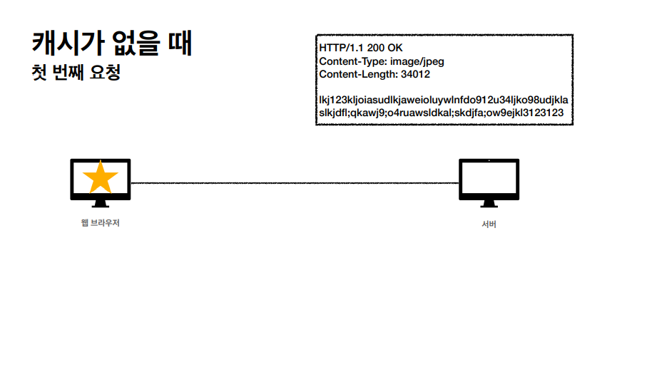
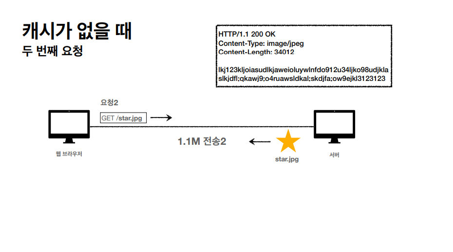
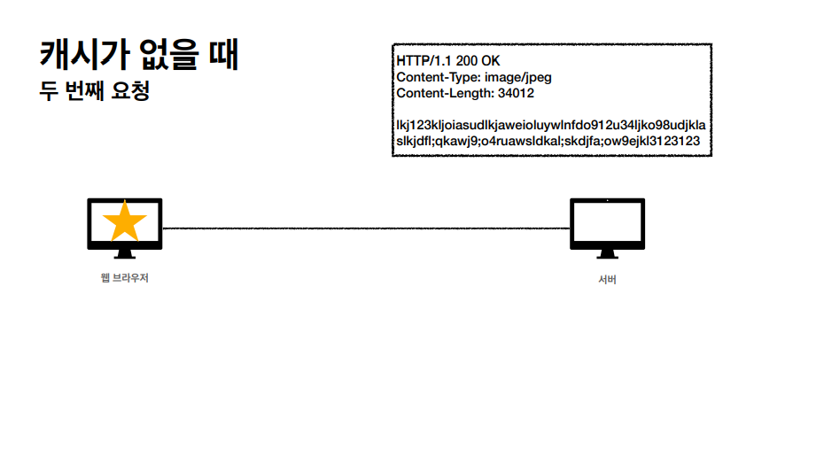

### 캐시가 없을 때
* 데이터가 변경되지 않아도 계속 네트워크를 통해서 데이터를 다운로드받아야 한다.
* 인터넷 네트워크는 매우 느리고 비싸다.
* 브라우저 로딩 속도가 느리다.
* 느린 사용자 경험

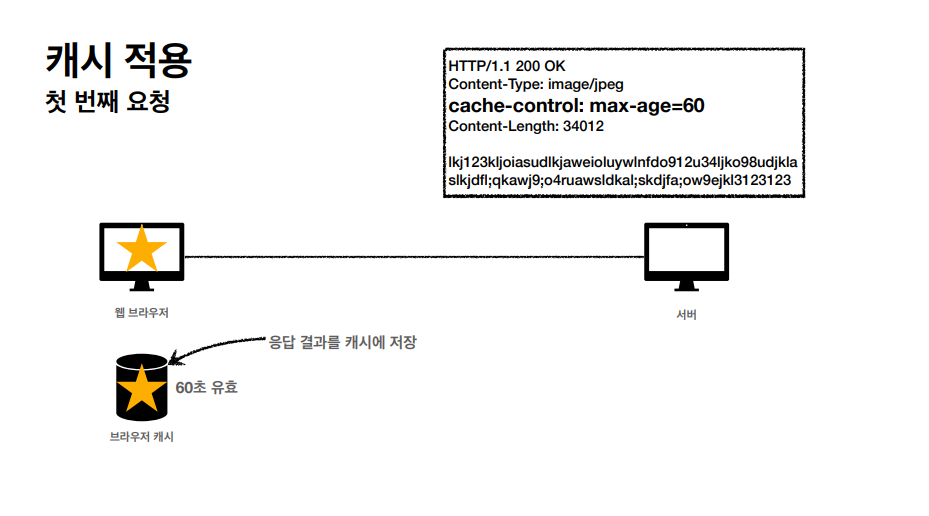
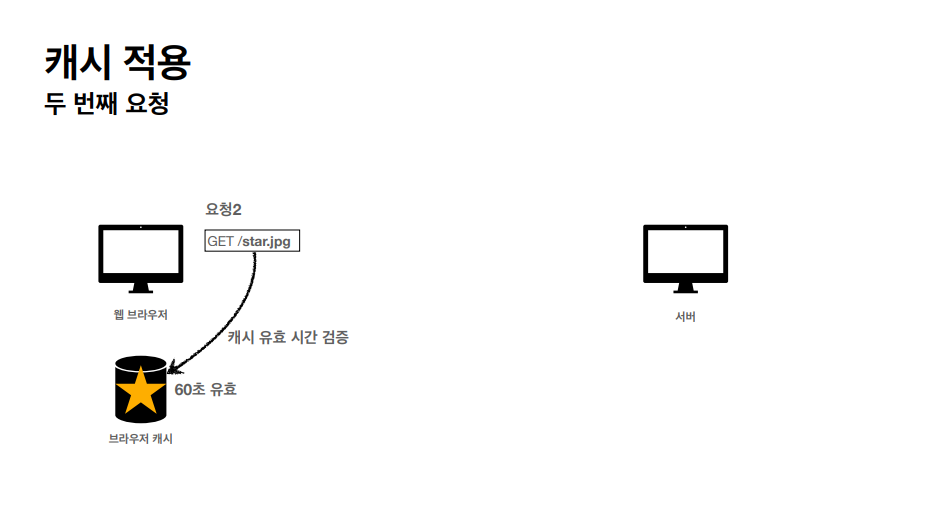

### 캐시 적용
* 캐시 덕분에 캐시 가능 시간 동안 네트워크를 사용하지 않아도 된다.
* 비싼 네트워크 사용량을 줄일 수 있다.
* 브라우저 로딩 속도가 매우 빠르다.
* 빠른 사용자 경험

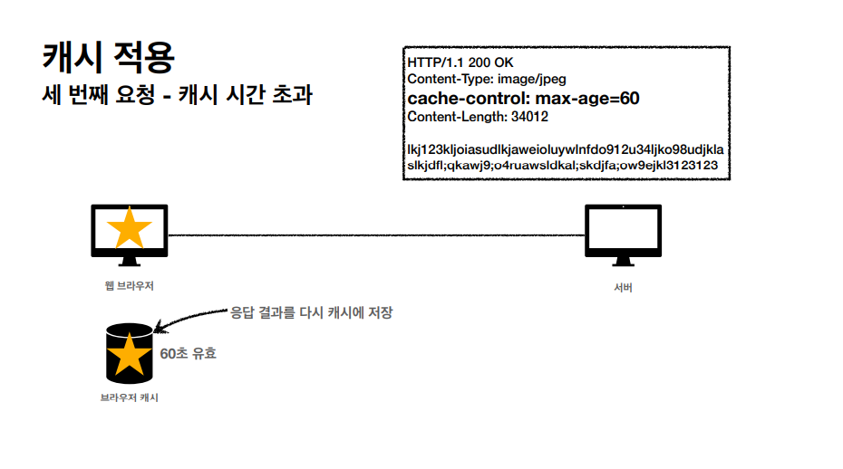

### 캐시 시간 초과
* 캐시 유효 시간이 초과하면, 서버를 통해 데이터를 다시 조회하고, 캐시를 갱신
* 이때 다시 네트워크 다운로드가 발생한다.

> ## HTTP 헤더2 - 캐시와 조건부 요청 - 검증 헤더와 조건부 요청 1

### 캐시 시간 초과
* 캐시 유효 시간의 초과로 서버에 재요청하면 다음 두 가지 상황이 나타난다.
    1. 서버에서 기존 데이터를 변경함
    2. 서버에서 기존 데이터를 변경하지 않음

* 캐시 만료 후에도 서버에서 데이터를 변경하지 않을 경우
    * 생각해보면 데이터를 전송하는 대신에 저장해 두었던 캐시를 재사용 할 수 있다.
    * 하지만 클라이언트의 데이터와 서버의 데이터가 같다는 사실을 확인할 수 있는 방법이 필요하다.

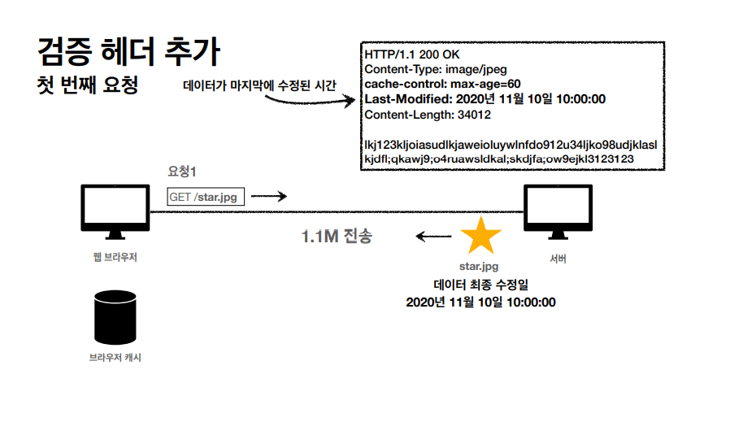
* *last modified는 UTC 표기법으로 작성해야 한다.*

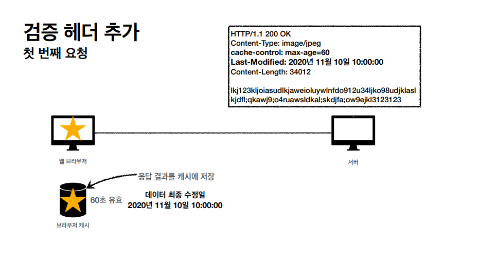
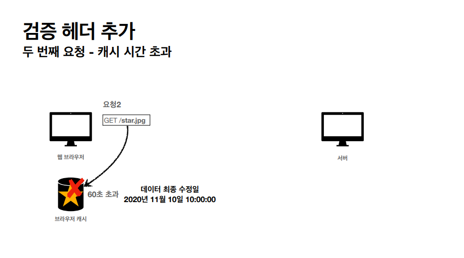
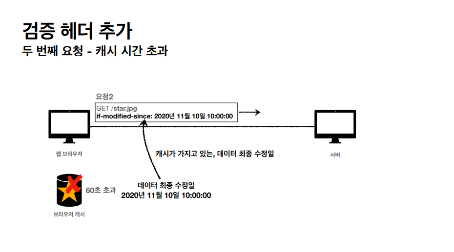
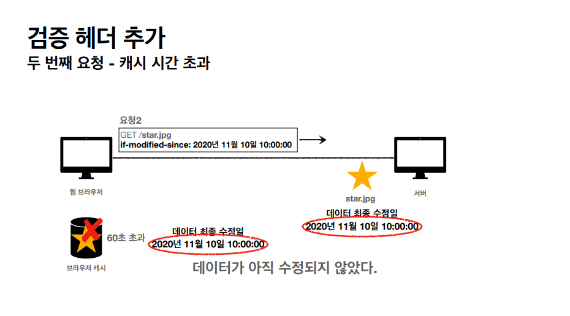
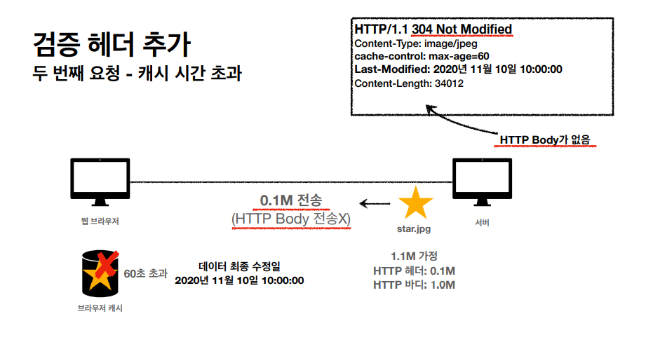
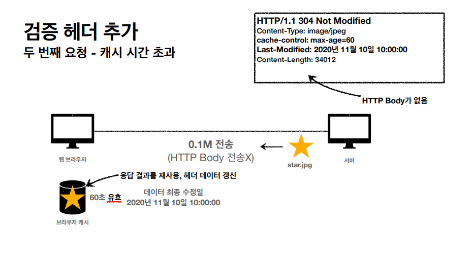

### 검증 헤더와 조건부 요청 - 정리
* 캐시 유효 시간이 초과해도, 서버의 데이터가 갱신되지 않았다면 304 Not Modified + 헤더 메타 정보만 응답(바디X)
* 클라이언트는 서버가 보낸 응답 헤더 정보로 캐시의 메타 정보를 갱신
* 클라이언트는 캐시에 저장되어 있는 데이터 재활용
* 결과적으로 네트워크 다운로드가 발생하지만, 용량이 적은 헤더 정보만 다운로드
* 매우 실용적인 해결책

> ## HTTP 헤더2 - 캐시와 조건부 요청 - 검증 헤더와 조건부 요청 2

* **검증 헤더**
    * 캐시 데이터와 서버 데이터가 같은지 검증하는 데이터
    * Last-Modified, ETag
* **조건부 요청 헤더**
    * 검증 헤더로 조건에 따른 분기
    * if-Modified-Since: Last-Modified 사용
    * if-None-Match : ETag 사용
    * 조건이 만족하면 200 OK
    * 조건이 만족하지 않으면 304 Not Modified

### 예시
* If-Modified-Since: 이후에 데이터가 수정되었으면?
    * **데이터 미변경 예시**
        * 캐시 : 2022년 1월 15일 11:25:00 vs 서버 : 2022년 1월 15일 11:25:00
        * **304 Not Modified**, 헤더 데이터만 전송(BODY 미포함)
        * 전송 용량 0.1M (헤더 0.1M, 바디 1.0M)
    * **데이터 변경 예시**
        * 캐시 : 2022년 1월 15일 11:25:00 vs 서버 : 2022년 1월 15일 12:50:00
        * **200 OK**, 모든 데이터 전송(BODY 포함)
        * 전송 용량 1.1M (헤더 0.1M, 바디 1.0M)

### Last-Modified, If-Modified-Since 단점
* 1초 미만(0.X초) 단위로 캐시 조정이 불가능
* 날짜 기반의 로직 사용
* 데이터를 수정해서 날짜가 다르지만, 같은 데이터를 수정해서 데이터 결과가 똑같은 경우
    * 예) A -> B로 수정했다가 다시 B -> A로 수정한 경우
* 서버에서 별도의 캐시 로직을 관리하고 싶은 경우
    * 예) 스페이스나 주석처럼 크게 영향이 없는 변경에서 캐시를 유지하고 싶은 경우

### ETag, If-None-Match
* ETag(Entity Tag)
* 캐시용 데이터에 임의의 고유한 버전 이름을 달아둠
    * 예) ETag: "v1.0", ETag: "a2jiodwjekjl3"
* 데이터가 변경되면 이 이름을 바꾸어서 변경함(Hash를 다시 생성)
    * 예) ETag: "aaaaa" -> ETag: "bbbbb"
* 진짜 단순하게 ETag만 보내서 같으면 유지, 다르면 다시 받기

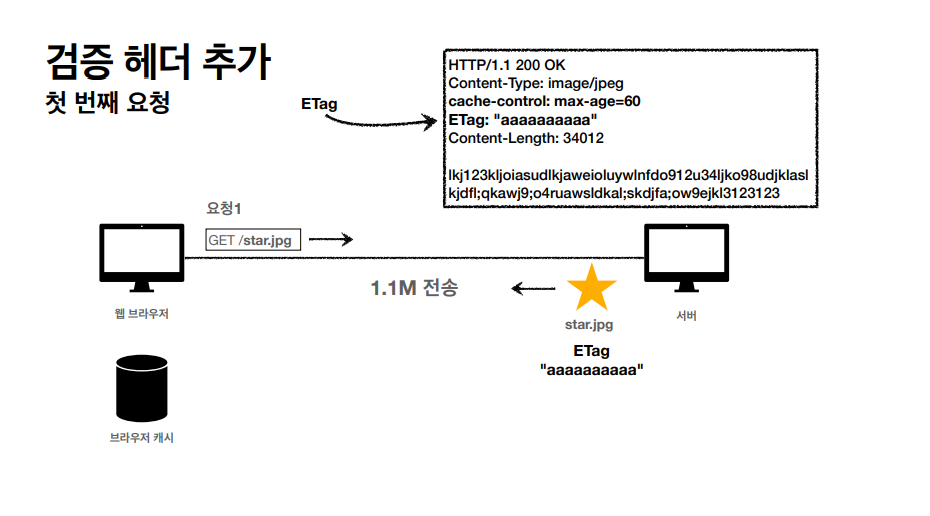

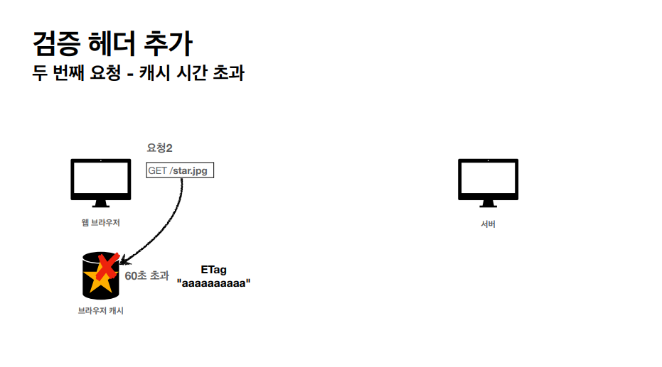

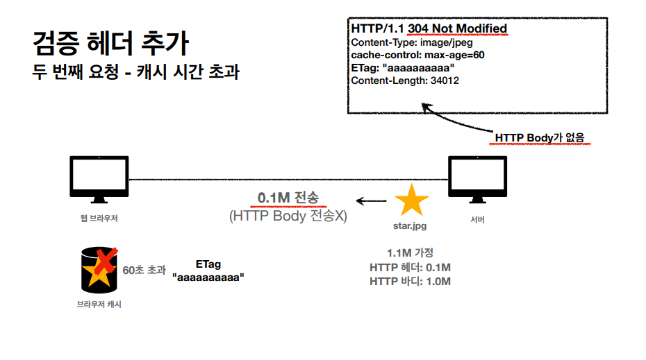
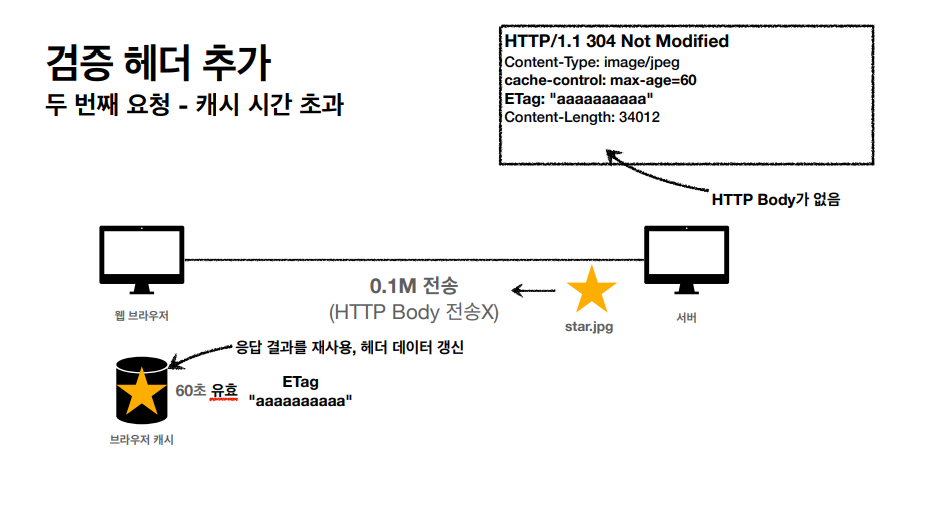
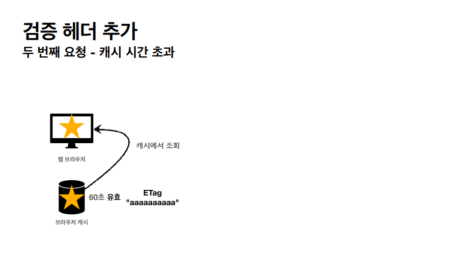

### ETag, If-None-Match 정리
* ETag만 서버에 보내서 데이터 비교
* **캐시 제어 로직을 서버에서 완전히 관리**
* 클라이언트는 단순히 이 값을 서버에 제공(클라이언트는 캐시 메커니즘을 모른다.)
* 예)
    * 서버는 베타 오픈 기간인 3일 동안 파일이 변경되어도 ETag를 동일하게 유지
    * 애플리케이션 배포 주기에 맞추어 ETag 모두 갱신

> ## HTTP 헤더2 - 캐시와 조건부 요청 - 캐시 제어 헤더

### Cache-Control - 캐시 지시어(directives)
* Cache-Control: max-age
    * 캐시 유효 시간, 초 단위
* Cache-Control: no-cache
    * 데이터는 캐시해도 되지만, 항상 오리진 서버에 검증하고 사용
* Cache-Control: no-store
    * 데이터에 민감한 정보가 있으므로 저장하면 안 됨(메모리에서 사용하고 최대한 빨리 삭제)

### Pragma - 캐시 제어(하위 호환)
* Pragma: no-cahce
* HTTP 1.0 하위 호환
* 지금은 거의 사용하지 않음

### Expires - 캐시 만료일 지정(하위 호환)
* expires: Mon, 01 Jan 1990 00:00:00 GMT
* 캐시 만료일을 정확한 날짜로 지정
* HTTP 1.0부터 사용
* 지금은 더 유연한 Cache-Control: max-age 권장
* Cache-Control: max-age와 함께 사용하면 Expires는 무시

### 검증 헤더와 조건부 요청 헤더
* **검증 헤더(Validator)**
    * **ETag**: "v1.0", ETag: "asid93jkrh2l"
    * **Last-Modified**: Sat, 15 Jan 2022 09:11:25 GMT
* **조건부 요청 헤더**
    * If-Match, If-None-Match: ETag 값 사용
    * If-Modified-Since, If-Unmodified-Since: Last-Modified 값 사용

> ## HTTP 헤더2 - 캐시와 조건부 요청 - 프록시 캐시

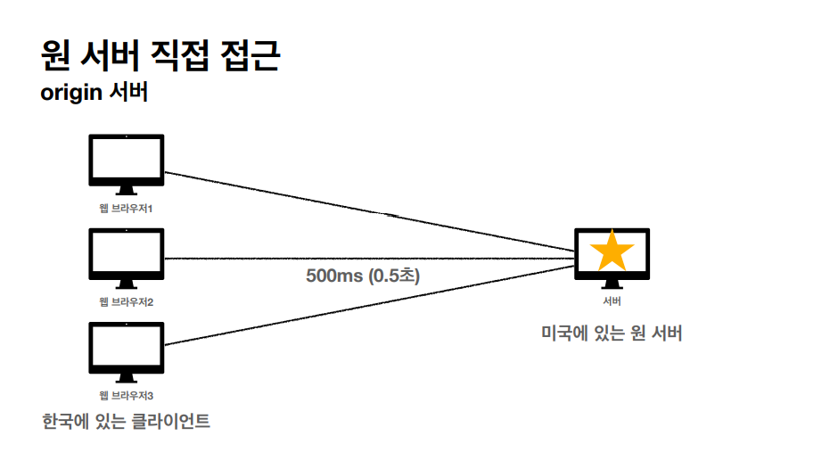
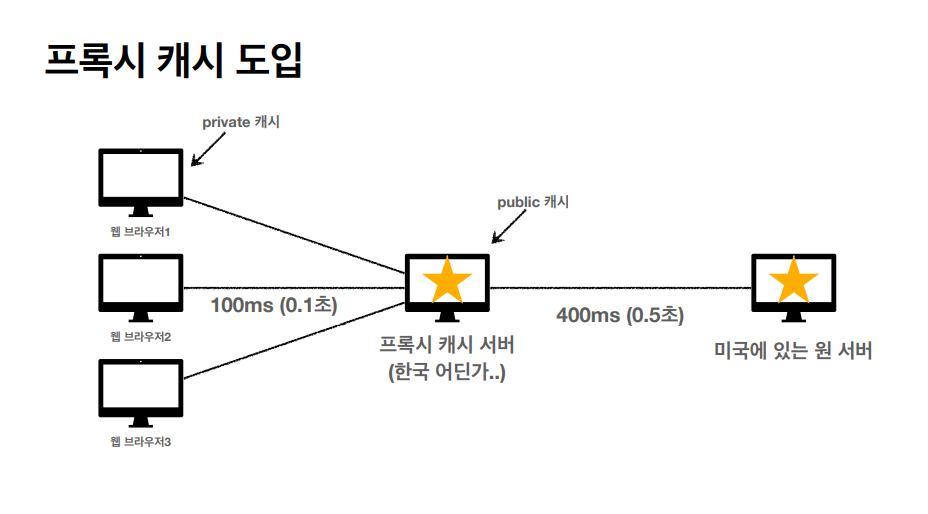

### Cache-Control - 캐시 지시어(directives)  - 기타
* Cache-Control: public
    * 응답이 public 캐시에 저장되어도 됨
* Cache-Control: private
    * 응답이 해당 사용자만을 위한 것임, private 캐시에 저장해야 함(기본값)
* Cache-Control: s-maxage
    * 프록시 캐시에만 적용되는 max-age
* Age: 60(HTTP 헤더)
    * 오리진 서버에서 응답 후 프록시 캐시 내에 머문 시간(초)
    
> ## HTTP 헤더2 - 캐시와 조건부 요청 - 캐시 무효화

### Cache-Control - 캐시 지시어(directives) - 확실한 캐시 무효화
* Cache-Control: no-cache
    * 데이터는 캐시 해도 되지만, 항상 **원 서버에 검증**하고 사용(이름에 주의!)
* Cache-Control: no-store
    * 데이터에 민감한 정보가 있으므로 저장하면 안 됨(메모리에서 사용하고 최대한 빨리 삭제)
* Cache-Control: must-revalidate
    * 캐시 만료 후 최초 조회 시 **원 서버에 검증**해야 함
    * 원 서버 접근 실패 시 반드시 오류가 발생해야 함 - 504 Gateway Timeout
    * must-revalidate는 캐시 유효 시간이라면 캐시를 사용함
* Pragma: no-cache
    * HTTP 1.0 하위 호환

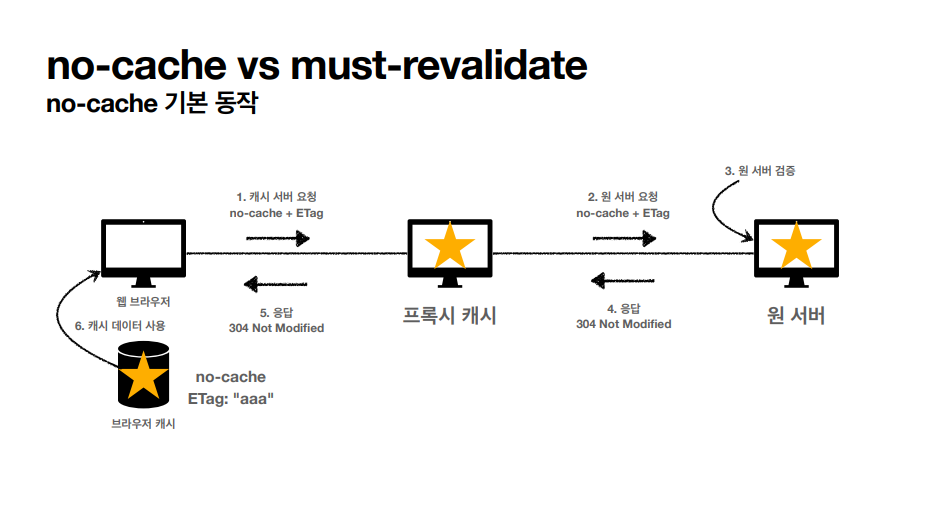
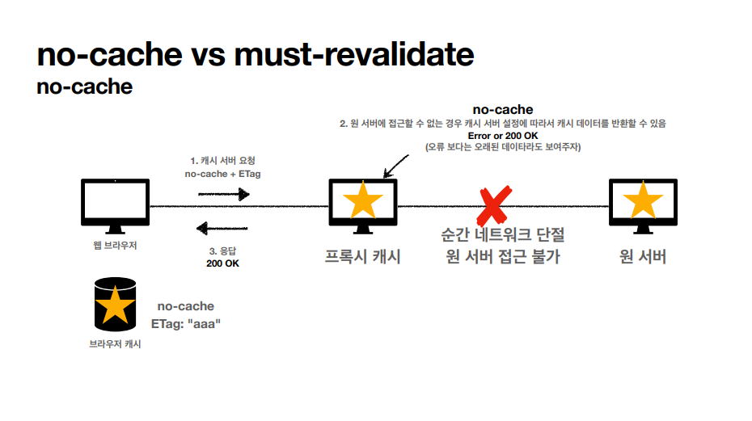
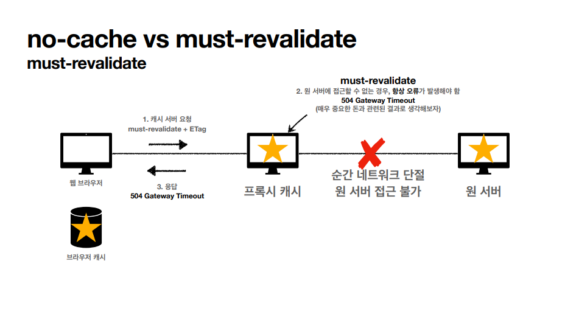

***
## 💡 틀렸거나 잘못된 정보가 있다면 망설임 없이 댓글로 알려주세요!

