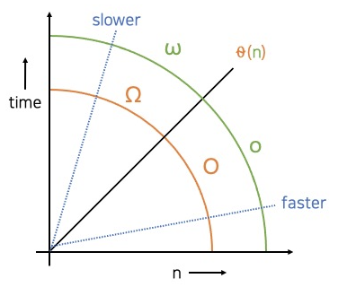

# 자바로 구현하고 배우는 자료구조 수강

> ## 시간 복잡도

시간 복잡도는 서로 다른 알고리즘의 효율성을 비교할 때 사용한다.

* 규칙 
    1. **입력값 $n$은 항상 0보다 크다.**
        * 입력값이 음수일 경우는 시간 복잡도를 고려할 때는 말이 되지 않는 경우이다. 그래서 복잡도는 항상 0보다 크다고 가정하고 계산을 해야 한다.
    2. 함수는 **많은 입력값이 있을 떄 더 많은 작업**을 하게 된다.
        * 더 많은 입력값이 주어지면 어떤 작업을 하는 데 필요한 계산이나 처리 시간이 길어진다.
    3. 시간 복잡도에서는 **모든 상수를 삭제**한다.
        * 어떤 알고리즘의 복잡도가 $3n$이라면 3은 고려하지 않고 복잡도는 $n$이 된다.
        $2n$, $5n$, $10n$, $50n$, $500n$ 모두 복잡도가 $n$인 알고리즘이다.
    4. **낮은 차수의 항들은 무시한다.**
        * 시간 복잡도에서 $n$과 $n^2$ 를 비교할 때 항상 $n^2$이 더 오래 걸리는 알고리즘이라고 판단한다.
         여기서 의문이 들 수 있는 점은 그래프에서 (1,1)인 지점 전까지는  $n$이 더 오래 걸릴 수 있다는 것이다. 하지만 알고리즘에서는 입력값 $n$이 1보다 작은 값은 고려하지 않고 큰 값에 대해서만 생각을 하므로 **n이 무한으로 커진 경우를 가정**하고 비교해야 한다..
         그래서 시간 복잡도에서는 낮은 차수의 항들을 무시한다. $n^3+n^2+n$이라는 함수가 있을 때, $n$과 $n^2$은 알고리즘의 시간 복잡도에 영향을 미치지 않고, 입력값이 무한이 될 때 고려해야 할 부분은 $n^3$이다.
    5. 시간 복잡도 함수가 $log$함수를 포함할 경우 밑은 무시한다.
        * 모든 로그는 서로 배수 관계이다. 그래서 복잡도에 관해서 이야기할 때는 로그의 밑에 대해서는 고려하지 않는다. 로그의 밑은 무시하고 로그($logn$) 알고리즘이라고만 말하면 된다.
        * 복잡도가 $log$인 알고리즘은 보통 **무언가를 반으로 나누거나 2를 곱한 경우**에 자주 사용된다. 그래서 만약 for 반복문을 사용해서 무언가를 탐색하면서 반으로 나누거나 2를 곱할 때 복잡도는 밑이 2인 로그가 된다. 10으로 나누거나 10을 곱하게 되면 밑이 10인 로그가 된다. 하지만 시간 복잡도를 표시할 때는 로그 밑은 무시하고 그냥 $logn$ 복잡도를 가진다고 표현한다.
    6. **등호를 사용하여 표현**한다.
        * $2n$은 $O(n)$과 같다. 여기서 $O(n)$은 $2n$이 어떤 함수의 집합에 속한다는 의미를 가진다. 그렇기 때문에 이 관계를 $2n=O(n), 2n \in O(n)$

> ## 빅 오 표기법

빅 오 표기법은 알고리즘의 성능을 수학적으로 표현해주는 표기법이다. 알고리즘의 시간과 공간 복잡도를 표현할 수 있다.

* 복잡도가 $n$인 알고리즘에 빅 오 표기법을 적용한 결과이다. x축은 복잡도 $n$, y축 필요한 일의 양이나 메모리를 의미한다.
* 다른 알고리즘이 이 그래프의 어떤 위치에 있는지에 따라 복잡도 $n$인 알고리즘과 다른 알고리즘의 복잡도를 비교할 수 있다. 다른 알고리즘이 복잡도 $n$인 알고리즘의 아래에 있다면, 같은 일을 하는 데 시간이 덜 들기 때문에 더 빠른 알고리즘이라 한다. 반대로, 복잡도 $n$인 알고리즘의 위에 있다면, 더 느린 알고리즘이다.

* 빅 오 표기법에서는 알고리즘 관계를 다음과 같이 표현한다.
    * $O$ (빅 오 복잡도) : 비교 대상인 그래프가 일치하거나 아래에 있을 때, 비교 대상인 다른 알고리즘과 같거나 더 빠르다.
    * $\Theta$ (세타 복잡도) : 비교 대상인 그래프가 일치할 때, 비교 대상인 다른 알고리즘과 같다.
    * $\Omega$ (빅 오메가 복잡도) : 비교 대상인 그래프가 일치하거나 위에 있을 때, 비교 대상인 다른 알고리즘과 같거나 느리다.
    * $o$ (리틀 오 복잡도) : 비교 대상인 그래프가 아래에 있을 때, 비교 대상인 다른 알고리즘보다 더 빠르다.
    * $\omega$ (리틀 오메가 복잡도) : 비교 대상인 그래프가 위에 있을 때, 비교 대상인 다른 알고리즘보다 느리다.

* 문제 (아래의 식이 옳은지 판단하기)
    1. $n^{4/3} = O(nlogn)$
    2. $3n^3 + 4n^2 + 5n + 6 = \Theta(n^3)$
    3. $n(n-1)/2 = O(n^2)$
    4. $2^n = \omega(n)$
    5. $n^3 = O(n^2)$
    6. $n^2 = O(n^3)$
    * [풀이](https://www.boostcourse.org/cs204/lecture/480419?isDesc=false)

***
### 참고 : [[자료구조 알고리즘] 빅 오(Big-O)표기법 완전정복](https://www.youtube.com/watch?v=6Iq5iMCVsXA)
* $O(1)$
    * 입력 데이터의 크기에 상관없이 언제나 일정한 시간이 걸리는 알고리즘

    .PNG)
    * 데이터의 증가함에 따라 성능에 변함이 없다.
* $O(n)$
    * 입력 데이터의 크기에 비례해서 처리 시간이 걸리는 알고리즘

    .PNG)
    * 언제나 데이터와 시간이 같은 비율로 증가
* $O(n^2)$

    .PNG)

    * 처음에는 조금씩 상승하다가 나중에는 수직 상승으로 시간이 증가
* $O(n^3)$
    .PNG)

    * $O(n^2)$보다 데이터가 증가함에 따라 더 급격하게 처리 시간이 늘어난다.
* $O(2^n)$
    * 대표적인 알고리즘 : 피보나치 수열

    .PNG)

* $O(logn)$
    * 대표적인 알고리즘 : 이진 검색

    .PNG)
    * $O(n)$보다 시간이 적게 들고 데이터가 증가해도 성능이 크게 차이 나지 않는다.

***
## 💡 틀렸거나 잘못된 정보가 있다면 망설임 없이 댓글로 알려주세요!

