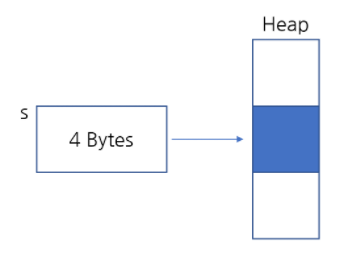

# [자바로 구현하고 배우는 자료구조](https://www.boostcourse.org/cs204) 수강

> ## 객체지향 프로그래밍

### 객체의 메모리 할당 방법

**new**를 사용하여 객체(인스턴스) student를 만들면(객체의 종류에 따라 다르지만) Java Virtual Machine은 코드를 읽고 메모리가 얼마나 필요한지 계산하고 그만큼의 공간을 힙에 할당한다. 그리고 힙에 있는 공간을 가리키는 4바이트짜리 포인터를 하나 만든다.
```java
Student s = new student();
```


### 상속
```java
public class Person{
}
public class Student extends Person{
}
public class Undergraduate extends Student{
}
```
* 특징
    1. Java에서 **각각의 클래스는 하나의 클래스만 상속**받을 수 있다.
    2. **상속받는 클래스의 정보**만 갖고 있다.
    3. **상속받는 클래스의 공간**을 함께 할당한다.
    ```java
    Undergraduate u = new Undergraduate();
    ```
    * 상속을 받은 상태로, 새로운 객체 Undergraduate u를 정의하면, u에는 4바이트가 할당된다.
    * 그리고 이 포인터가 가리키는 힙에는 Undergraduate에 맞는 공간이 할당된다.
    * Undergraduate에 있는 변수와 Student 클래스, Person 클래스에 들어 있는 모든 변수도 힙에 들어간다.
    ```java
    Student s = new Undergraduate();
    ```
    * Undergraduate 객체에 필요한 만큼 공간을 할당받고 Person의 변수, Student의 변수, Undergraduate의 변수를 모두 알 수 있습니다. 
    * 따라서, Student 클래스의 변수를 파악하고 메모리를 계산할 수 있습니다.
    * 하지만 Undergraduate 클래스와 관련된 메소드는 사용할 수 없지만 모든 내용을 담을 수 있는 공간을 있다.
    ```java
    Undergraduate u = new Student();
    ```
    * 반대로는 할 수 없다. 이런 코드를 쓰게 되면 힙에 할당되는 공간은 Student에 해당하는 만큼 할당된다. 
    * 하지만 이렇게 되면 Student에 포함된 내용과 Person에 포함된 내용만 알 수 있고 Undergraduate 클래스의 내용은 접근할 수 없기 때문에, 이 객체에 대해서 힙에 충분한 공간이 할당되지 않는다. 이 코드는 컴파일되지 않는다.

> ## Comparable 인터페이스

### Override
```java
String one = "hello world";
String two = "hello world";
// 문자열 비교
if(one.equals(two))
	System.out.println("they are the same");
```
* 두 개의 **문자열**을 비교하기 때문에 equals 메소드는 두 변수가 같다고 할 것이다.

```java
Object one = "hello world";
Object two = "hello world";
// 객체 비교
if(one.equals(two))
	System.out.println("they are the same");
```
* 이 때 equals 메소드는 두 개의 **메모리 주소**를 비교하게 되므로 두 개의 객체는 일치하지 않는다고 할 것이다.

이처럼, 객체 클래스의 equals는 메모리 주소를 비교하지만, 문자열 클래스의 equals를 **오버라이드**하면 **메모리 주소 대신 문자열을 비교**하게 만들 수 있다.

### Comparable 인터페이스
객체에서 원하는 자료형으로 비교하기 위해, Comparable 인터페이스를 활용하면 좋다. 그리고 Comparable 인터페이스는 **같은 자료형**의 다른 객체 하나를 인자로 받아와 **비교**하는 **compareTo 함수**를 사용합니다. a.compareTo(b)는 a가 b보다 작을 때는 0보다 작은 수, a와 b가 같으면 0, a가 b보다 크면 0보다 큰 수를 반환합니다.
```java
if(((Comparable<T>) data).compareTo(obj)==0)
```
* Comparable 인터페이스를 만들면 자료형에 맞는 데이터가 들어와 compareTo 함수를 통해 같은 자료형의 데이터를 비교할 수 있다.

> 제너릭 프로그래밍

* 제너릭 프로그래밍은 다양한 자료형의 객체에 대해 작성한 코드를 재사용한다는 객체 지향 기법이다.
```java
// 정렬 알고리즘 예시
public class ss{
	public int[] superSort(int[] array){
		// ...sort...
		return array;
	}
}
```
* 이 정렬 함수를 int 외의 다른 자료형에 대해 사용하려면 어떻게 해야하나? 제너릭 프로그래밍이 없었다면 int를 String 등 문자열, 원하는 객체로 바꿔야 했다. 제너릭 프로그래밍의 목표는 모든 것을 정렬할 수 있게 만드는 것이다.

***
## 💡 틀렸거나 잘못된 정보가 있다면 망설임 없이 댓글로 알려주세요!

