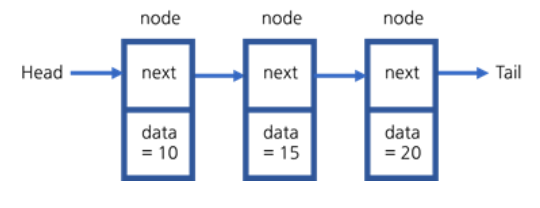

# 자바로 구현하고 배우는 자료구조 수강

> ## 연결 리스트

**포인터를 사용하여 여러 개의 노드를 연결하는 자료 구조**를 연결 리스트라고 한다. 

연결 리스트의 기본 구성 요소는 **노드**이다. 노드에는 두 가지 정보가 들어있다. 첫 번째는 **인접한 노드를 가리키는 next**라는 이름의 포인터, 두 번째는 우리가 **노드에 넣는 데이터**를 가리키는 포인터이다.

이 리스트는 **head**라는 이름의 포인터에서 시작한다. Head는 **리스트의 첫 번째 노드**를 가리킨다. **힙에서는 이 연결 리스트의 head만 알고 있기 때문에**, head.next 혹은 head.data 등으로 노드의 내용을 찾는다. 하지만 연결 리스트의 길이가 매우 길 경우, 계속 head 뒤에 next를 붙일 수는 없다. 그래서 **임시 포인터**를 사용하여 탐색하는 방법을 사용한다.

### 배열과 차이점
* 배열도 **순서대로 여러 데이터를 저장할 때 사용**한다는 공통점이 있지만, 배열의 문제는 크기가 맞지 않다. 필요한 요소보다 너무 크게 만들어서 자리가 남을 수 있고 너무 작게 배열을 만들어서 요소를 추가했을 때 배열이 이미 가득 차 있어서 크기를 두 배로 늘리기 위해서 모든 내용을 복사한 다음 배열의 크기를 조정해야 할 수도 있다.
* **연결 리스트는 배열과 다르게 항상 맞는 크기로 만들어지도록 설계**되어 있다. 그래서 순차적인 데이터나 많은 양의 데이터가 있을 때 자주 사용한다.

***
### 참고 : [엔지니어대한민국의 [자료구조 알고리즘] Linked List 개념](https://www.youtube.com/watch?v=DzGnME1jIwY)

### Linked List 개념
* 컴퓨터에 자료를 저장하는 구조의 한 종류로 일렬로 연결된 데이터를 저장할 때 사용한다.
* 길이가 정해져 있지 않은 데이터의 연결된 집합이다.
* 데이터를 저장한 노드에 다음 노드의 주소를 가지고 있는 형태이다. 
* 연결 리스트는 주소를 일일이 찾아다녀야 되기 때문에 배열보다 속도가 느릴 수가 있지만, 데이터의 삽입 및 삭제에 용이하다.
* 배열은 배열 방들이 물리적으로 한곳에 모여있어 배열 방 크기를 한 번 정하면 늘이거나 줄일 수 없다.

### 단방향/양방향 Linked List 개념
* 단방향 연결 리스트
	* 각 노드는 하나의 포인터를 가진다.
	* 단방향 연결 리스트에서는 거꾸로 가는 방법은 없다.
	* 탐색은 첫 번째 노드부터 시작되어야 한다.
	* 탐색 시간은 포인터를 이용하여 순차적으로 추적해야 하므로 O(n)이다.
* 양방향 연결 리스트
	* 각 노드에 2개의 포인터가 있다. 각 포인터는 각각 앞뒤 노드를 가리킨다.
	* 양방향 연결 리스트는 순방향과 역뱡항 검색이 가능하다. (양방향 자료 처리 가능)
	* 임의 노드의 포인터가 손상되어도 복구할 수 있다.

***
## 💡 틀렸거나 잘못된 정보가 있다면 망설임 없이 댓글로 알려주세요!

