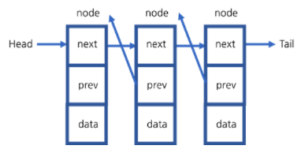
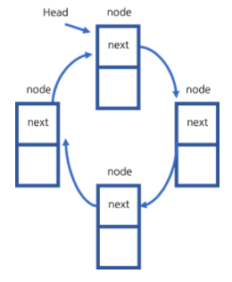

# [자바로 구현하고 배우는 자료구조](https://www.boostcourse.org/cs204) 수강

> ## 연결리스트 - 테스트
```java
public class Tester {
	public static void main (String[] args){
		static ListI<Integer> List = new LinkedList <Integer>(); // ListI는 인터페이스
		int n=10;
		// 연결 리스트를 만든다.
		for(int i=0; i<n; i++)
			List.addFirst(i); // addLast도 가능
		// 연결 리스트를 제거한다.
		for(int i=n-1; i>=0; i--)
			int x=List.removeFirst(); // removeLast도 가능
	}
}
```

### 생각해보기
* Tester 코드에서 노드의 숫자들은 어떻게 채워지고 지워지나요? 숫자들의 순서를 반대로 바꾸려면 어떻게 해야 할까요?

> ## 연결리스트 - 반복자
배열의 각각의 원소를 출력할 때
```java
int arr[] = {1,2,3,4,5};
for (int i=0; i<arr.length; i++){
	system.out.println(arr[i]);
}

OR

int arr[] = {1,2,3,4,5};
for (int x:arr){
	system.out.println(x);
}
```
* (int x : arr) -> Iterable<E> interface

객체에서 두 번째 방식으로 반복문이 동작하도록 하기 위해서는 **Iterator 인터페이스를 구현**해야 한다.

```java
public Iterator<E> iterator(){
	return new IteratorHelper();
}

public class LinkedList<E> implements ListI<E>{
	class IteratorHelper implements Iterator<E>{
		Node<E> index;
		public IteratorHelper(){
			index=head;
		}
		public boolean hasNext(){
			return (index != null)
		}
		public E next(){
			if (!hasNext())
				throw new NoSuchElementException();
			E val = index.data;
			index = index.next;
			return val;
		}
	}
}
```
* 이 코드를 연결 리스트 안에 넣으면 된다.
```java
for(int i : List)
	// 연결 리스트에 추가한 숫자들을 출력할 수 있다.
	system.out.println(i);
```

### 생각해보기
* hasNext는 노드의 어떤 정보를 반환할까요?

> ## 연결리스트 - 이중 연결 리스트


* 이중 연결 리스트(양방향 연결 리스트)는 단일 연결 리스트에 바로 전의 노드를 가리키는 **previous 포인터를 추가**한 연결 리스트
* removeLast 메소드를 사용할 때, 단일 연결 리스트는 tail 포인터가 있더라도  $O(n)$ 의 시간 복잡도로 모든 노드를 한 번씩 거쳐야 한다는 단점이 있다. 하지만 이중 연결 리스트는 tail 포인터가 가리키는 노드에서 previous 포인터가 가리키는 노드를 찾으면 되기 때문에 시간 복잡도가 $O(1)$ 이 된다.
```java
이중 연결 리스트의 removeLast
E tmp = tail.data;
tail.prev.next = null;
tail.tail.prev;
return tmp;
```
* 이중 연결 리스트의 단점은 previous 포인터가 추가되기 때문에 노드를 추가하는 과정이 더 복잡해진다는 것이다.

### 생각해보기
* 이중 연결 리스트의 장단점은 무엇인가요?

> ## 연결리스트 - 원형 연결 리스트

* 원형 연결 리스트는 **마지막 next포인터가 연결 리스트의 노드를 가리키는 연결 리스트**이다.
* 원형 연결 리스트의 마지막 next 포인터가 head를 가리키는지 확인하는 방법
	*  head에서 시작하여 임시포인터 t == null($or$ t == head $or$ t.next == head)이 될 때까지 반복한다면, 시간복잡도는 $O(n)$ 이다.
	* tail 포인터를 사용할 경우, 시간복잡도는 $O(1)$ 이다.(if tail.next == head)
* 마지막 next 포인터가 임의의 노드를 가리킨다면 확인하는 방법
	* tail에서 시작하여 tail 포인터가 다시 나타나는지 확인합니다. 시간복잡도는 $O(n)$ 이다.
	* 임시 포인터 2개를 사용하여 시작점을 잡고 currentSize만큼 떨어진 노드까지 확인한 후 시작점을 다음으로 옮겨 같은 노드가 나타날 때까지 반복합니다. 시간복잡도는 $O(n^2)$ 이다. 

### 생각해보기
* 원형 연결 리스트는 어떨 때 사용할까요?

***
## 💡 틀렸거나 잘못된 정보가 있다면 망설임 없이 댓글로 알려주세요!

