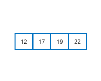
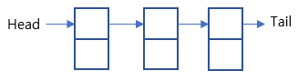
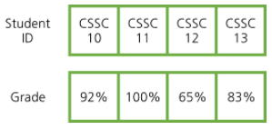

# [자바로 구현하고 배우는 자료구조](https://www.boostcourse.org/cs204) 수강

> ## 스택과 큐

### 배열

* 배열에는 순서가 있다.
* 배열에서 addLast,removeLast의 시간 복잡도는 $O(1)$이다.
* 배열에서 addFirst,removeFirst는  요소들을 하나씩 옮겨야 하기에 시간 복잡도는 $O(n)$이다. 
* Stack
	1. addLast : $O(1)$ removeLast : $O(1)$
	2. addFirst : $O(n)$ removeFirst : $O(n)$
* Queue
	1. addLast : $O(1)$ removeFirst : $O(n)$
	2. addFirst : $O(n)$ removeLast : $O(1)$
* 스택과 큐의 과정이 비효율적이기 때문에 스택과 큐에서 기본적인 배열을 사용하지 않는다.

* 연결 리스트에서는 배열 맨 앞을 가리키는 head 포인터를 사용한다. 그래서 리스트의 첫 부분을 제거하거나 추가하는 과정의 시간 복잡도가 $O(1)$이다. 더 효율적인 알고리즘인 연결 리스트는 스택과 큐를 하는 데 사용한다.

||장점|단점|
|:---:|:---:|:---:|
|배열|연결 리스트보다 전형적으로 더 빠르다.(약 10배 차이) 메모리를 덜 차지한다.|크기가 고정되어 있다. 배열에 크기 추가를 빠르게 하게 되면 빠르게 크는 작업도 오래 걸린다.|
|연결 리스트|수용량이 정해져 있지 않다.|더 느리고 더 많은 메모리가 필요하다.|

### 생각해보기
* 스택과 큐를 배열에 구현한다면 시간 복잡도는 어떻게 되나요?

> ## 해시 - 소개

* 연결 리스트의 단점은 리스트에서 무언가를 찾고 싶을 때 무조건 모든 요소를 살펴봐야 한다는 것인데 이러한 단점을 해결하여, **데이터를 빠르게 추가하거나 제거하도록 한 데이터 구조**가 해시이다.

* 해시는 키, 그와 연관된 값을 가지고 있다. 모든 요소를 살펴본 후 동일한 노드를 찾는 연결 리스트와 달리, 해시에서는 키가 주어지면 바로 그와 연관된 값을 찾을 수 있다.

### 생각해보기
* 원하는 요소를 찾을 때, 연결 리스트와 해시의 시간 복잡도는 각각 무엇인가요?

> ## 해시 - 해시 함수
### 해시 함수 작성 시 고려해야 할 점
1. 데이터의 속성
2. 연산이 빨라야 한다.
3. 두 요소가 "같다면" 같은 값을 반환해야 한다.
4. 같은 실행 환경일 경우 같은 객체라면 같은 값이 나와야 한다.
5. 코드를 새로 실행하면 객체가 같더라도 다른 값이 나올 수 있다. (Object - toString, equals, hashCode (메모리 위치 기반))
6. 코드에서 최대한 충돌이 일어나지 않도록 해야 한다.

### 생각해보기
* 코드를 새로 실행한다는 것이 어떤 의미일까요? 왜 다른 값이 나올 수 있을까요?

***
## 💡 틀렸거나 잘못된 정보가 있다면 망설임 없이 댓글로 알려주세요!

