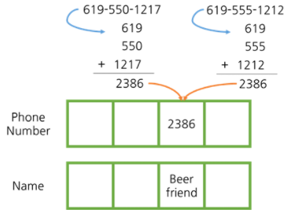

# [자바로 구현하고 배우는 자료구조](https://www.boostcourse.org/cs204) 수강

> ## 해시 - 해시 충돌

해시 충돌 : 서로 다른 값을 가진 키가 일치하는 경우


* 예시) 전화번호를 세 부분으로 나눈 것의 합을 키로 지정, 그런데 키가 2386으로 같아 해시 충돌이 발생함.

* 해시 함수는 충돌이 일어나지 않도록 만들어야 한다. 배열에 두 키가 같은 공간에 들어갈 수 없기 때문

### 생각해보기
* 위 예시에서 해시 충돌이 일어나지 않게 하려면 전화번호를 어떻게 folding 하는 것이 좋을까요?

> ## 해시 - 해시 함수에서 문자열
해시에 저장하고 싶은 문자열이 여러 개 있을 때 문자열을 숫자로 바꿔야 하고 그 숫자는 정수여야 한다. 이유는 배열에 추가하고자 함인데 배열은 그 정수를 위치로 사용하면 되기 때문이다.

문자열 "this"를 해시로 나타내려면 어떻게 해야 할까요?

모든 문자는 유니코드로 변환하여 숫자 형태로 나타낼 수 있다. 따라서 각 문자를 변환한 후 그 숫자들을 합한다면, 문자열을 숫자로 나타낼 수 있을 것이다.
* this : 440
	* t : 116
	* h : 104
	* i : 105
	* s : 115

하지만 이렇게 변환하면, this뿐만 아니라 hits, tish 등 다른 문자열도 같은 숫자로 표현되는 **해시 충돌**이 발생한다. 어떤 상수 g를 문자의 위치만큼 제곱한 뒤 그 수를 곱하면 문제가 해결된다.
```java
public int hashCode(String s) {
	int g=31;
	int hash=0;
	// 문자열을 숫자로 나타내기
	// 상수 g를 문자의 위치만큼 제곱한 뒤 곱합니다.
	for (int i=0; i<s.length; i++)
		hash = g*hash + s.charAt(i);
	return hash;
}
```

### 생각해보기
* 문자열을 해시에 저장할 때, 해시 충돌을 방지하는 다른 방법에는 어떤 것이 있을까요?

> ## 해시 - 해시 크기 최적화

**해시 충돌을 방지**하기 위해 해시의 크기를 최적화합니다.
* 예시
	1. 해시의 크기를 홀수로 설정하여 % 연산자를 사용했을 때 다양한 결과가 나오게 합니다.
	2. 해시의 크기를 소수로 설정하여 나머지가 다양한 숫자가 나오게 합니다.

### 생각해보기
* 해시의 크기를 최적화하는 방법에는 어떤 것이 있을까요?

***
## 💡 틀렸거나 잘못된 정보가 있다면 망설임 없이 댓글로 알려주세요!

