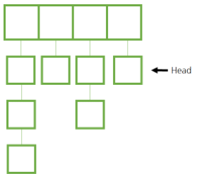

# [자바로 구현하고 배우는 자료구조](https://www.boostcourse.org/cs204) 수강

> ## 해시 - 체이닝 (Chaining)



* 체이닝(Chaining)은 요소마다 연결 리스트를 만들어 수많은 데이터를 수용할 수 있게 하는 방법이다. 체인 해시는 가장 안정적이고 보편적으로 사용되는 자료 구조 중 하나이다.

* 상수 시간으로 어떤 요소든 추가하고 제거하고 찾을 수 있다. (Best case : $O(1)$)

* 체이닝을 하면 수용 가능한 요소 개수에 제한이 없어지고 크기 조정도 자주 할 필요가 없어진다. 적재율 λ는 항목의 개수를 가능한 체인 개수로 나눈 값이다. 체인 1개에 여러 항목을 넣을 수 있어 λ는 1보다 큰 수가 될 수 있다.

* 하지만 hashCode가 같은 숫자만 반환하여 하나의 체인이 너무 길어지면 결국 연결 리스트와 시간 복잡도가 같아지는 문제가 발생한다. (Worst case : $O(n)$)

### 생각해보기
* 체인 해시를 효율적으로 사용하려면 hashCode 함수를 어떻게 설계해야 할까요?

> ## 해시 - 재해싱
체인 해시에서 해시가 너무 많이 차면 **크기 조정**을 해야 한다.
1. 크기가 2배인 배열을 만든다.
2. 아래 코드에 따라 data의 index를 다시 결정하여 연결 리스트의 요소들을 옮긴다.

```java
// data x의 index 결정
int idx = x.hashCode(s);
idx = idx & 0x7FFFFFFF;
idx = idx % tableSize;
```

연결 리스트의 위치를 그대로 하여 옮기면 정보를 다시 찾거나 제거하려 할 때 문제가 발생한다. 정보의 위치를 지정할 때 다른 정보는 그대로인데, tableSize만 바뀌기 때문이다. 그래서 각 요소의 위치를 초기화한 후, **처음부터 다시 위치를 지정해주어야** 한다.

> ## 해시 - 해시 클래스
```java
// 해시 클래스
public class Hash<K, V> implements HashI<K, V> {
	// 데이터 담당
	class HashElement <K, V> implements Comparable <HashElement<K, V>>{
		// 키와 값 정의
		K key;
		V value;
		public HashElement (K key, V value) {
			this.key = key;
			this.value = value;
		}
		// compareTo 함수
		public int compareTo (HashElement<K, V> o)
			return (((Comparable<K>)this.key).compareTo(o.key))
	}
	// 변수
	// numElements : 요소의 개수, tableSize : 배열의 크기
	int numElements, tableSize; 
	// maxLoadfactor : 최대 적재율
	double maxLoadfactor;
	LinkedList<HashElement<K, V>> [] harray;
}
```

> ## 해시 - 내부 클래스
```java
public class Hash<K, V> implements HashI<K, V> {
	class HashElement <K, V> implements Comparable <HashElement<K, V>>{
		// 키와 값 정의
		K key;
		V value;
		public HashElement (K key, V value) {
			this.key = key;
			this.value = value;
		}
		// compareTo 함수
		public int compareTo (HashElement<K, V> h)
			return (((Comparable<K>)h.key).compareTo(this.key))
	}
}
```

### 생각해보기
*  compareTo 함수에서 key를 비교하는 이유는 무엇인가요?

***
## 💡 틀렸거나 잘못된 정보가 있다면 망설임 없이 댓글로 알려주세요!

