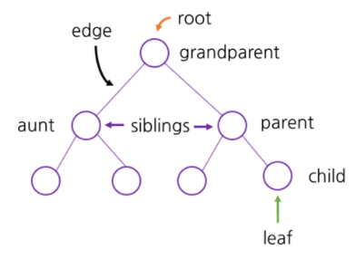
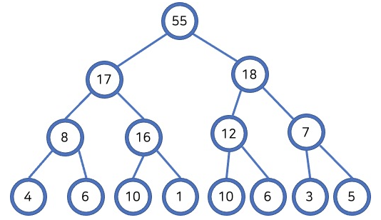
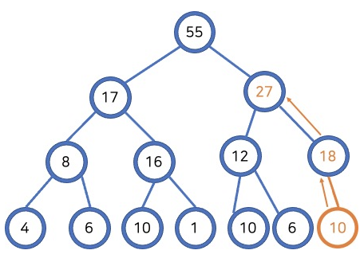
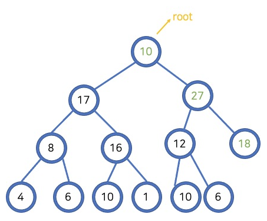

# [자바로 구현하고 배우는 자료구조](https://www.boostcourse.org/cs204) 수강

> ## 힙과 트리 - 소개

### 트리


**노드를 나무 형태로 연결한 구조**를 트리라고 한다. 트리에 있는 각각의 요소는 노드이며 노드는 **부모, 자식** 형태로 이어져 있다.
* 뿌리 (root): 트리의 시작 부분, 뿌리를 통해 들어가서 트리를 탐색한다.
* 잎 (leaf): 자식이 딸려있지 않은 부분
* 간선 (edge): 두 노드를 연결하는 선, 뿌리로부터의 간선의 수에 따라 level을 나눈다.

### 생각해보기
* 어떤 경우에 데이터를 트리 형태로 저장하는 것이 효과적일까요?

> ## 힙과 트리 - 힙:Tree levels

힙은 최댓값 및 최솟값을 찾아내는 연산을 빠르게 하기 위해 고안된 **완전이진트리를 기반으로 한 자료구조**이다.

힙에는 **최대 힙**(max heap)과 **최소 힙**(min heap)이 있다. 부모 노드가 자식 노드보다 크면 최대 힙, 반대이면 최소 힙이다. 가장 큰 숫자가 뿌리에 있게 하려면 최대 힙, 가장 작은 숫자로부터 시작하려면 최소 힙을 사용하면 된다.
* parent > children <span style="color:red">MAX HEAP</span>
* parent < children <span style="color:red">MIN HEAP</span>


|n(노드의 개수)|level|height|$log_2(n+1)-1$|
|:---:|:---:|:---:|:---:|
|1|0|0|0|
|3|1|1|1|
|7|2|2|2|
|15|3|3|3|
* 높이 (height): 뿌리에서부터 가장 먼 잎까지 가는데 거치게 되는 간선의 개수이다.
* $log_2(n+1)-1$은 height와 일치하므로, 트리에 요소가 몇 개 있는지 알면 트리의 높이를 계산할 수 있다.

### 생각해보기
*  최대 힙, 최소 힙에서 최댓값과 최솟값은 각각 어디에 위치하나요?

> ## 힙과 트리 - 힙:추가와 제거
힙에 새로운 데이터를 추가하거나 제거할 때 **힙의 규칙**을 지켜야 한다.
* 최대 힙이면 부모 노드가 자식 노드보다 커야 하고 최소 힙은 자식 노드가 부모 노드보다 커야 한다.

### 노드 추가


1. 새로운 노드를 비어있는 공간에 추가한다.
2. 부모 노드보다 큰 숫자인지 확인하고 만약 그렇다면 두 노드를 바꾼다. (trickle up)

### 루트 제거


1. 루트를 제거한다.
2. 트리의 마지막 요소를 루트에 넣어준다.
3. 루트에서 시작하여 두 자식 중 큰 노드와 바꿔주어 힙의 규칙을 만족하게 한다. (trickle down)
* 뭔가를 제거할 때 힙에서는 항상 루트를 제거해야 한다.

### 생각해보기
* 루트를 제거할 때, 트리의 마지막 요소를 루트 자리에 넣어주는 이유는 무엇인가요?

> ## 힙과 트리 - 힙:TrickleUp 함수
완전이진트리이기 때문에 **노드의 위치**는 아래와 같은 성질을 가진다.
* children: 2 * parent + 1, 2 * parent + 2(루트에 적힌 숫자가 0인 경우에만 성립)
* parent: floor((child-1)/2)

```java
int lastposition; // 배열에 몇 개의 요소가 들어있는지 기록
E[] array = (E[]) new Object[size];
public void add(E obj){
	array[++lastposition] = obj; // 1. 노드 추가
	trickleup(lastposition); // 2. trickle up
}
public void swap(int from, int to){
	E tmp = array[from];
	array[from] = array[to];
	array[to] = tmp;
}
public void trickleup(int position){
	if (position == 0)
		return;
	int parent = (int) Math.floor((position-1)/2)
	if (((Comparable<E>) array[position]).compareTo(array.parent)>0) {
		swap(position, parent);
		trickleup(parent);
	}
}
```

### 생각해보기
* 위 코드에서 lastposition 변수를 사용하는 이유는 무엇인가요?

> ## 힙과 트리 - 힙:TrickleDown 함수
```java
public E remove(){
	E tmp = array[0];
	swap(0, lastposition--); // 루트와 마지막 노드를 바꿔주고 lastposition을 줄여 배열에서 제거한다.
	trickleDown(0);
	return tmp;
}
public void trickleDown(int parent){
	int left = 2*parent + 1;
	int right = 2*parent + 2;
	// 마지막에 왼쪽 자식이 클 때
	if (left==lastposition && (((Comparable<E>)array[parent]).compareTo(array[left])<0){
		swap(parent, left)
		return;
	}
	// 마지막에 오른쪽 자식이 클 때
	if (right==lastposition && (((Comparable<E>)array[parent]).compareTo(array[right])<0){
		swap(parent, right)
		return;
	}
	// 마지막에 부모가 클 때
	if (left >= lastposition || right >= lastposition)
		return;
	// 왼쪽 자식이 클 때
	if (array[left] > array[right] && array[parent] < array[left]) {
		swap(parent, left);
		trickleDown(left);
	}
	// 오른쪽 자식이 클 때
	else if (array[parent] < array[right]){
		swap(parent, right);
		trickleDown(right);
	}
}
```

### 생각해보기
* 루트의 정보를 없애는 대신 swap 함수를 이용하여 제거하면 어떤 점이 좋나요?

> ## 힙과 트리 - 힙:정렬
힙 규칙에 맞게 숫자의 순서를 맞추는 과정을 **힙 정렬 알고리즘**이라고 한다. 임의의 숫자들을 나열하고 **힙 규칙에 맞게 TrickleDown을 반복**하면 그 숫자들이 정렬된다.

힙 정렬 알고리즘의 시간 복잡도는 $O(nlogn)$이다. 두 수를 비교해서 하나를 고르는 방식으로 숫자를 골라내기 때문이다. (총 n개의 숫자를 $logn$개의 숫자와 비교한다.)

숫자들의 순서를 바꿔 정렬하기 때문에 데이터의 복사본을 만들 필요가 없다는 점이 힙 정렬의 장점이다.

### 생각해보기
* 힙 정렬 알고리즘 외의 정렬 방법에는 어떤 것이 있을까요?

***
## 💡 틀렸거나 잘못된 정보가 있다면 망설임 없이 댓글로 알려주세요!

