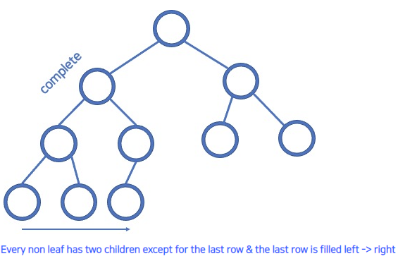
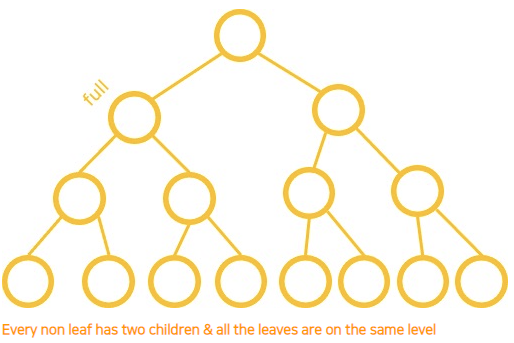
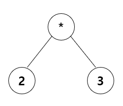
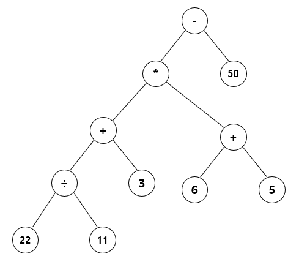
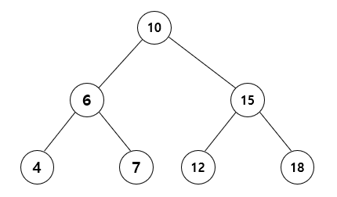

# [자바로 구현하고 배우는 자료구조](https://www.boostcourse.org/cs204) 수강

> ## 힙과 트리 - 트리:완전 트리와 정 트리

### 완전 트리(Complete Tree)

* **모든 잎이 아닌 노드가 2개의 자식 노드**를 가지고 있고 **마지막 줄은 왼쪽에서 오른쪽 순서**로 채워져 있는 트리

### 정 트리(Full Tree)

* **모든 잎이 아닌 노드가 2개의 자식 노드를** 가지고 있고 **모든 잎이 같은 레벨**에 있는 트리

### 생각해보기
* 완전 트리와 정 트리의 공통점과 차이점은 무엇인가요?

> ## 힙과 트리 - 트리:순회
* 전위 순회 (Pre order traversal): 루트 노드에서 시작하여 왼쪽 자식 노드에 갔다가 오른쪽 자식 노드로 가는 순회 방법

* 중위 순회 (In order traversal): 왼쪽 자식 노드에서 시작하여 루트 노드에 갔다가 오른쪽 자식 노드로 가는 순회 방법

* 후위 순회 (Post order traversal): 왼쪽 자식 노드에서 시작하여 오른쪽 자식 노드에 갔다가 루트 노드로 가는 순회 방법

* 너비 우선 선회/레벨 순서 순회 (Breadth first traversal/level order traversal): 가장 위에 있는 노드에서 시작하여 왼쪽에서 오른쪽으로 가는 순회 방법

### 생각해보기
* 전위, 중위, 후위 순회는 반복적인 규칙을 갖고 있습니다. 이를 코드로 구현하려면 어떻게 해야 할까요?

> ## 힙과 트리 - 트리:표현
표현식 트리를 활용해여 굉장히 복잡한 식도 트리 형식으로 표현할 수 있다.

예1)

* 전위 표기식: * 2 3
* 중위 표기식: 2 * 3
* 후위 표기식: 2 3 *

예2)

* 중위 표기식: (((22 / 11) + 3) * (6 + 5)) - 50
* 후위 표기식: 22 11 / 3 + 6 5 + * 50 -

### 생각해보기
*  복잡한 식을 후위 표기식으로 표현하였을 때의 장점은 무엇인가요?

> ## 힙과 트리 - 트리:노드 클래스


트리에서는 **부모 노드보다 작은 데이터가 왼쪽 자식 노드**에 와야 하고 **부모 노드보다 큰 데이터가 오른쪽 자식 노드**에 와야한다.

그래서 어떤 수를 찾으려고 할 때 트리를 따라 내려가는 과정은  $O(logn)$의 복잡도를 가진다.

```java
class Node<E> {
	E data;
	Node <E> left, right;
	public Node(E obj){
		this.data = obj;
		left=right=null;
	}
}
```
* 연결 리스트에서 노드가 next 포인터를 갖고 있었던 것처럼, 트리에서는 노드가 **left, right 포인터**를 갖는다.

### 생각해보기
* left, right 포인터는 부모 노드에서 자식 노드로 향하는 포인터입니다. 자식 노드에서 부모 노드로 향하게 하면 어떤 문제가 생길 수 있을까요?

> ## 힙과 트리 - 트리:재귀 함수

트리에 새로운 데이터를 추가하는 과정
1. 루트에서부터 시작
2. **트리의 규칙**에 따라 내려간다.
3. **null인 부분**을 찾았다면 그 곳에 새로운 노드를 추가

```java
public void add (E obj, Node<E> node){
	if (((Comparable<E>) obj).compareTo(node.data) > 0){
		// go to the right
		if(node.right == null) { // 3
			node.right = new Node<E>(obj);
			return;
		}
		return add (obj, node.right); // 2
	}
	// go to the left
	if(node.left == null) { // 3
		node.left = new Node<E>(obj);
		return;
	}
	return add (obj, node.left); // 2
}
// 트리가 비어있을 경우 (오버로딩)
public void add (E obj){
	if (root==null)
		root = new Node<E>(obj);
	else
		add(obj, root);
	currentSize++; // 현재 크기 증가
}
```
* **재귀 함수**를 이용하여 트리의 규칙에 따라 내려가는 기능을 구현

### 생각해보기
* 재귀 함수를 활용하였을 때의 장점은 무엇인가요?

> ## 힙과 트리 - 트리:Contains
특정 요소가 트리에 포함되어있는지 확인하는 함수를 구현
1. 루트에서부터 시작
2. **트리의 규칙**에 따라 내려간다.
3. **그 요소를 찾으면 True**를 반환하고 **null인 노드**에 다다르면 **False**를 반환

```java
public boolean contains (E obj){
	return contains(obj, root);
}
private boolean contains (E obj, Node<E> node){
	// 트리의 끝에 도달했는데 null
	if (node==null)
		return false;
	// node의 data와 일치
	if (((Comparable<E>) obj).compareTo(node.data) == 0)
		return true;
	// go to the right
	if (((Comparable<E>) obj).compareTo(node.data) > 0)
		return contains(obj, node.right);
	// go to the left
	return contains(obj, node.left);
}
```

### 생각해보기
* 트리가 비어있을 경우에도 contains 함수는 잘 동작하나요?

***
## 💡 틀렸거나 잘못된 정보가 있다면 망설임 없이 댓글로 알려주세요!

