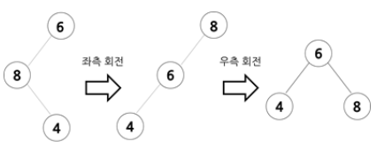

# [자바로 구현하고 배우는 자료구조](https://www.boostcourse.org/cs204) 수강

> ## 힙과 트리 - 트리:제거
자식 노드의 개수에 따라 트리의 특정 요소를 제거하는 방법
1. 잎 노드를 제거할 경우
	* 그 노드의 **부모 노드의 포인터를 null로 설정**
2. 자식 노드가 하나인 노드를 제거할 경우
	* 그 노드의 **부모 노드의 포인터를 자식 노드로** 향하게 하면 된다.
	* 주의할 점은 부모 노드에서 사용했던 포인터와 같은 포인터(left, right 중 하나)를 사용해야 한다는 것이다.
3. 자식 노드가 2개인 노드를 제거할 경우
	* **중위 후속자와 중위 선임자 중 하나와 자리를 바꾼 후 그 잎 노드를 제거**
		* 중위 후속자(in order successor): 제거하고자 하는 노드에서 시작하여 왼쪽으로 한 번 내려갔다가 계속 오른쪽으로 내려간 곳의 잎 노드(중위 순회 방식으로 노드를 탐색할 때 루트 노드를 방문하기 직전에 만나게 되는 노드이기 때문에 중위 후속자라고 부른다.)<br>중위 후속자는 **제거하고자 하는 노드보다 작은 노드들 중에서 가장 큰 노드**
		* 중위 선임자(in order predessor): 제거하고자 하는 노드에서 시작하여 오른쪽으로 한 번 내려갔다가 계속 왼쪽으로 내려간 곳의 잎 노드<br>중위 선임자는 **제거하고자 하는 노드보다 큰 노드들 중에서 가장 작은 노드**

### 생각해보기
* 자식 노드가 2개인 노드를 제거할 때, 중위 후속자 혹은 중위 선임자와 자리를 바꾸는 이유는 무엇인가요?

> ## 힙과 트리 - 트리:회전 소개

회전 : **균형 잡힌 트리**를 만들기 위해 **트리의 노드 위치를 바꾸는 과정**

연결 리스트처럼 **한 방향으로 나열된 트리는 균형 잡혀 있지 않다**고 표현한다. 균형 잡힌 트리에서는 특정 요소를 탐색하는 시간 복잡도가 $O(logn)$이지만 균형 잡히지 않은 트리에서는 연결 리스트와 같은 $O(n)$이 된다. 따라서, **데이터를 효율적으로 관리**하려면 트리를 균형 있게 만들어야 한다. 

조부모 노드, 부모 노드, 자식 노드의 크기 관계에 따라 우측 회전, 혹은 좌측 회전을 한다.
트리를 재정렬하면 항상 중간 크기의 요소가 가장 위에 있는 루트가 된다.

1. 불균형이 왼쪽 서브트리에서 나타날 경우

* 크기 관계는 (조부모 노드) > (부모 노드) > (자식 노드)이다. **우측 회전**을 하여 조부모 노드를 부모 노드의 오른쪽 자식 노드 위치로 옮겨준다.

2. 불균형이 오른쪽 서브트리에서 나타날 경우

* 크기 관계는 (조부모 노드) < (부모 노드) < (자식 노드)이다. **좌측 회전**을 하여 조부모 노드를 부모 노드의 왼쪽 자식 노드 위치로 옮겨준다.

### 생각해보기
* 회전을 하기 위한 조건은 무엇인가요?

> ## 힙과 트리 - 트리:회전

트리가 한쪽으로 치우치지 않은 경우에는 어떻게 해결할까?
우측 회전과 좌측 회전을 모두 사용하여 불균형을 해소해준다.

1. 불균형이 오른쪽 자식의 왼쪽 서브 트리에서 나타날 경우

* 크기 관계는 (부모 노드) > (자식 노드) > (조부모 노드)이다. 자식 노드에 대해 부모 노드를 우측 회전 후 좌측 회전을 하여 조부모 노드를 부모 노드의 왼쪽 자식 노드 위치로 옮겨준다.

2. 불균형이 왼쪽 자식의 오른쪽 서브 트리에서 나타날 경우

* 크기 관계는 (부모 노드) > (조부모 노드) > (자식 노드)이다. 자식 노드에 대해 부모 노드를 좌측 회전 후 우측 회전을 하여 조부모 노드를 부모 노드의 오른쪽 자식 노드 위치로 옮겨준다.

> ## 힙과 트리 - 트리:회전(코딩)

임시 포인터를 사용하여 좌측 회전, 우측 회전을 구현한다.
```java
// 좌측 회전: 조부모 노드를 부모 노드의 왼쪽 자식 노드 위치로 옮김
public Node<E> leftRotate (Node<E> node){
	Node<E> tmp = node.right; // set temp=grandparents right child
	node.right = tmp.left; // set grandparents right child=temp left child
	tmp.left = node; // set temp left child=grandparent 
	return tmp; // use temp instead of grandparent
}

// 우측 회전: 조부모 노드를 부모 노드의 오른쪽 자식 노드 위치로 옮김
public Node<E> rightRotate (Node<E> node){
	Node<E> tmp = node.left; // set temp=grandparents left child
	node.left = tmp.right; // set grandparents left child=temp right child
	tmp.right = node; // set temp right child=grandparent 
	return tmp; // use temp instead of grandparent
}
```

트리가 한쪽으로 치우치지 않을 경우, 우측 회전과 좌측 회전을 둘 다 사용해야 한다. 위에서 구현한 우측 회전, 좌측 회전 함수를 활용하여 아래와 같이 구현한다.
```java
// 우측 회전 후 좌측 회전
public Node<E> rightLeftRotate(Node<E> node){ // node의 인자는 항상 조부모의 노드로 전달한다.
	node.right = rightRotate(node.right);
	return leftRotate(node);
}

// 좌측 회전 후 우측 회전
public Node<E> leftRightRotate(Node<E> node){
	node.left = leftRotate(node.left);
	return rightRotate(node);
}
```

### 생각해보기
* 임시 포인터 tmp를 사용하는 이유는 무엇인가요?

***
## 💡 틀렸거나 잘못된 정보가 있다면 망설임 없이 댓글로 알려주세요!

