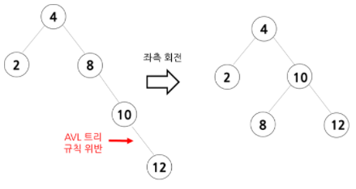
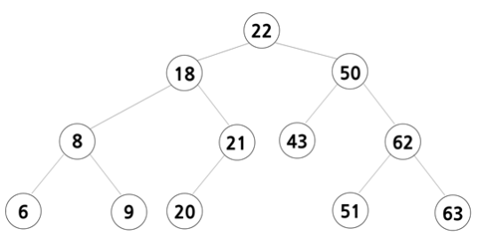

# [자바로 구현하고 배우는 자료구조](https://www.boostcourse.org/cs204) 수강

> ## AVL Tree - 소개

AVL 트리는 스스로 **균형**을 잡는 이진 탐색 트리

AVL 트리에서는 **왼쪽과 오른쪽의 높이 차이가 항상 1보다 작거나 같아야** 한다.



### 생각해보기
* AVL 트리를 구현하는 데 어떤 기능이 필요할까요?

> ## AVL Tree - 노드

```java
class Node<T>{
	T data;
	Node<T> left;
	Node<T> right;
	Node<T> parent;
	// 생성자
	public Node(T obj){
		data = obj;
		parent = left = right = null;
}
```
 * left, right 노드뿐만 아니라, 기능을 간단하게 구현하기 위한 부모 노드에 대한 포인터도 있다.

### 생각해보기
* left 노드, right 노드, 부모 노드의 포인터는 각각 어떤 곳을 가리킬까요?

> ## AVL Tree - add 메소드

```java
// AVL 클래스의 생성자
public AVLTree(){
	root = null;
	currentSize = 0;
}
// add 메소드
public void add(E obj){
	Node<E> node = new Node<E>(obj);
	// 트리가 비어있을 경우
	if (root == null){
		root = node;
		currentSize++;
		return;
	}
	// 트리에 노드가 있으면 add 메소드를 재귀로 호출
	add(root, node);
}
```
* AVL 트리의 클래스 생성자, add 메소드에 대한 코드
* 클래스를 생성 후, 트리가 비어있으면 노드를 추가하고 비어있지 않는다면 add 메소드를 재귀로 호출한다.

### 생각해보기
* 트리에 노드가 있으면 add 메소드를 재귀로 호출하는 이유는 무엇인가요?

> ## AVL Tree - 재귀 add 메소드

이전의 add 메소드에서 재귀로 호출되는 add 메소드
```java
public void add(Node<E> parent, Node<E> newNode){
	// newNode의 data가 parent의 data보다 크면 트리의 오른쪽에 추가
	if (((Comparable<E>)newNode.data.compareTo(parent.data)>0{
		if (parent.right == null){
			parent.right = newNode;
			newNode.parent = parent;
			currentSize++;
		}
		else
			add(parent.right, newNode);
	// newNode의 data가 parent의 data보다 작거나 같으면 트리의 왼쪽에 추가
	else{
		if (parent.left == null){
			parent.left = newNode;
			newNode.parent = parent;
			currentSize++;
		}
		else
			add(parent.left, newNode);
	// AVL트리가 규칙에 맞게 잘 되어있는지 확인
	checkBalance(newNode);
}
```

> ## AVL Tree - 균형 확인 메소드

AVL 트리에서의 규칙은 왼쪽과 오른쪽의 높이 차이가 항상 1보다 작거나 같아야 한다.  따라서, 노드를 추가하였을 때 높이의 차이가 1보다 커지면 회전을 하여 트리의 균형을 맞춰주어야 한다.

```java
public void checkBalance(Node<E> node){
	// 높이 차이가 1 초과 혹은 -1 미만 (AVL 트리 규칙 위반)
	if ((height(node.left) - height(node.right)>1) || (height(node.left) - height(node.right)<-1)){
		rebalance(node);
	// 부모 노드를 계속 확인해서 루트까지 간다.
	if (node.parent == null)
		return;
	checkBalance(node.parent);
}
```
* 트리의 높이 차이를 확인하고 균형을 맞추는 checkBalance 코드

### 생각해보기
* checkBalance 메소드에서 새로 추가한 노드뿐만 아니라 모든 부모 노드를 확인해야 하는 이유는 무엇인가요?

> ## AVL Tree - Rebalance 메소드

Rebalance 메소드는 **어느 쪽에서 균형이 깨졌는지 확인하고 회전을 하여 균형을 유지**한다.

```java
public void rebalance(Node<E> node){
	// 왼쪽 자식 > 오른쪽 자식
	if (height(node.left) - height(node.right)>1) {
		if(height(node.left.left) > height(node.left.right)) // 왼쪽 서브 트리 > 오른쪽 서브 트리
			node = rightRotate(node); // 우측 회전
		else // 왼쪽 서브 트리 < 오른쪽 서브 트리
			node = leftRightRotate(node); // 좌측-우측 회전
	}
	// 왼쪽 자식 < 오른쪽 자식
	else{ 
		if(height(node.right.left) > height(node.right.right)) // 왼쪽 서브 트리 > 오른쪽 서브 트리
			node = rightLeftRotate(node); // 우측-좌측 회전
		else // 왼쪽 서브 트리 < 오른쪽 서브 트리
			node = leftRotate(node); // 좌측 회전	
	}
	// 루트로 올 때까지 반복
	if (node.parent == null)
		root=node;
}
```

### 생각해보기
* checkBalance 메소드와 Rebalance 메소드의 차이점은 무엇인가요? 각각 어떤 역할을 하나요?

> ## AVL Tree - adding data 예제


* add 메소드를 활용하여 43에 18, 22, 9, 21, 6, 8, 20, 63, 50, 62, 51을 순서대로 추가한 결과
* 먼저 트리의 규칙에 따라 내려가 잎에 새로운 데이터를 추가한 뒤 균형이 깨졌는지 확인하고 회전을 하여 균형을 유지하도록 한다.

### 생각해보기
* 우측, 좌측 회전은 각각 어떨 때 필요한가요?
* 43에 18, 22, 9, 21, 6, 8, 20, 63, 50, 62, 51을 순서대로 추가한 AVL 트리를 스스로 만들어보세요.

***
## 💡 틀렸거나 잘못된 정보가 있다면 망설임 없이 댓글로 알려주세요!

