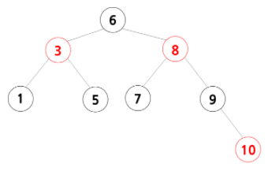

# [자바로 구현하고 배우는 자료구조](https://www.boostcourse.org/cs204) 수강

> ## Red Black Tree - 규칙
Red Black Tree는  자가 균형 이진 탐색 트리로서, AVL 트리처럼 스스로 균형을 잡는 트리이다.

### 규칙
1. 모든 노드는 빨간색이나 검은색
2. 루트는 항상 검은색
3. 새로 추가되는 노드는 항상 빨간색
4. 루트에서 잎 노드로 가는 모든 경로에는 같은 수의 검은색 노드가 있어야 한다.
5. 어떤 경로에서도 빨간색 노드 2개가 연속으로 있어서는 안 된다.
6. 모든 빈 노드는 검은색이라고 가정한다.

### 균형을 맞추는 방법
1. 이모 노드가 검은색일 경우
	* 회전을 한다. 회전을 하고 나면 부모 노드는 검은색, 두 자식 노드는 빨간색이 되어야 한다.
2. 이모 노드가 빨간색일 경우
	* 색상 전환을 한다. 색상 전환을 하고 나면 조부모 노드는 빨간색, 부모와 이모 노드는 검은색이 되어야 한다. (단 조부모 노드가 루트인 경우 조부모 노드를 다시 검은색으로 색상 전환을 한다.)

### 생각해보기
* Red Black Tree에서 검은색 노드 2개가 연속으로 있는 경우는 가능한가요?

> ## Red Black Tree - Red Black Tree


* 1~10까지의 숫자들을 레드 블랙 트리 규칙에 따라 배열
* 1부터 숫자들을 하나씩 추가하면서 규칙에 적합한지 확인
* 규칙을 위반하면 회전과 색상 전환으로 규칙에 맞게 바꾸어 주면 된다.

### 생각해보기
* 회전과 색상 전환을 사용하여 1~10까지의 숫자들이 있는 레드 블랙 트리를 스스로 만들어보세요.

> ## Red Black Tree - 클래스
```java
public class RedBlackTree<K,V> implements RedBlackI<K,V> {
	Node<K,V> root;
	int size;
	class Node<K,V> {
		K key;
		V value;
		Node<K,V> left, right, parent;
		boolean isLeftChild, black;
		public Node (K key, V value) {
			this.key = key;
			this.value = value;
			left = right = parent = null;
			black = false;
			isLeftChild = false;
		}
	}
}
```
* 불리언 값을 가진 black으로 참이면 검은색, 거짓이면 빨간색을 표시
* 이모 노드를 알아내기 위해 left, right, parent 노드를 가리키는 포인터뿐만 아니라 불리언 값을 가진 isLeftChild를 사용

### 생각해보기
* isLeftChild가 참이면 이모 노드는 어떻게 찾을 수 있나요?

> ## Red Black Tree - add 메소드

```java
public void add(K key, V value){
	Node<K,V> node = new Node<K,V>(key, value);
	// 트리가 비어있을 경우
	if (root == null) {
		root = node;
		root.black = true;
		size++;
		return;
	}
	// 트리에 노드가 있으면 재귀 메소드 사용
	add(root, node);
	size++;
}
// add 재귀함수, 내부클래스
private void add (Node<K,V> parent, Node<K,V> newNode){
	// newNode의 data가 parent의 data보다 크면 트리의 오른쪽에 추가
	if (((Comparable<K>) newNode.key).compareTo(parent.key) > 0){
		if(parent.right == null){
			parent.right = newNode;
			newNode.parent = parent;
			newNode.isLeftChild=false;
			return;
		}
		return add(parent.right, newNode);
	// newNode의 data가 parent의 data보다 작거나 같으면 트리의 왼쪽에 추가
	if (parent.left == null){
		parent.left = newNode;
		newNode.parent = parent;
		newNode.isLeftChild=true;
		return;
	}
	return add(parent.left, newNode);
	// 레드 블랙 트리가 규칙에 맞게 잘 되어있는지 확인
	checkColor(newNode);
}
```

### 생각해보기
* checkColor 메소드는 왜 필요한가요?

***
## 💡 틀렸거나 잘못된 정보가 있다면 망설임 없이 댓글로 알려주세요!

