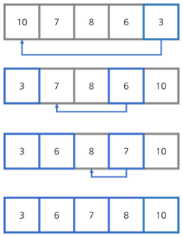
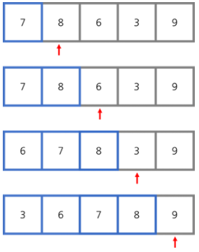
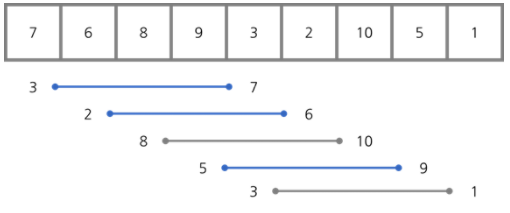
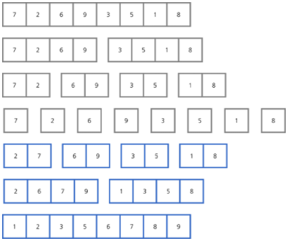
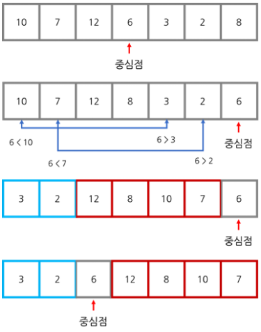
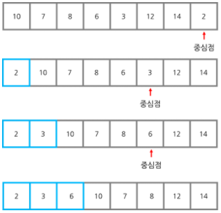

# [자바로 구현하고 배우는 자료구조](https://www.boostcourse.org/cs204) 수강

> ## Sort - 소개

### out-of-place 정렬과 in-place 정렬
* out-of-place 정렬은 모든 데이터를 **자료 구조의 복사본에 옮긴 후** 순서대로 배열하여 정렬하는 방법
* in-place 정렬은 **자료 구조를 그대로 두고** 그 안에서 요소들의 위치를 바꾸어 정렬하는 방법

### 안정 정렬과 불안정 정렬
* 안정 정렬은 **중복된 숫자가 원래 순서를 유지한 상태**로 정렬하는 방법
* 불안정 정렬은 **중복된 숫자의 순서를 보장할 수 없다.**

### 시간복잡도
* 최악의 경우: 원래의 리스트가 완전히 반대순서일 경우
* 평균적인 경우: 완전히 임의의 순서로 되어 있는 리스트가 있고 이를 정렬하는 경우
* 최선의 경우: 이미 정렬된 경우

### 생각해보기
* 일상생활에서 책과 같이 순서가 있는 물건들을 정리할 때, 어떤 정렬 방법을 사용하시나요?

> ## Sort - 선택 정렬

선택 정렬은 **순서대로 리스트의 가장 작은 수를 찾고 그 수를 확정되지 않은 부분의 가장 앞자리에 놓는 방법**
* 리스트 안에서 순서만 바꿔주기 때문에 **in-place 정렬**
* 첫 번째 칸에서는 n-1번 대소 비교를 하고 그 이후로 n-2번, n-3번, ... , 1번 비교하기 때문에 이들을 모두 합하면 복잡도는 $O(n^2)$이다.
	* 리스트가 이미 정렬되어 있다고 하더라도 대소 비교를 해야 하므로 **최선, 평균, 최악의 경우 모두 $O(n^2)$이 된다.**



### 생각해보기
* 선택 정렬을 코드로 구현하려면 어떻게 해야 할까요?

> ## Sort - 삽입 정렬

삽입 정렬은 **요소를 하나씩 꺼내서 그 요소 앞에 있는 다른 요소들과 모두 비교하는 방법**
* 리스트 안에서 순서만 바꿔주기 때문에 **in-place 정렬**
* **안정 정렬**이다.
* 시간 복잡도
	* 최악의 경우, 두 번째 칸에서는 1번 대소 비교를 하고 그 이후로 2번, 3번, ... , n-1번 비교하기 때문에 이들을 모두 합하면 복잡도는 $O(n^2)$이다.
	* 평균적인 경우에도 복잡도는 $O(n^2)$이다.
	* 최선의 경우는 **이미 순서에 맞게 정렬**된 경우로 각각 1번씩 n-1번 비교하면 되기에 복잡도는 $O(n)$이 된다.
* 삽입 정렬은 이미 잘 정렬된 딕셔너리나 데이터베이스에 정렬된 몇 개의 요소를 추가할 때 자주 사용한다. 이 경우에 복잡도는 $O(n)$에 가까워진다. 왜냐하면, 이미 정렬된 부분은 다시 정렬할 필요가 없기 때문이다.



### 생각해보기
* 삽입 정렬의 장점은 무엇인가요?

> ## Sort - 삽입 정렬(코드)

```java
// 요소를 선택하여 v에 저장
for (int i=1; i < array.length; i++) {
	int j;
	int v = array[i];
	for (int j=i-1; j >= 0; j--) {
		// v가 바로 전의 요소보다 크거나 같으면 break
		if (array[j] <= v)
			break;
		// v가 바로 전의 요소보다 작으면 위치를 바꿔줌
		array[j+1] = array[j];
	}
	array[j+1] = v;
}
```

### 생각해보기
* 위 코드에서 변수 v는 무엇을 의미하나요?

> ## Sort - 셀 정렬

셀 정렬은 **일정한 너비만큼 떨어진 요소를 가져와서 그 둘을 대소비교한 후 바꾸는 방법**, 처음에는 큰 간격으로 시작해서 더 적은 간격으로 정렬을 하고 간격의 크기가 1이 되면 삽입 정렬을 한다. 즉, 셀 정렬은 작은 값을 가진 요소는 오른쪽에서 왼쪽으로 옮기고 큰 값을 가진 요소는 왼쪽에서 오른쪽으로 옮기는 알고리즘
* 중복된 숫자의 순서가 보장되지 않는 **불안정 정렬**
* 리스트 안에서 순서만 바꿔주기 때문에 **in-place 정렬**
* 시간복잡도
	* 최악의 경우, 삽입 정렬과 같아지므로 복잡도는 $O(n^2)$이다.
	* **평균적인 시간 복잡도는 간격의 크기에  따라** 달라진다.($O(n^{5/4}), O(n^{3/2})$)



### 생각해보기
* 삽입 정렬과 셀 정렬의 차이점은 무엇인가요?

> ## Sort - 합병 정렬

합병 정렬은 **요소가 하나만 남을 때까지 리스트를 나눠준 후, 나눴던 리스트를 대소 관계에 맞게 다시 합치는 방법**
* 중복된 숫자의 순서가 유지되는 **안정 정렬**
* 리스트를 나눠 다른 공간에 저장해야 하므로 **out-of-place 정렬**
* 리스트를 나눌 때마다 필요한 대소 비교의 횟수가 줄어들어 **평균적인 시간 복잡도는 $O(nlogn)$**



### 생각해보기
* 합병 정렬의 장점은 무엇인가요? 합병 정렬은 어떨 때 사용할까요?

> ## Sort - 합병 정렬(코드)

```java
int[] array, temp;
public mergeSort(int[] array) {
	this.array = array;
	// 빈 배열을 만들어 데이터가 정렬되면 이를 저장
	temp = new int[array.length];
	split(0, array.length - 1);
}
// 리스트가 1개 남을 때까지 나눈다.
public void split(int low, int high) {
	if (low == high) return;
	int mid = (high + low) / 2;
	split (low, mid)
	split (mid + 1, high)
	merge (low, mid, high)
}
// 대소 비교 후 순서에 맞게 열거한다.
private void merge(int low, int mid, int high) {
	int i=low, j=mid+1, tempposn = low;
	// 나눈 리스트의 대소 비교와 정렬
	while (i <= mid && j <= high) {
		if (array [i] <= array [j])
			temp[tempposn++] = array[i++];
		else
			temp[tempposn++] = array[j++];
	}
	// // i가 mid로 가고 j가 high로 갈 때까지 반복
	while (i <= mid) temp[tempposn++] = array[i++];
	while (j <= high) temp[tempposn++] = array[j++];
	// 원래 배열에 다시 복사
	for (tempposn = low; tempposn <= high; tempposn++)
		array[tempposn] = temp[tempposn];
}
```
### 참고자료
* [[알고리즘] 병합 정렬 - Merge Sort (Python, Java)](https://www.daleseo.com/sort-merge/)

### 생각해보기
* 합병 정렬이 out-of-place 정렬인 이유는 무엇인가요? 위 코드에서 어떤 변수에 리스트를 저장하나요?

> ## Sort - 퀵 정렬

퀵 정렬은 **중심점(Pivot Point)을 임의로 고른 후 이 중심점보다 작은 수를 한쪽으로 분류하고 큰 수들은 다른 쪽으로 분류하여 정렬하는 방법**
* 퀵 정렬 알고리즘은 Python, C, C++의 표준 라이브러리나 Java의 sort 메소드에서 사용하는 정렬 알고리즘, 그리고 모든 종류의 변수에 대해 사용할 수 있다.
* 중심점의 왼쪽에 있는 숫자들은 오른쪽에 있는 숫자들과 비교할 필요가 없고 리스트를 분리하여 따로 비교하므로, **평균적인 경우에 시간 복잡도는 $O(nlogn)$**

### 순서
1. 중심점을 선택, 주로 리스트의 중간에 있는 숫자 혹은 마지막에 있는 숫자를 선택
2. 마지막 요소와 중심점의 위치를 바꿔 중심점을 리스트의 가장 끝으로 보낸다.
3. 2개의 카운터를 사용하여 리스트의 처음부터 탐색, 첫 번째 카운터에는 중심점보다 큰 숫자의 위치를 저장하고 두 번째 카운터에는 현재 탐색하고 있는 위치를 저장한다.
4. 탐색하며 중심점보다 작은 숫자를 발견하면 첫 번째 카운터의 숫자 위치와 바꿔준다.
5. 과정 3, 4를 반복하면 중심점보다 큰 수와 중심점보다 작은 수가 나뉘게 된다.
6. 다시 중심점을 선택하여 과정 2 ~ 5를 반복하면 리스트가 정렬된다.



### 생각해보기
*  중심점을 리스트의 중간에 있는 숫자 혹은 마지막에 있는 숫자로 고르는 이유가 무엇인가요?

> ## Sort - 퀵 정렬(최악의 경우)


* 퀵 정렬에서는 전체 데이터를 계속해서 반으로 줄여나가기 때문에 평균적인 상황에서는 $O(nlogn)$의 시간 복잡도를 갖지만 **최악의 경우, 계속해서 최소인 지점을 중심점으로 잡는다면 시간 복잡도는 $O(n^2)$까지도 늘어날 수 있다.**(모든 숫자가 중심점보다 커서 대소비교만 하고 분류가 되지 않는 경우)

### 생각해보기
* n개의 숫자가 있는 리스트에 퀵 정렬을 적용하려 합니다. 최악의 경우에는 총 몇 번의 대소 비교를 해야 하나요?

> ## Sort - 퀵 정렬(코드)

```java
public class QuickSort <E> {
	E[] array;
	// 제너릭 생성자
	public E[] sort(E[] array) {
		this.array = array;
		quicksort(0, array.length - 1);
		return array;
	}
	// 위치를 바꿔주는 함수
	public void swap(int from, int to) {
		E tmp = array[from];
		array[from] = array[to];
		array[to] = tmp;
	}
	// 퀵 정렬
	public void quicksort(int from, int to) {
		// 정렬 종료
		if (from >= to) return;
		// 중심점(Pivot Point)으로 배열의 마지막에 있는 숫자를 선택한다.
		E value = array[to];
		// 중심점보다 큰 값을 가리키는 카운터
		int counter = from;
		// 중심점의 바로 앞까지 탐색
		for (int i=from; i < to; i++) {
			// 중심점보다 작은 값을 발견하면 중심점보다 큰 값과 위치를 바꾼다.
			if (((Comparable<E>) array[i].compareTo(value) <= 0) {
				swap(i, counter);
				counter++;
			}
		}
		// 중심점이 중간에 오게 한다.
		swap(counter, to);
		// 배열의 왼쪽과 오른쪽을 정렬한다. 카운터의 위치는 맞는 자리이므로 더 옮길 필요가 없다.
		quicksort(from, counter - 1);
		quicksort(counter + 1, to);
	}
}
```

### 생각해보기
* 퀵 정렬의 최악의 경우라면 quicksort 함수에서 swap 함수는 몇 번 쓰이게 되나요?

> ## Sort - 기수 정렬

기수 정렬은 **우편번호, 자릿수 등의 기준을 만들어 기준에 따라 숫자를 분류하여 정렬하는 방법**

예로 4자리 숫자를 일의 자리의 숫자, 십의 자리의 숫자, 백의 자리의 숫자, 천의 자리의 숫자에 따라 분류하여 정렬할 수 있다. 이럴 경우 시간 복잡도는 4n이 된다.

이론적으로 $O(n)$의 복잡도를 갖는 빠른 정렬 방법이지만 **실제로는 숫자를 복사하는 과정이 너무 많아 수행 속도가 느리다.** 그래서 컴퓨터에서는 사용하기 어렵고 일상생활에서 우편물을 정렬할 때와 같이 기계적으로 정렬할 때 많이 쓴다.

### 생각해보기
* 기수 정렬은 out-of-place 정렬과 in-place 정렬 중 어떤 것인가요?

> ## Sort - 정렬 요약

||평균 복잡도|안정|In-place|기타|
|:---:|:---:|:---:|:---:|:---:|
|선택 정렬|$O(n^2)$|X|O||
|삽입 정렬|$O(n^2)$|O|O|최선의 경우, 복잡도가 $O(n)$|
|셀 정렬|$O(n^{3/2})$|X|O||
|합병 정렬|$O(nlogn)$|O|X||
|퀵 정렬|$O(nlogn)$|X|O|최악의 경우, 복잡도가 $O(n^2)$|
|기수 정렬|$O(n)$|O|X|매우 느림|
|힙 정렬|$O(nlogn)$|X|O||

### 생각해보기
* 지금까지 배운 정렬 알고리즘을 복습하고 각각의 특징을 정리하는 표를 만들어봅시다.

***
## 💡 틀렸거나 잘못된 정보가 있다면 망설임 없이 댓글로 알려주세요!

