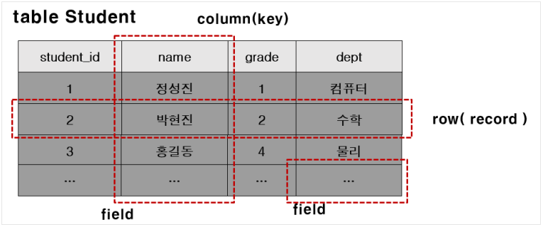

# [웹 백엔드](https://www.boostcourse.org/web326) 수강

> ## 데이터베이스

### 데이터베이스 개념
* **데이터의 집합 (a Set of Data)**
* 여러 응용 시스템(프로그램)들의 **통합**된 정보들을 **저장**하여 **운영**할 수 있는 **공용(share)** 데이터의 집합
* 효율적으로 저장, 검색, 갱신할 수 있도록 데이터 집합들끼리 **연관**시키고 **조직화**되어야 한다.

### 데이터베이스의 특성
* 실시간 접근성(Real-time Accessability)
	* 사용자의 요구를 즉시 처리할 수 있다.
* 계속적인 변화(Continuous Evolution)
	* 정확한 값을 유지하려고 삽입·삭제·수정 작업 등을 이용해 데이터를 지속적으로 갱신할 수 있다.
* 동시 공유성(Concurrent Sharing)
	* 사용자마다 서로 다른 목적으로 사용하므로 동시에 여러 사람이 동일한 데이터에 접근하고 이용할 수 있다.
* 내용 참조(Content Reference)
	* 저장한 데이터 레코드의 위치나 주소가 아닌 사용자가 요구하는 데이터의 내용, 즉 데이터 값에 따라 참조할 수 있어야 한다.

### 데이터베이스 관리 시스템 (Database Management System)
* **데이터베이스를 관리하는 소프트웨어**
* 여러 응용 소프트웨어(프로그램) 또는 시스템이 동시에 데이터베이스에 접근하여 사용할 수 있게 한다.
* 필수 3기능
	* **정의기능** : 데이터 베이스의 논리적, 물리적 구조를 정의
	* **조작기능** : 데이터를 검색, 삭제, 갱신, 삽입, 삭제하는 기능
	* **제어기능** : 데이터베이스의 내용 정확성과 안전성을 유지하도록 제어하는 기능
* Oracle, SQL Server, MySQL, DB2 등의 상용 또는 공개 DBMS가 있다.

### 데이터베이스 관리 시스템의 장/단점
* 장점
	* 데이터 중복이 최소화
	* 데이터의 일관성 및 무결성 유지
	* 데이터 보안 보장
* 단점
	* 운영비가 비싸다
	* 백업 및 복구에 대한 관리가 복잡
	* 부분적 데이터베이스 손실이 전체 시스템을 정지

> ## SQL

### SQL
* SQL은 데이터를 보다 쉽게 검색하고 추가, 삭제, 수정 같은 조작을 할 수 있도록 고안된 컴퓨터 언어이다.
* 관계형 데이터베이스에서 데이터를 조작하고 쿼리하는 표준 수단이다.
* DML (Data Manipulation Language): 데이터를 조작하기 위해 사용한다.
	* INSERT, UPDATE, DELETE, SELECT
* DDL (Data Definition Language): 데이터베이스의 스키마를 정의하거나 조작하기 위해 사용한다.
	* CREATE, DROP, ALTER
* DCL (Data Control Language) : 데이터를 제어하는 언어로 권한을 관리하고, 테이터의 보안, 무결성 등을 정의한다.
	* GRANT, REVOKE


### Database 생성하기
```
mysql -u root -p
```
* MySQL 관리자 계정이 root로 데이터 베이스 관리 시스템에 접속
* -p는 패스워드 옵션
* 윈도우즈 사용자는 설치시에 입력했던 암호를 입력한다.
```
mysql> create database DB이름;
```
* 관리자 계정으로 MySQL에 접속했다면, 위와 같은 명령으로 데이터베이스를 생성

### Database 사용자 생성과 권한 주기
* Database를 생성했다면, 해당 데이터베이스를 사용하는 계정을 생성해야 한다.
* 또한, 해당 계정이 데이터베이스를 이용할 수 있는 권한을 줘야 한다.
* 아래와 같은 명령을 이용해서 사용자 생성과 권한을 줄 수 있다.
* db이름 뒤의 * 는 모든 권한을 의미한다.
* @’%’는 어떤 클라이언트에서든 접근 가능하다는 의미이고, @’localhost’는 해당 컴퓨터에서만 접근 가능하다는 의미이다.
* flush privileges는 DBMS에게 적용을 하라는 의미이다.
* 해당 명령을 반드시 실행해줘야 한다.
```
create user '계정이름'@'%' identified by `암호`;
create user '계정이름'@'localhost' identified by `암호`;
grant all privileges on DB이름.* to 계정이름@'%';
grant all privileges on DB이름.* to 계정이름@'localhost';
flush privileges;
```

### 생성한 Database에 접속하기
```
mysql –h호스트명 –uDB계정명 –p 데이터베이스이름
```

### MySQL 연결끊기
```
mysql> QUIT;
mysql> exit;
```
* 프롬프트에서 quit혹은 exit라고 입력

### MySQL 버전과 현재 날짜 구하기
```
mysql> SELECT VERSION(), CURRENT_DATE;
```

### 키워드는 대소문자를 구별하지 않는다.
```
mysql> SELECT VERSION(), CURRENT_DATE;
mysql> select version(), current_date;
mysql> SeLeCt vErSiOn(), current_DATE;
```
* 위의 쿼리들은 모두 같다.

### 쿼리를 이용해서 계산식의 결과도 구할 수 있다.
```
mysql> SELECT SIN(PI()/4), (4+1)*5;
```

### 여러 문장을 한 줄에 연속으로 붙여서 실행가능하다.
```
mysql> SELECT VERSION(); SELECT NOW();
```
* 각 문장에 semicolon(;)만 붙혀 주면 된다.

### 하나의 SQL은 여러 줄로 입력가능하다.
```
mysql> SELECT
    -> USER()
    -> ,
    -> CURRENT_DATE;
```
* MySQL은 문장의 끝을 라인으로 구분하는 것이 아니라 semicolon(;)으로 구분하기 때문에 여러 줄에 거쳐 문장을 쓰는 것도 가능하다.

### SQL을 입력하는 도중에 취소할 수 있다.
```
mysql> SELECT

    -> USER()

    -> \c
```
* 긴 쿼리를 작성하다가 중간에 취소해야 하는 경우에는 즉시 \c를 붙혀주면 된다.

### DBMS에 존재하는 데이터베이스 확인하기
```
mysql> show databases;
```
* 현재 서버에 존재하는 데이터베이스를 찾아보기 위해서 SHOW statement을 사용한다.

### 사용중인 데이터베이스 전환하기
```
mysql> use 데이터베이스명;
```
* Database을 선택하기 위해, “use” command 사용한다.
* 데이터베이스를 전환하려면, 이미 데이터베이스가 존재해야 하며 현재 접속 중인 계정이 해당 데이터베이스를 사용할 수 있는 권한이 있어야 한다.

### 데이터를 저장하는 공간 테이블(Table)

* 테이블(table)의 구성요소
	* 테이블 : RDBMS의 기본적 저장구조 한 개 이상의 column과 0개 이상의 row로 구성
	* 열(Column) : 테이블 상에서의 단일 종류의 데이터를 나타냄. 특정 데이터 타입 및 크기를 가지고 있다.
	* 행(Row) : Column들의 값의 조합. 레코드라고 불림. 기본키(PK)에 의해 구분. 기본키는 중복을 허용하지 않으며 없어서는 안 된다.
	* 필드(Field) : Row와 Column의 교차점으로 Field는 데이터를 포함할 수 있고 없을 때는 NULL 값을 가지고 있다.

### 현재 데이터베이스에 존재하는 테이블 목록 확인하기
```
mysql> show tables;
```

### 테이블 구조를 확인하기 위한 DESCRIBE 명령
```
mysql> desc 테이블명;
```

***
## 💡 틀렸거나 잘못된 정보가 있다면 망설임 없이 댓글로 알려주세요!

