# [웹 백엔드](https://www.boostcourse.org/web326) 수강

> ## DML

### 데이터 조작어(Data Manipulation Language, DML)의 종류
* SELECT – 검색
* INSERT - 등록
* UPDATE - 수정
* DELETE - 삭제

### SELECT 구문의 기본문형
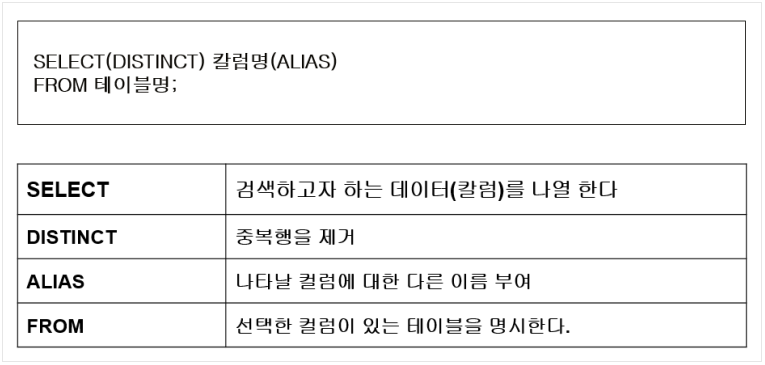

### SELECT 구문 예제
* 전체 데이터 검색(*)
	* 예) DEPARTMENT 테이블의 모든 데이터를 출력하시오.
	```
	SELECT * FROM  DEPARTMENT;
	```
* 특정 컬럼 검색
	* SELECT 뒤에 컬럼을 콤마(,)로 구별해서 나열
	* 예) employee 테이블에서 직원의 사번(empno), 이름(name), 직업(job)을 출력하시오.
	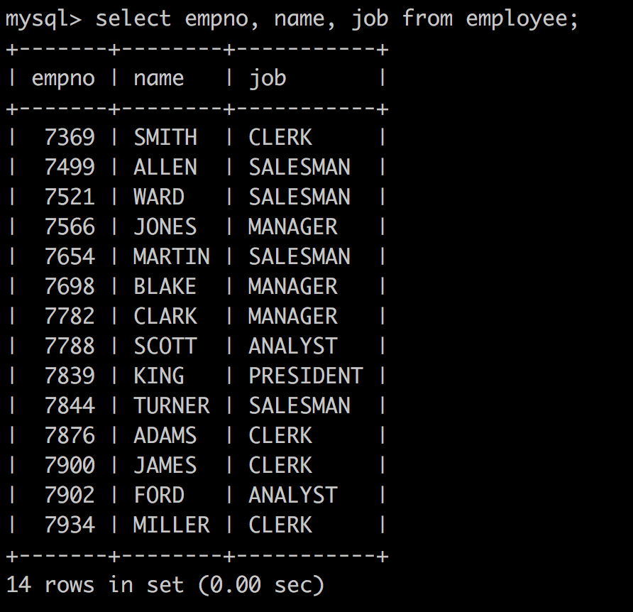
* 컬럼에 별칭 부여하기
	* 컬럼명 뒤에 `공백 후 별칭` 또는 `AS 별칭`을 작성해주면 된다.
	* 별칭에 공백을 포함하고 싶은 경우 `' '`로 감싸줘야 한다.
	* 컬럼에 대한 ALIAS(별칭)을 부여해서 나타내는 컬럼의 HEADING을 변경할 수 있다.
	* 예) employee 테이블에서 직원의 사번(empno), 이름(name), 직업(job)을 출력하시오.
	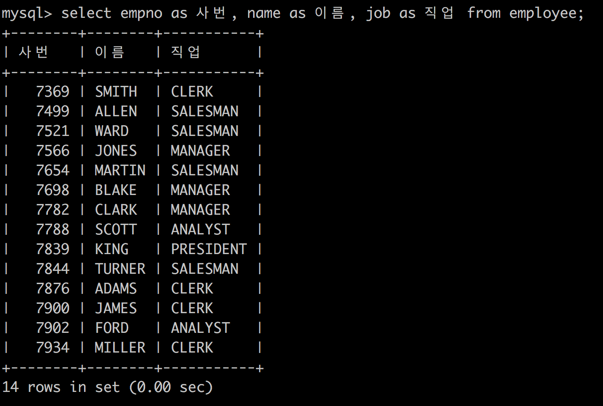
* 컬럼의 합성
	* 문자열 결합함수 CONCAT 사용
	* 예) employee 테이블에서 사번과 부서번호를 하나의 칼럼으로 출력하시오.
	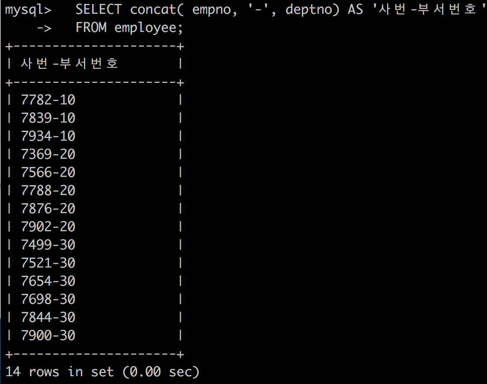
* 중복행 제거
	* 중복되는 행이 출력되는 경우, DISTINCT 키워드로 중복행을 제거한다.
	* 예) employee 테이블의 부서번호를 중복되지 않게 출력하시오.
	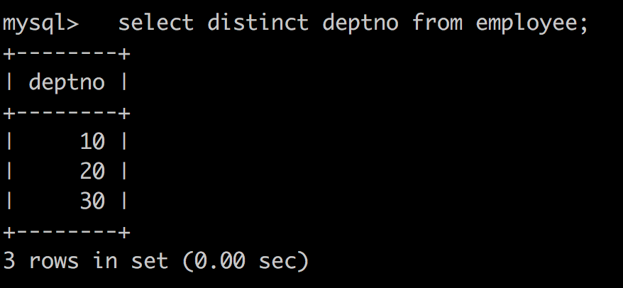

### SELECT - 정렬
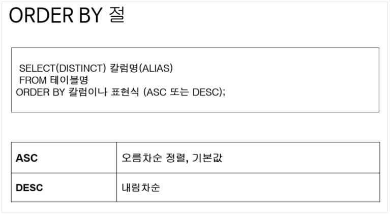
* 오름차순 정렬
	* 예) employee 테이블에서 직원의 사번(empno), 이름(name), 직업(job)을 출력하시오. 단, 이름을 기준으로 오름차순 정렬합니다.
	```
	select empno, name, job from employee order by name;
	select empno as 사번, name as 이름, job as 직업 from employee order by 이름;
	```
* 내림차순 정렬
	* 예) employee 테이블에서 직원의 사번(empno), 이름(name), 직업(job)을 출력하시오. 단, 이름을 기준으로 내림차순 정렬합니다.
	```
	select empno, name, job from employee order by name desc;
	select empno as 사번, name as 이름, job as 직업 from employee order by 이름 desc;
	```

### SELECT - 특정 행 검색(WHERE)
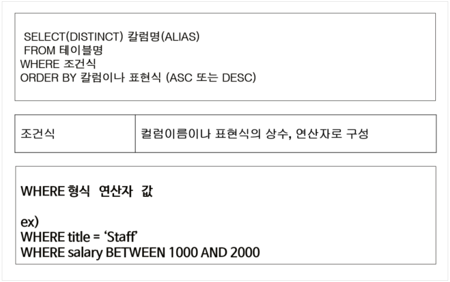
* 산술비교 연산자
	* 예) employee 테이블에서 고용일(hiredate)이 1981년 이전의 사원이름과 고용일을 출력하시오.
	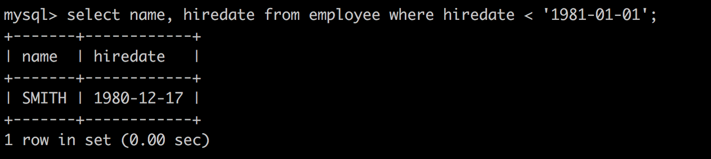
* 논리연산자
	* 예) employee 테이블에서 부서번호가 30인 사원이름과 부서번호를 출력하시오.
	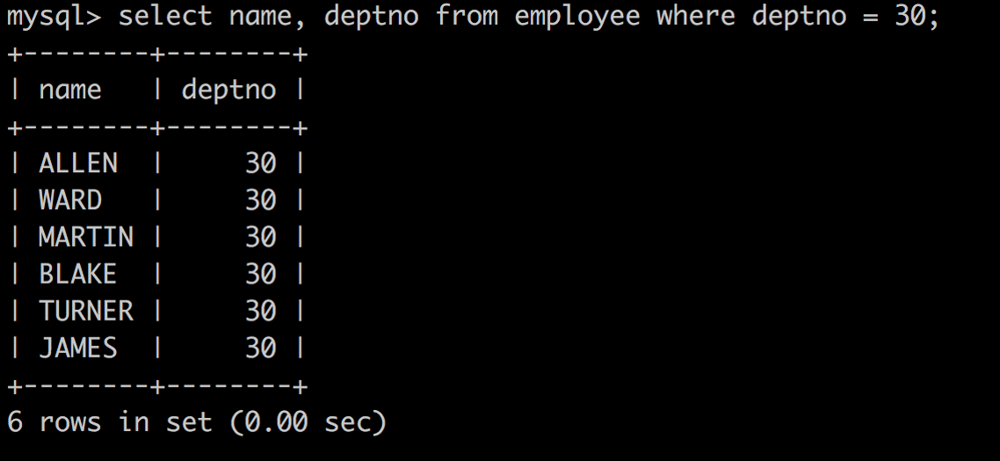
* IN 키워드
	* 예) employee 테이블에서 부서번호가 10 또는 30인 사원이름과 부서번호를 출력하시오.
	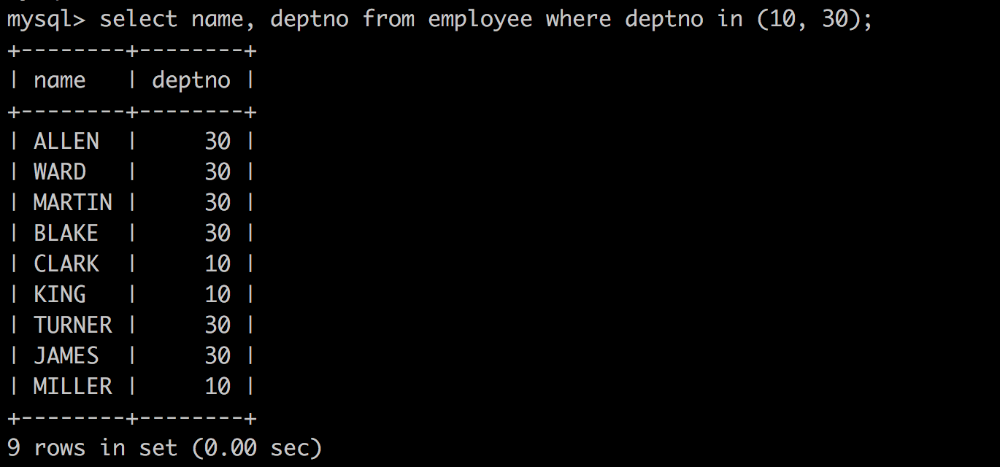
* LIKE 키워드
	* 와일드카드를 사용하여 특정 문자를 포함한 값에 대한 조건을 처리
		* % 는 0에서부터 여러 개의 문자열을 나타냄
		* _ 는 단 하나의 문자를 나타내는 와일드카드
	* 예) employee 테이블에서 이름에 'A'가 포함된 사원의 이름(name)과 직업(job)을 출력하시오.
	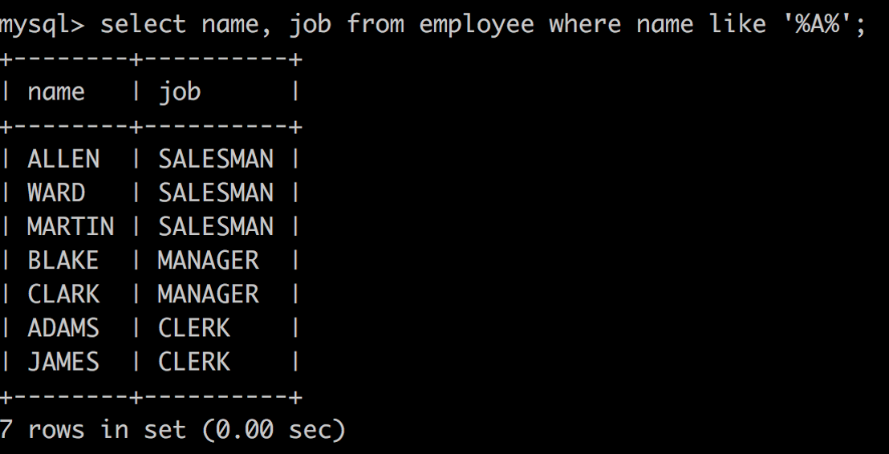

### SELECT - 함수
* UCASE('문자열'), UPPER('문자열') : 문자열을 대문자로 변환

* LCASE('문자열'), LOWER('문자열') : 문자열을 소문자로 변환


* SUBSTRING('문자열', '시작시점', '길이') : 문자열을 시작지점에서부터 길이만큼 추출한다.

* LPAD, RPAD
	* LPAD('문자열', '원하는 자릿수, '채울 문자열') : 왼쪽에 특정문자를 원하는 자릿수만큼 채워서 반환
	* RPAD('문자열', '원하는 자릿수, '채울 문자열') : 오른쪽에 특정문자를 원하는 자릿수만큼 채워서 반환

* TRIM, LTRIM, RTRIM
	* TRIM('문자열') : 문자열의 양쪽 공백 제거
	* LTRIM('문자열') : 문자열의 왼쪽 공백 제거
	* RTRIM('문자열') : 문자열의 오른쪽 공백 제거

* ABS(x) : x의 절댓값 추출
* MOD(x,y) : x을 y로 나눈 나머지 값을 추출
* FLOOR(x) : x보다 크지 않은 가장 큰 정수를 반환,  BIGINT로 자동 변환
* CEILING(x) : x보다 작지 않은 가장 작은 정수를 반환
* ROUND(x) : x에 가장 근접한 정수를 반환
* POW(x,y) POWER(x,y) : x의 y 제곱 승을 반환
* GREATEST(x,y,...) : 가장 큰 값을 반환합니다.
* LEAST(x,y,...) : 가장 작은 값을 반환합니다.
* CURDATE(),CURRENT_DATE : 오늘 날짜를 YYYY-MM-DD나 YYYYMMDD 형식으로 반환
* CURTIME(), CURRENT_TIME : 현재 시각을 HH:MM:SS나 HHMMSS 형식으로 반환
* NOW(), SYSDATE() , CURRENT_TIMESTAMP : 오늘 현 시각을 YYYY-MM-DD HH:MM:SS나 YYYYMMDDHHMMSS 형식으로 반환
* DATE_FORMAT(date,format) : 입력된 date를 format 형식으로 반환
* PERIOD_DIFF(p1,p2) : YYMM이나 YYYYMM으로 표기되는 p1과 p2의 차이 개월을 반환

### SELECT - 형 변환


### SELECT - 그룹 함수


* GROUP BY
	* 예) employee 테이블에서 부서별 직원의 부서번호, 급여 평균과 총합계를 출력하시오.
	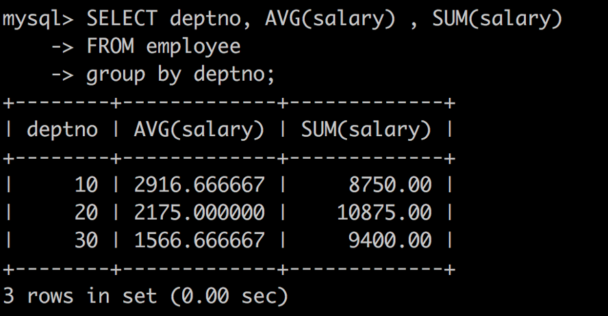

### INSERT - 데이터 입력
```
INSERT INTO 테이블명(필드1, 필드2, 필드3, 필드4, … ) 
VALUES ( 필드1의 값, 필드2의 값, 필드3의 값, 필드4의 값, … )

INSERT INTO 테이블명
VALUES ( 필드1의 값, 필드2의 값, 필드3의 값, 필드4의 값, … )
```
* 필드의 개수와 필드의 값의 개수는 같아야 한다.
* 필드명을 지정해주는 방식은 디폴트 값이 세팅되는 필드는 생략할 수 있다.
* 필드명을 지정해주는 방식은 추후, 필드가 추가/변경/수정되는 변경에 유연하게 대처할 수 있다.
* 필드명을 생략했을 경우에는 모든 필드 값을 반드시 입력해야 한다.
* 예) ROLE테이블에 role_id는 200, description에는 'CEO'로 한 건의 데이터를 저장하시오.
	```
	insert into ROLE (role_id, description) values ( 200, 'CEO');
	```
	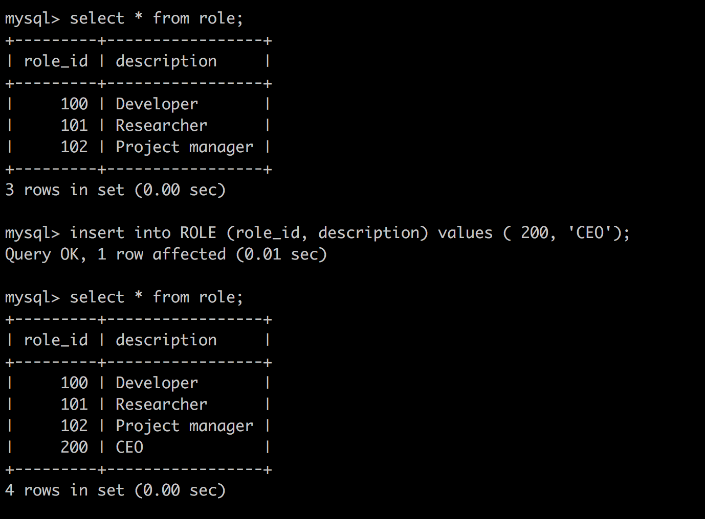

### UPDATE - 데이터 수정
```
UPDATE  테이블명
SET  필드1=필드1의값, 필드2=필드2의값, 필드3=필드3의값, …
WHERE  조건식
```
* 조건식을 통해 특정 row만 변경할 수 있다.
* 조건식을 주지 않으면 전체 로우가 영향을 미치니 조심해서 사용한다.
* 예) ROLE테이블에 role_id가 200일 경우 description을 'CTO'로 수정하시오.
	```
	update ROLE
	set description = 'CTO'
	where role_id = 200;
	```
	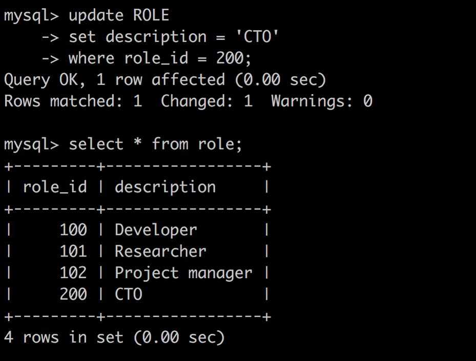

### DELETE - 데이터 삭제
```
DELETE
FROM  테이블명
WHERE  조건식
```
* 조건식을 통해 특정 row만 삭제할 수 있다.
* 조건식을 주지 않으면 전체 로우가 영향을 미치니 조심해서 사용한다.
* 예) ROLE테이블에서 role_id는 200인 정보를 삭제하시오.
	```
	delete from ROLE where role_id = 200;
	```
	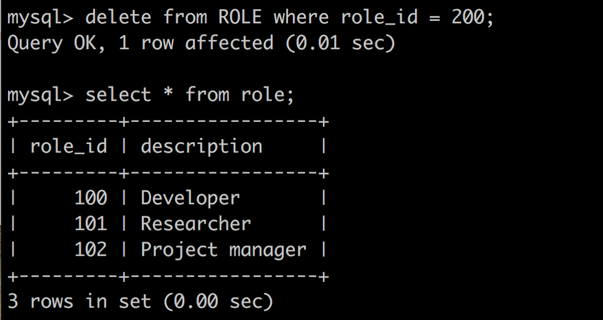

> ## DDL

### MySQL 데이터 타입
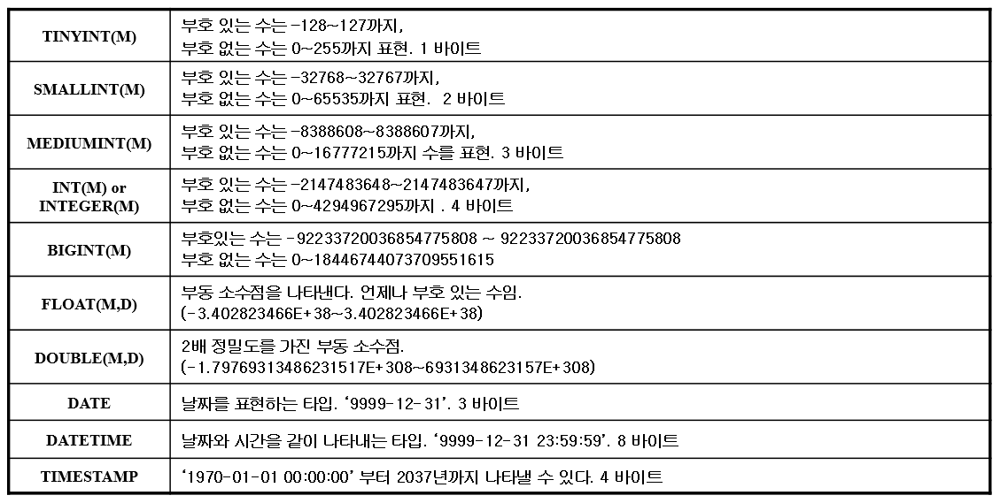


### 테이블 생성
```
create table 테이블명( 
    필드명1 타입 [NULL | NOT NULL][DEFAULT ][AUTO_INCREMENT], 
    필드명2 타입 [NULL | NOT NULL][DEFAULT ][AUTO_INCREMENT], 
    필드명3 타입 [NULL | NOT NULL][DEFAULT ][AUTO_INCREMENT], 
    ........... 
    PRIMARY KEY(필드명) 
    );
```
* 데이터형 외에도 속성값의 빈 값 허용 여부는 NULL 또는 NOT NULL로 설정
* DEFAULT 키워드와 함께 입력하지 않았을 때의 초깃값을 지정
* 입력하지 않고 자동으로 1씩 증가하는 번호를 위한 AUTO_INCREMENT
* 예) 
	```
	CREATE TABLE EMPLOYEE(   
        empno	INTEGER NOT NULL PRIMARY KEY,
        name	VARCHAR(10),
        job		VARCHAR(9),
        boss	INTEGER,
        hiredate	VARCHAR(12),
        salary	DECIMAL(7, 2), 
        comm	DECIMAL(7, 2),
        deptno	INTEGER);
	```

### 테이블 수정 - 컬럼 추가
```
alter table 테이블명
add  필드명 타입 [NULL | NOT NULL][DEFAULT ][AUTO_INCREMENT];
```
* 예) EMPLOYEE 테이블에 생일(birthdate)칼럼을 varchar(12)형식으로 추가하시오.
	```
	alter table EMPLOYEE
	add birthdate varchar(12);
	```

### 테이블 수정 - 컬럼 삭제
```
alter table 테이블명
drop  필드명;
```
* 예) EMPLOYEE 테이블의 생일(birthdate)칼럼을 삭제하시오.
	```
	alter table EMPLOYEE
	drop birthdate;​
	```

### 테이블 수정 - 컬럼 수정
```
alter table  테이블명
change  필드명  새필드명 타입 [NULL | NOT NULL][DEFAULT ][AUTO_INCREMENT];
```
* change 키워드를 사용하고  칼럼을 이름부터 속성까지 전부 새롭게 재정의
* 예) EMPLOYEE 테이블의 부서번호(deptno)를 dept_no로 수정하시오.
	```
	alter table EMPLOYEE
	change deptno dept_no int(11);
	```

### 테이블 이름 변경
```
alter table  테이블명 rename 변경이름
```

### 테이블 삭제
```
drop table 테이블이름;
```
* 참고로, 제약 조건이 있을 경우에는  drop table 명령으로도 테이블이 삭제되지 않을 수 있다. 그럴 경우 테이블을 생성한 반대 순서로 삭제를 해야 한다.

***
## 💡 틀렸거나 잘못된 정보가 있다면 망설임 없이 댓글로 알려주세요!

