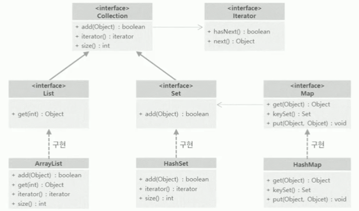

# 프로그래머스의 [자바 중급](https://programmers.co.kr/learn/courses/9) 수강

> ## Object와 오버라이딩

* Object클래스는 모든 클래스의 최상위 클래스

* 아무것도 상속받지 않으면 자동으로 Object를 상속

* Object가 가지고 있는 메소드는 모든 클래스에서 다 사용할 수 있다는 것을 의미

* Object가 가지고 있는 메소드 중에서 가장 많이 사용하는 메소드
	* equals : 객체가 가진 값을 비교할 때 사용

	* toString : 객체가 가진 값을 문자열로 반환

	* hashCode : 객체의 해시코드 값 반환

	* 위 세 가지 메소드는 사용할 때 반드시 오버라이딩해서 사용해야 한다.

> ## java.lang 패키지/오토 박싱
자바는 기본적으로 다양한 패키지를 지원한다. 그중에서 **가장 중요한 패키지**

* java.lang패키지의 클래스는 import를 하지 않고도 사용할 수 있다.

* java.lang패키지에는 기본형 타입을 객체로 변환시킬 때 사용하는 Wrapper클래스가 있다.(실제 클래스가 존재하는 것은 아님)
	* Boolean, Byte, Short, Integer, Long, Float, Double 클래스

* 모든 클래스의 최상위 클래스인 Object도 java.lang패키지

* 문자열과 관련된 String, StringBuffer, StringBuilder도 모두 java.lang패키지

* 화면에 값을 출력할 때 사용했던 System클래스도 java.lang패키지

* 수학과 관련된 Math클래스도 java.lang패키지

* Thread와 관련된 중요 클래스들이 java.lang패키지

* 이외에도 다양한 클래스와 인터페이스가 java.lang패키지에 속해 있다.
```java
public class WrapperExam {
    public static void main(String[] args) {
        int i = 5; 
        Integer i2 = new Integer(5); // 객체형, 참조형
        Integer i3 = 5;	//오토 박싱
        int i4 = i2.intValue();
        int i5 = i2;	//오토 언박싱
    }
}
```
* 오토 박싱(Auto Boxing)
	* 기본 타입 데이터를 객체 타입의 데이터로 자동 형변환 시켜주는 기능

	* Integer i3 = 5; 숫자 5는 원래 기본형이지만 자동으로 Integer형태로 변환

* 오토 언박싱(Auto unboxing)
	* 오토 박싱과 반대로 객체 타입의 데이터를 기본형 타입 데이터로 자동 형변환

	* int i5 = i2; Integer객체 타입의 값을 기본형 int로 자동으로 변환되어 값을 할당

* 오토 박싱(Auto Boxing),오토 언박싱(Auto unboxing) 은 JAVA 5부터 지원한다. 이때 내부적으로 Wrapper클래스들이 사용된다.

> ## java.lang 패키지 - StringBuffer
String 클래스는 자기 자신이 변하지 않는 불변 클래스

StringBuffer 클래스는 자기 자신이 변하는 클래스
##### 아무 값도 가지고 있지 않은 StringBuffer객체를 생성
```java
StringBuffer sb = new StringBuffer();
// 해당 StringBuffer에 "hello", 공백, "world"를 차례대로 추가
sb.append("hello");
sb.append(" ");
sb.append("world");
// StringBuffer에 추가된 값을 toString()메소드를 이용하여 반환
String str = sb.toString();
System.out.println(str);
```
* 출력 결과 : hello world

##### StringBuffer가 가지고 있는 메소드들은 대부분 자기 자신, this를 반환
```java
StringBuffer sb2 = new StringBuffer();
StringBuffer sb3 = sb2.append("hello");
if(sb2 == sb3){
    System.out.println("sb2 == sb3");
}
```
* 자기 자신의 메소드를 호출하여 자기 자신의 값을 바꿔나가는 것을 메소드체이닝이라고 한다.

* StringBuffer클래스는 메소드 체인 방식으로 사용할 수 있도록 만들어져 있다.
```java
String str2 = new StringBuffer().append("hello").append(" ").append("world").toString();
System.out.println(str2);
```
* 앞에서 5줄로 작성했던 코드를 위와 같이 한 줄로 수정할 수 있다.

* StringBuffer는 append메소드 외에도 길이를 구하거나, 자르거나 등의 다양한 메소드들을 가지고 있다.

> ## java.lang 패키지 - 스트링 클래스의 문제점
##### String클래스는 문자열을 다룰때 사용하는 클래스이자 불변클래스
```java
String str1 = "hello world";
String str2 = str1.substring(5);
System.out.println(str1);
System.out.println(str2);
```
* 실행 결과
```
hello world
world
```
* 기존의 str1은 전혀 변화없다.

* substring메소드는 5번째 부터 문자열을 잘라서 새로운 문자열을 반환하는 메소드

String클래스를 사용할 때 가장 문제가 발생하는 경우는 다음과 같은 코드를 사용할 때
```java
String str3 = str1 + str2;
System.out.println(str3);
```
* 실행결과
```
hello world world
```
* 문자열과 문자열을 더하게 되면 내부적으로는 다음과 같은 코드가 실행
	```java
	String str4 = new StringBuffer().append(str1).append(str2).toString();
	System.out.println(str4);
	```
	* 문자열과 문자열을 더하는 코드가 실제는 StringBuffer라는 객체를 만들고 append라는 메소드를 이용해서 문자열이 누적되고 그 누적된 문자열을 toString 메소드로 다시 String 객체로 변환을 해서 리턴하는 것이다.
##### 문자열을 반복문 안에서 더하는 것은 성능상 문제가 발생할 수 있으니 반드시 피한다.

> ## java.lang 패키지 - Math
수학계산을 위한 클래스

##### 코싸인, 싸인, 탄젠트, 절대값, 랜덤값을 구할 수 있는 클래스
* Math클래스는 생성자가 private으로 되어 있기 때문에 new 연산자를 이용하여 객체를 생성할 수 없다.

* 객체를 생성할 수는 없지만 모든 메소드와 속성이 static으로 정의되어 있기 때문에 객체를 생성하지 않고도 사용할 수 있다.
```java
public class MathExam {
    public static void main(String[] args) {
        int value1 = Math.max(5, 20); // 두 값중에 더 큰 값을 구하는 메소드
        int value2 = Math.min(5, -5); // 작은 값을 구하는 메소드
        int value3 = Math.abs(-10); // 절대값을 구하는 메소드
        double value4 = Math.random(); // 랜덤값을 구해주는 메소드
        double value5 = Math.sqrt(25); // 제곱근을 구해주는 메소드 
        }
    }
```

> ## java.util 패키지
유용한 클래스들을 많이 가지고 있는 패키지
* 날짜와 관련된 클래스인 Date, Calendar클래스

* 자료구조와 관련된 컬렉션 프레임워크와 관련된 인터페이스와 클래스

* API문서에서 Date라는 클래스의 생성자에서 deprecated란 더 이상 지원하지 않는 기능이므로 사용을 자제하라는 의미

* Date클래스는 지역화를 지원하지 않는다. 지역화란 국가별로 현재 날짜와 시간은 다를 수 있는데, 그 부분을 지원하지 못한다.

* 이런 문제를 해결하기 위하여 나온 클래스가 Calendar클래스. Calendar클래스는 자바 1.1에 등장함.

* 지역화와 관련된 클래스들은 Locale로 시작되는 이름을 가진 클래스들이다. 역시 1.1 이후에 등장한다.

* List, Set, Collection, Map 등 자료구조에 관련된 인터페이스들을 확인할 수 있다.

> ## java.util 패키지 - 컬렉션 프레임워크
java.util패키지에는 자료를 다룰 수 있는 자료구조 클래스가 다수 존재하는데 자료구조 클래스들을 컬렉션 프레임워크라고 한다.
* 자료구조란 자료를 저장할 수 있는 구조

* 책을 보관하기 위해서 책장을 이용하는 것처럼 다양한 자료들을 다양한 방식으로 관리하기 위한 방법이 필요한데, 이러한 방법을 제공하는 것을 자료구조, 컬렉션 프레임워크이다.

* 컬렉션 프레임워크에서 가장 기본이 되는 interface는 Collection인터페이스
	* Collection인터페이스는 여기에 자료가 있다라는 것을 표현.
	
	* 중복도 허용하고, 자료가 저장된 순서도 기억하지 못하는 것이 Collection인터페이스

	* Collection이 가지고 있는 대표적인 메소드는 add(), size(), iterator() 메소드
		* add 메소드는 컬렉션의 자료를 추가해주는 메소드

		* size 메소드는 저장된 자료의 수를 반환하는 메소드

		* iterator는 자료를 하나씩 꺼내기 위한 iterator인터페이스를 반환하는 메소드
	* Collection은 저장된 순서를 기억하지 못하기 때문에 "첫번째 자료를 달라, 두번째 자료를 달라"와 같은 기능을 가질 수 없다.

	* Collection은 저장된 자료를 하나씩 하나씩 꺼낼 수 있는 Iterator라는 인터페이스를 반환한다.
		* Iterator는 꺼낼것이 있는지 없는지 살펴보는 hasNext()메소드와 하나씩 자료를 꺼낼때 사용하는 next()메소드를 가지고 있다.

* Set자료구조는 중복을 허용하지 않는 자료구조를 표현하는 인터페이스
	* Collection인터페이스를 상속받는다.

	* Set인터페이스가 가지고 있는 add 메소드는 같은 자료가 있으면 false, 없으면 true를 반환하는 add 메소드를 가지고 있다.

* List자료구조는 중복은 허용하면서 순서를 기억하는 자료구조를 표현
	* Collection인터페이스를 상속받는다.

	* List는 순서를 기억하고 있기 때문에 0번째 1번째 n번째처럼 순차적으로 자료를 꺼낼 수 있는 get(int)메소드를 가지고 있다.

* Map자료구조는 Key와 Value를 가지는 자료구조
	* 저장할 때 put()메소드를 이용하여 key와 value를 함께 저장

	* 원하는 값을 꺼낼때는 key를 매개변수로 받아들이는 get()메소드를 이용하여 값을 꺼낸다.

	* Map에 저장되어 있는 모든 Key들은 중복된 값을 가지면 안 된다.

	* Key의 이런 특징 때문에 Map은 자신이 가지고 있는 모든 Key들에 대한 정보를 읽어들일 수 있는 Set을 반환하는 keySet()메소드를 가지고 있다.



> ## java.util 패키지 - Generic
Generic을 사용함으로써 선언할 때는 가상의 타입으로 선언하고, 사용 시에는 구체적인 타입을 설정함으로써 다양한 타입의 클래스를 이용하는 클래스를 만들 수 있다. Generic을 사용하는 대표적인 클래스는 컬렉션 프레임워크와 관련된 클래스이다.

* Box 클래스
```java
public class Box {
    private Object obj;
    public void setObj(Object obj){
    this.obj = obj;
    }

    public Object getObj(){
    return obj;
    }
}
```
* BoxExam 클래스
```java
public class BoxExam {
    public static void main(String[] args) {
        Box box = new Box();
        box.setObj(new Object());
        Object obj = box.getObj();

        box.setObj("hello");
        String str = (String)box.getObj();
        System.out.println(str);

        box.setObj(1);
        int value = (int)box.getObj();
        System.out.println(value);
    }
}
```
-> Box는 매개변수로 Object를 하나 받아들이고, Object를 반환한다
.

-> Object를 받아들일 수 있다는 것은 Object의 후손이라면 무엇이든 받아들일 수 있다는 것이다.

-> 모든 객체가 다 들어가기 때문에 다시 꺼내서 사용할 떄 매번 형변환을 해줘야 한다.

* Generic을 이용한 Box 클래스
```java
public class Box<E> {
    private E obj;
    public void setObj(E obj){
    this.obj = obj;
    }

    public Object getObj(){
    return obj;
    }
}
```
-> 클래스 이름 뒤에 `<E>`가 제네릭을 적용한 것이다. Box는 가상의 클래스 E를 사용한다는 의미

-> Object를 받아들이고, 리턴하던 부분이 E로 변경,  E는 실제로 존재하는 클래스는 아니다. 
* Generic을 이용한 BoxExam클래스
```java
public class BoxExam {
    public static void main(String[] args) {
        Box<Object> box = new Box<>();
        box.setObj(new Object());
        Object obj = box.getObj();

        Box<String> box2 = new Box<>();
        box2.setObj("hello");
        String str = box2.getObj();
        System.out.println(str);

        Box<Integer> box3 = new Box<>();
        box3.setObj(1);
        int value = (int)box3.getObj();
        System.out.println(value);
    }
}
```
-> 참조타입에 `<Object>` , `<String>`, `<Integer>`가 있는 것을 볼 수 있다.

-> 첫번째는 Object를 사용하는 Box를 인스턴스로 만들겠다는 의미

-> 두번째는 String을 사용하는 Box인스턴스를 만들겠다는 의미

-> 세번째는 Integer를 사용하는 Box인스턴스를 만든다는 의미

> ## java.util 패키지 - Set
set은 중복이 없고, 순서도 없는 자료구조, Hashset과 TreeSet이 있다.

### Hashset
```java
import java.util.HashSet;
import java.util.Iterator;
import java.util.Set;

public class SetExam {
    public static void main(String[] args) {
        Set<String> set1 = new HashSet<>();

        boolean flag1 = set1.add("kim");
        boolean flag2 = set1.add("lee");
        boolean flag3 = set1.add("kim");

        System.out.println(set1.size());   //저장된 크기를 출력한다. 3개를 저장하였지만, 이미 같은 값이 있었기 때문에 2개가 출력
        System.out.println(flag1);  //true
        System.out.println(flag2);  //true
        System.out.println(flag3);  //false

        Iterator<String> iter = set1.iterator();

        while (iter.hasNext()) {   // 꺼낼 것이 있다면 true 리턴.          
            String str = iter.next(); // next()메소드는 하나를 꺼낸다. 하나를 꺼내면 자동으로 다음것을 참조한다.
            System.out.println(str);
        }
    }
}
```

> ## java.util 패키지 - List
리스트는 배열과 비슷하게 사용되는 자료 구조로 생각하면 되는데 차이점으로는 배열은 한번 생성하면 크기 변경되지 않는 자료구조였다면 리스트는 저장공간이 필요에 따라 자유롭게 변경할 수 있는 자료구조이다.
리스트에는 데이터의 중복이 있을 수 있고 순서도 있다.

```java
import java.util.ArrayList;
import java.util.List;

public class ListExam {

    public static void main(String[] args) {
        List<String> list = new ArrayList<>();
        // list에 3개의 문자열을 저장한다.
        list.add("kim");
        list.add("lee");
        list.add("kim");

        System.out.println(list.size()); //list에 저장된 자료의 수를 출력 (중복을 허용하므로 3 출력) 
        for(int i = 0; i < list.size(); i++){
            String str = list.get(i);
            System.out.println(str);
        }
    }   
}
```

> ## java.util 패키지 - Map
Map은 key와 value를 쌍으로 저장하는 자료구조, key를 이용해서 value를 찾을 수 있도록 설계되었기 때문에 key가 중복될 수 없고 값은 중복될 수 있다.
```java
import java.util.HashMap;
import java.util.Iterator;
import java.util.Map;
import java.util.Set;   
public class MapExam {  
    public static void main(String[] args) {
        // Key, Value가 모두 String 타입인 HashMap인스턴스를 만든다.
        Map<String, String> map = new HashMap<>();

        // key와 value값을 put으로 저장한다.
        map.put("001", "kim");
        map.put("002", "lee");
        map.put("003", "choi");
        // 같은 key가 2개 있을 수 없다. 첫번째로 저장했던 001, kim은 001, kang으로 바뀐다.
        map.put("001", "kang");

        // map에 저장된 자료의 수를 출력한다. 3이 출력된다.
        System.out.println(map.size());

        // 키가 001, 002, 003인 값을 꺼내 출력한다.
        System.out.println(map.get("001"));
        System.out.println(map.get("002"));
        System.out.println(map.get("003"));

        // map에 저장된 모든 key들을 Set자료구조로 꺼낸다.
        Set<String> keys = map.keySet();
        // Set자료구조에 있는 모든 key를 꺼내기 위하여 Iterator를 구한다.
        Iterator<String> iter = keys.iterator();
        while (iter.hasNext()) {
            // key를 꺼낸다.
            String key = iter.next();
            // key에 해당하는 value를 꺼낸다.
            String value = map.get(key);
            // key와 value를 출력한다.
            System.out.println(key + " : " + value);
        }
    }
}
```


***
## 💡 틀렸거나 잘못된 정보가 있다면 망설임 없이 댓글로 알려주세요!

