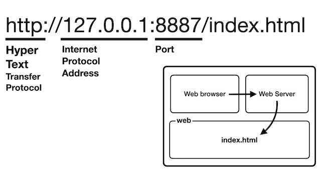

# [생활코딩의 WEB1 - HTML & Internet](https://www.opentutorials.org/course/3084) 수강

> ## 부모 자식과 목록 

몇몇 태그들은 부모 자식 관계처럼 고정된 관계인 태그들이 있다.

* 목차(list) 태그
    * `<li></li>`

    * `<ul></ul>`
        * unordered list
        * 순서 없는 목차
        * li 태그의 부모
        * 서로 연관된 항목이 어디서부터 어디까지인지 경계를 짓기 위한, 그룹화 하기 위해 사용
    
    * `<ol></ol>`
        * ordered list
        * 순서 있는 목차

> ## 문서의 구조와 슈퍼스타들

### HTML 약속

* HTML로서 만들어졌다는 것을 표현하기 위해 문서의 시작에 아래와 같은 코드를 추가
    * `<!doctype html>`

* head 태그와 body 태그를 감싸는 하나의 태그
    * `<html></html>`
    * 본문 설명 태그
        * `<head></head>`
        * 웹페이지 제목 태그
            * `<title></title>`
            * 책으로 비유하면 책 표지

        * 문자 표현 규정
            * UTF-8 설정
            * `<meta charset="utf-8">`
        
    * 본문 태그
        * `<body></body>`

> ## HTML 태그의 제왕

* 이 태그는 무엇인가?
    * 현대의 HTML은 150여 개의 태그로 이루어져 있지만 이들 모두 이 태그의 아래에 있다.

    * 검색엔진들은 이 태그 덕분에 전 세계의 웹을 항해하면서 웹페이지들을 발견할 수 있고, 이 태그 덕분에 더 좋은 검색 결과를 만들 수 있었다. 이 태그가 없다면 검색엔진은 존재하지 않았을 것이다.

    * 이 태그는 도시의 길과 인체의 혈관과 같은 것이다. 이 태그가 없다면 전 세계의 모든 웹페이지는 고립될 것이고, 정보혁명도 시작되지 않았을 것이다.

    * 이 태그는 매일 백 번 넘게 사용하는 기능을 표현하는 태그이다.

    * HyperText Markup Language의 HyperText가 이 태그를 의미한다.

### 링크 태그
* 웹 페이지와 다른 웹 페이지를 연결

* 배가 정박할 때 사용하는 닻을 의미하는 anchor의 첫 글자를 따옴

* `<a href="링크 주소"></a>`
    * 예)
    ```html
    <a href="https://www.w3.org/TR/html5/" target="_blank" title="html5 specification"></a>
    ```
    * `target="_blank"` : 링크를 클릭했을 때 새 창에서 페이지가 열리게 하는 속성

    * `title` : 이 링크가 어떤 내용을 담고 있는지 툴팁으로 보여주는 기능

> ## 원시 웹

### Internet VS WEB
* 인터넷과 웹은 다르다

* 비유적 표현으로 인터넷이 도시라면 웹은 도시 위의 건물 하나, 인터넷이 도로라면, 웹은 도로 위를 달리는 자동차 한 대, 인터넷이 운영체제라면, 웹은 운영체제에서 동작하는 하나의 프로그램이라 할 수 있다.

* 1960년에 인터넷이 탄생

* 1990년에 웹이 시작

* 일반 사람들이 이 두 기술을 잘 구분하지 못한 이유는 웹이 너무나 성공했고 웹 때문에 사람들이 인터넷을 쓰기 시작했기 때문이다.

* 인터넷은 당시 중앙집중적인 통신 시스템의 문제를 극복하기 위해 분산된 형태의 통신시스템을 구상하게 된 것이 시초이다.
    * 그 당시 인터넷은 대학, 군대, 기업들만 사용하는 엘리트 시스템이다.

* 웹은 팀 버너스 리에 의해 만들어 짐.
    * 1990년 10월 - 웹페이지를 편집하는 프로그램을 만듦

    * 1990년 11월 - 세계 최초의 웹브라우저를 만듦. 이 브라우저의 이름은 월드 와이드 웹(world wide web)

    * 1990년 12월 24일 - 웹 서버 완성
        * http://info.cern.ch

        * 세계 최초의 웹페이지

        * 웹의 메소포타미아

> ## 인터넷을 여는 열쇠 : 서버와 클라이언트

* 인터넷이 동작하기 위해서는 컴퓨터가 최소 2대가 필요하다.
    
    * 웹브라우저 프로그램이 설치된 컴퓨터, 요청하는 컴퓨터를 클라이언트 컴퓨터

    * 웹서버가 설치된 컴퓨터, 응답하는 컴퓨터를 서버 컴퓨터라고 부른다.

* 웹 브라우저는 클라이언트에서 동작한다.
    * 웹 브라우저는 다른 말로 웹 클라이언트라고 부른다.

* 웹 서버는 서버에서 동작한다.


> ## 웹서버 운영하기

### 웹서버를 통해서 웹페이지를 여는 것과 파일 찾기를 통해서 웹페이지를 여는 것은 구체적으로 어떤 차이가 있을까?


* 파일 찾기로 통한 것은 웹 브라우저가 웹서버를 통하지 않고 직접 웹 페이지를 연 것


* http는 웹 페이지를 전송하기 위해서 고안된 통신 규칙

* 127.0.0.1은 Internet Protocol Address로서 컴퓨터와 컴퓨터가 서로 통신을 할 때 사용하는 주소체계
    * IP Address는 0.0.0.0부터 255.255.255.255까지의 주소가 존재함
        * 약 43억 개의 주소가 존재
    
    * 127.0.0.1은 내컴퓨터 자신을 가르키는 특별한 주소이다.

> ## 코드의 힘

### 동영상 삽입
* 유튜브 소스코드 활용
```html
<iframe width="640" height="360" src="https://www.youtube.com/embed/7T7r_oSp0SE" title="YouTube video player" frameborder="0" allow="accelerometer; autoplay; clipboard-write; encrypted-media; gyroscope; picture-in-picture" allowfullscreen></iframe>
```

***
## 💡 틀렸거나 잘못된 정보가 있다면 망설임 없이 댓글로 알려주세요!

