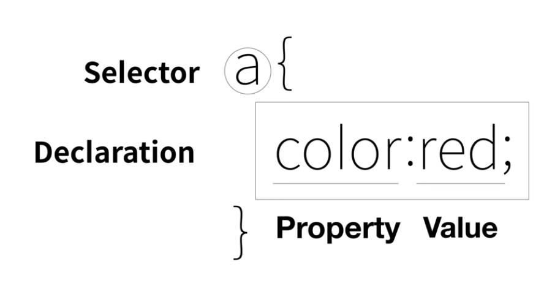
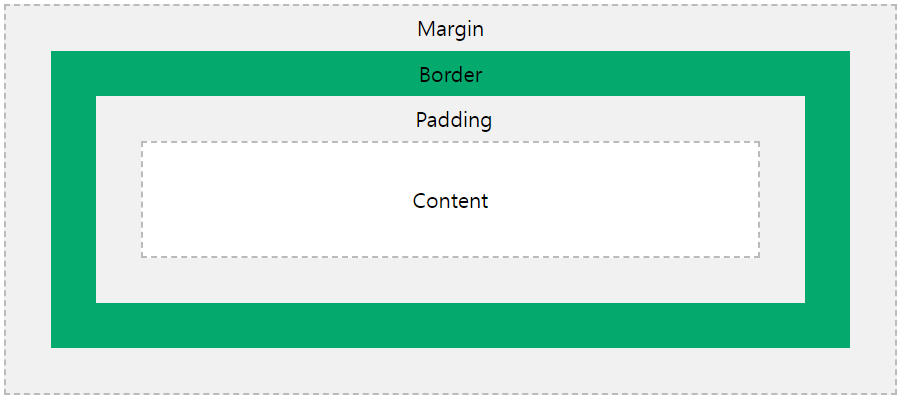
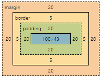

# [생활코딩의 WEB2 - CSS](https://www.opentutorials.org/course/3086) 수강

> ## CSS 등장 이전의 상황

* 글꼴 색상 태그
    * `<font color = "red"></font>`

    * 지금은 사용하지 않음

    * 한계가 명확하다.
        * 수만 개의 글꼴 색상을 바꿔줘야 한다면? 수만 개의 글꼴 색상을 일일이 바꿔줘야 한다.

> ## CSS 등장

* `<style></style>`
    * HTML의 문법

    * 의미 : 웹브라우저에 style 태그 안쪽에 있는 내용은 CSS라는 언어의 문법에 맞게 해석해서 처리해야 한다는 것을 알려준다.

    * 예) 이 웹페이지의 모든 a 태그의 font 컬러를 붉은색으로 해라.
    ```html
    <!--font 태그로 글꼴 색상 지정-->
    <h1><a href="index.html"><font color = "red">WEB</font></a></h1>
    <ol>
      <li><a href="1.html"><font color = "red">HTML</font></a></li>
      <li><a href="2.html"><font color = "red">CSS</font></a></li>
      <li><a href="3.html"><font color = "red">JavaScript</font></a></li>
    </ol>
    ```
    ```html
    <!--CSS로 글꼴 색상 지정-->
    <style> 
    a {
      color:red;
    }
    </style>
    ...
    <h1><a href="index.html">WEB</a></h1>
    <ol>
      <li><a href="1.html">HTML</a></li>
      <li><a href="2.html">CSS</a></li>
      <li><a href="3.html">JavaScript</a></li>
    </ol>
    ...
    ```

### CSS라는 언어가 도입된 중요한 이유
1. HTML이 정보에 전념하게 하기 위해서 HTML로부터 디자인에 대한 기능을 뺏어온 것

2. CSS를 통해서 웹페이지를 디자인하는 것이 HTML을 통해서 디자인하는 것보다 훨씬 더 효율적이다.

> ## CSS의 기본 문법

### 웹페이지 안에 CSS를 삽입하는 방법
1. style 태그를 쓴다.
    * 예)
    ```html
    <style> 
    a { 
      color: black;
      text-decoration: none;
    }
    </style>
    ```
    * 선택자(selector) : 이 웹페이지에서 주고 싶은 효과를 누구에게 줄 것인가를 선택한다.
        * a {...}
    
    * 효과(declaration) : style 속성에서 선언된 경우는 그 속성이 있는 태그에 효과를 줄 것이기 때문에 선택자는 사용할 필요가 없다.
        * {...} 안에 있는 내용



2. style 속성을 쓴다.
    * html의 속성

    * 예)
    ```html
    <li><a href="2.html" style="color:red; text-decoration: underline;">CSS</a></li>
    ```

    * 의미 : style이라는 속성을 썼으면 그 속성의 값을 웹브라우저는 css의 문법에 따라 해석해서 style 속성이 있는 이 태그에 효과 적용

### property
* `font-size` : 텍스트 크기 지정
* `text-align` : 텍스트 위치 지정

### selector

* `.className` : class 네임 값의 태그를 선택

* `class="className"` : class 네임 지정
  * 그룹핑한다.

* `#idName` : id 네임 값의 태그를 선택

* `id="idName"` : id 네임 지정
  * id 네임이 중복할 수 없다.

* 선택자 우선순위 : ID 선택자 > CLASS 선택자 > TAG(ELEMENT) 선택자

* 같은 등급의 선택자 우선순위 : 가장 마지막에 등장하는 선택자 순으로 우선순위가 높다.

```html
<!doctype html>
<html>
<head>
  <title>WEB - CSS</title>
  <meta charset="utf-8">
  <style>
    #active {
      color:red;
    }
    .saw {
      color:gray;
    }
    a {
      color:black;
      text-decoration: none;
    }
    h1 {
      font-size:45px;
      text-align: center;
    }
  </style>
</head>
<body>
  <h1><a href="index.html">WEB</a></h1>
  <ol>
    <li><a href="1.html" class="saw">HTML</a></li>
    <li><a href="2.html" class="saw" id="active">CSS</a></li>
    <li><a href="3.html">JavaScript</a></li>
  </ol>
  <h2>CSS</h2>
  <p>
    Cascading Style Sheets (CSS) is a style sheet language used for describing the presentation of a document written in a markup language.[1] Although most often used to set the visual style of web pages and user interfaces written in HTML and XHTML, the language can be applied to any XML document, including plain XML, SVG and XUL, and is applicable to rendering in speech, or on other media. Along with HTML and JavaScript, CSS is a cornerstone technology used by most websites to create visually engaging webpages, user interfaces for web applications, and user interfaces for many mobile applications.
  </p>
</body>
</html>
```

> ## Box Model

### block level element & inline element
* block level element : 화면 전체를 쓰는 태그
  * h1 태그

* inline element : 자기 자신의 부피만큼 갖는 태그
  * a 태그
```html
<!DOCTYPE html>
<html>
  <head>
    <meta charset="utf-8">
    <title></title>
    <style>
      h1, a{
        border:5px solid red;
      }
    </style>
  </head>
  <body>
    <h1>CSS</h1>
    <a href="https://developer.mozilla.org/ko/docs/Web/CSS">CSS</a>
  </body>
</html>
```

### Box Model
* HTML 태그 하나하나를 일종의 박스로 취급해서 부피감을 결정한다.
[](https://www.w3schools.com/css/css_boxmodel.asp)
```html
<!DOCTYPE html>
<html>
  <head>
    <meta charset="utf-8">
    <title></title>
    <style>
      h1{
        border:5px solid red;
        /* content와 테두리 사이 간격 지정 */
        padding:20px;
        /* 테두리 사이 간격 지정 */
        margin:20px;
        display:block;
        /* content의 크기 지정 : width(폭), height(높이)*/
        width:100px;
      }
    </style>
  </head>
  <body>
    <h1>CSS</h1>
    <h1>CSS</h1>
  </body>
</html>
```
* 개발자 도구에서의 box model


***
### 참고
* [CSS 참고](https://developer.mozilla.org/ko/docs/Web/CSS/Reference)
* [CSS 선택자](https://developer.mozilla.org/ko/docs/Web/CSS/CSS_Selectors)
* [CSS Box Model](https://developer.mozilla.org/ko/docs/Web/CSS/CSS_Box_Model/Introduction_to_the_CSS_box_model)

### CSS Box Model 사진 출처
* [w3schools - CSS Box Model](https://www.w3schools.com/css/css_boxmodel.asp)

***
## 💡 틀렸거나 잘못된 정보가 있다면 망설임 없이 댓글로 알려주세요!

